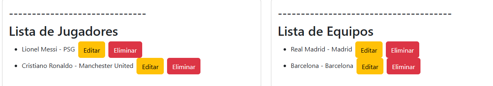
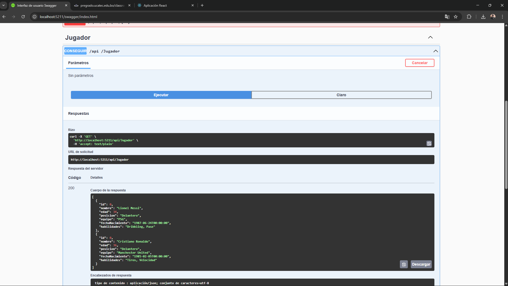
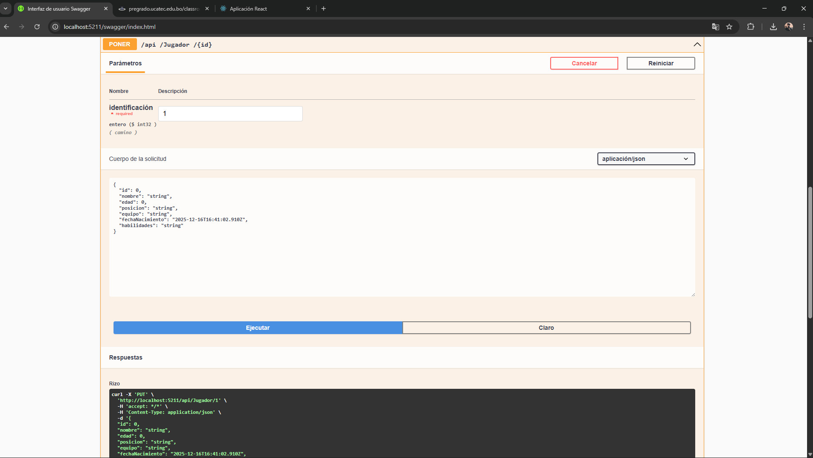

# Gestión de Jugadores y Equipos de Fútbol

Este proyecto consiste en una aplicación cliente-servidor para la gestión de jugadores y equipos de fútbol. Utiliza una API RESTful en el backend desarrollada con ASP.NET Core y un frontend en React.

## Tecnologías Utilizadas

### Backend:
- **ASP.NET Core Web API**
- **Entity Framework Core**
- **SQL Server (LocalDB)**
- **Swagger** (para documentación y pruebas de la API)

### Frontend:
- **React**
- **Axios** (para hacer las peticiones a la API)
- **Bootstrap** (para diseño y estilos)

## Estructura del Proyecto

```
/ExamenFinal
│
├── /Backend (API RESTful) - .NET 8
│   ├── /Controllers
│   │   ├── JugadorController.cs   <-- API para gestionar jugadores (CRUD)
│   │   └── EquipoController.cs    <-- API para gestionar equipos (CRUD)
│   ├── /Data
│   │   ├── Jugadorescx.cs             
│   ├── /Models
│   │   ├── Jugador.cs             <-- Modelo de datos para los jugadores
│   │   └── Equipo.cs              <-- Modelo de datos para los equipos
│   ├── Program.cs                 <-- Configuración de la API
│   ├── Startup.cs                 
│   └── appsettings.json           <-- Cadena de conexión a la base de datos
│
└── /Frontend (React)
    ├── /src
    │   ├── /components
    │   │   ├── AddJugadorForm.js   <-- Formulario para agregar jugador
    │   │   ├── AddEquipoForm.js    <-- Formulario para agregar equipo
    │   │   ├── JugadoresList.js    <-- Componente para listar jugadores
    │   │   └── EquiposList.js      <-- Componente para listar equipos
    │   ├── App.js                  <-- Componente principal
    │   ├── App.css                 <-- Estilos generales
    │   ├── index.js                <-- Punto de entrada
    │   └── index.css               <-- Estilos globales
    ├── package.json                <-- Dependencias de Node
    ├── vite.config.js              <-- Configuración de Vite para React
```

## Cómo Configurar y Ejecutar el Proyecto

### Backend (API):

1. Clona el repositorio del Backend:
    ```bash
    git clone <url-del-repositorio-backend>
    cd Backend
    ```

2. Restaurar dependencias y ejecutar:
    ```bash
    dotnet restore
    dotnet run
    ```

   La API estará disponible en `http://localhost:5211`.

### Frontend (React):

1. Clona el repositorio del Frontend:
    ```bash
    git clone <url-del-repositorio-frontend>
    cd Frontend
    ```

2. Instalar dependencias:
    ```bash
    npm install
    ```

3. Iniciar el servidor de desarrollo:
    ```bash
    npm start
    ```

   El frontend estará disponible en `http://localhost:3000`.

## Funcionalidades

### Backend (API RESTful):

La API permite realizar las siguientes operaciones con jugadores y equipos:

#### Jugadores:
- **GET /api/jugador**: Obtener la lista de jugadores.
- **POST /api/jugador**: Crear un nuevo jugador.
- **PUT /api/jugador/{id}**: Actualizar un jugador existente.
- **DELETE /api/jugador/{id}**: Eliminar un jugador.

#### Equipos:
- **GET /api/equipo**: Obtener la lista de equipos.
- **POST /api/equipo**: Crear un nuevo equipo.
- **PUT /api/equipo/{id}**: Actualizar un equipo existente.
- **DELETE /api/equipo/{id}**: Eliminar un equipo.

### Frontend (React):

El frontend permite realizar las siguientes interacciones:
- **Ver jugadores**: Lista de jugadores obtenida desde el backend.
- **Agregar jugadores**: Formulario para agregar nuevos jugadores a la lista.
- **Eliminar jugadores**: Botón para eliminar jugadores de la lista.
- **Ver equipos**: Lista de equipos obtenida desde el backend.
- **Agregar equipos**: Formulario para agregar nuevos equipos a la lista.
- **Eliminar equipos**: Botón para eliminar equipos de la lista.

## Pruebas y Swagger

Para probar la API, puedes utilizar Swagger UI que se encuentra en `http://localhost:5211/swagger`.

### Interfaz de Swagger


Desde allí, puedes realizar las siguientes pruebas:
- Ver los detalles de cada endpoint.
- Probar los métodos de GET, POST, PUT y DELETE para jugadores y equipos.

### Interfaz del Frontend


### Lista de Jugadores y Equipos


### Edición y Eliminación de Jugadores y Equipos


### Prueba GET para Jugadores (Swagger)


### Prueba POST para Jugadores (Swagger)


### Prueba PUT para Jugadores (Swagger)



