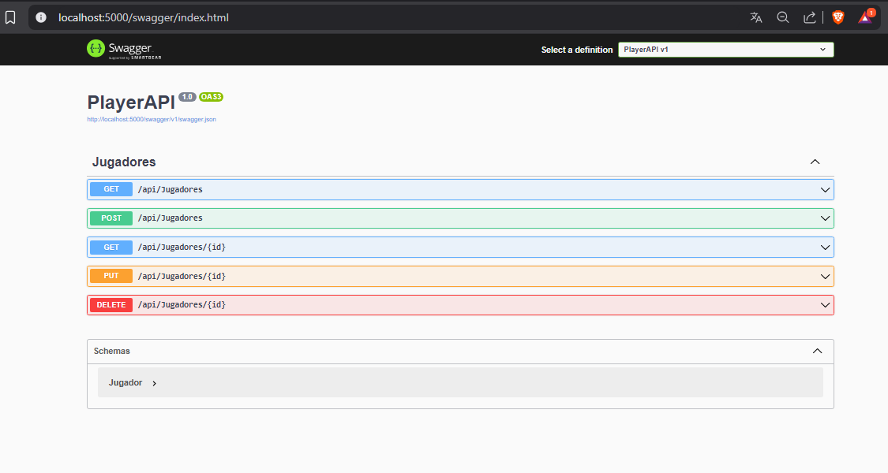
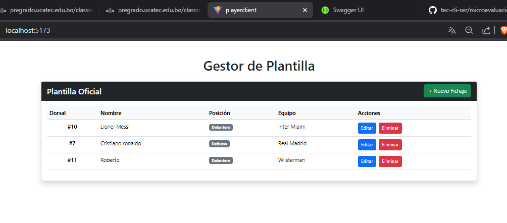
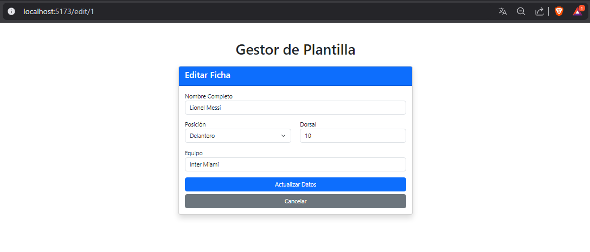
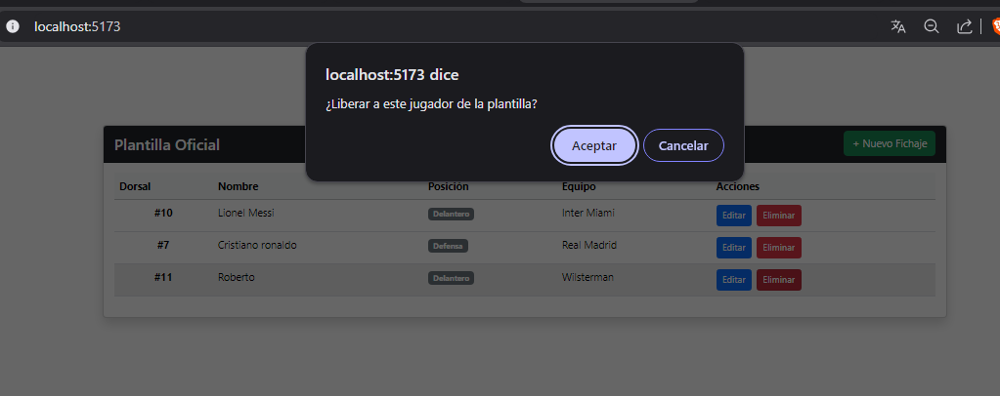
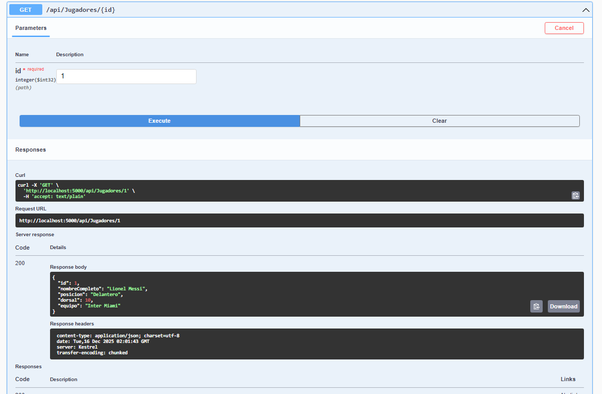
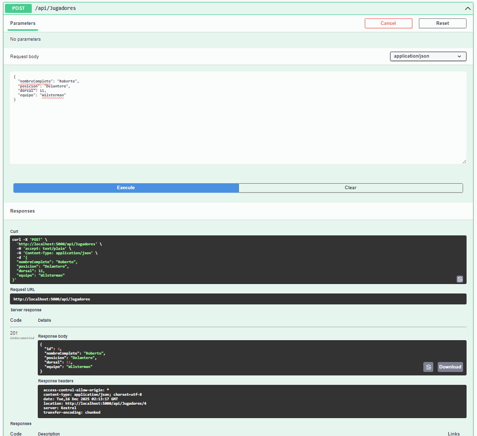
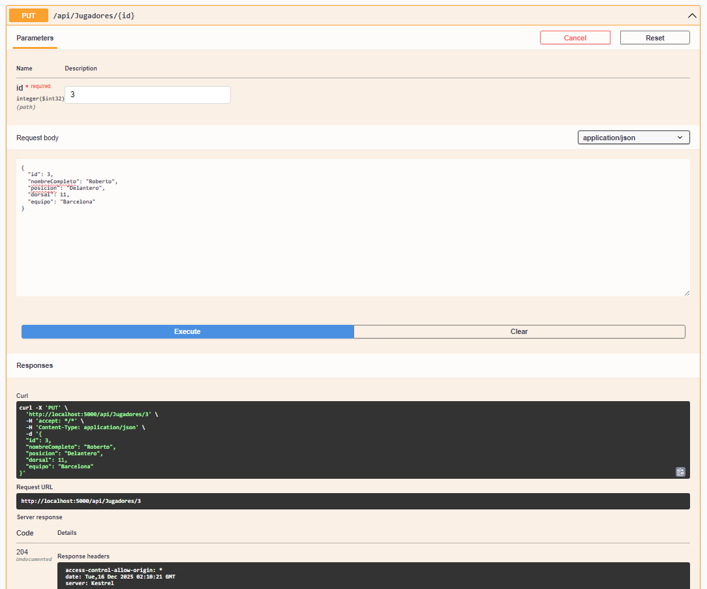
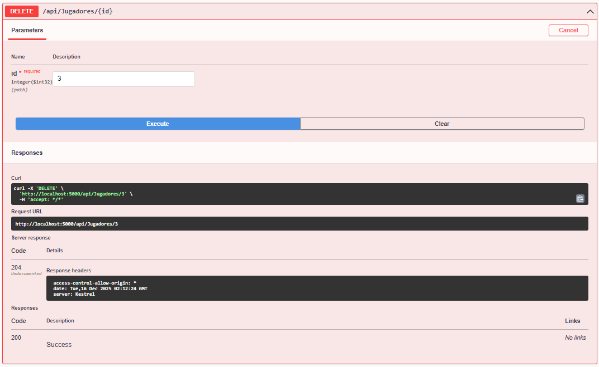

# Gestor de Plantilla de Fútbol (SoccerManager) - Cliente Servidor
Este repositorio contiene la implementación profesional de un sistema Cliente-Servidor para la gestión de jugadores de fútbol. El objetivo es demostrar una arquitectura desacoplada utilizando ASP.NET Core Web API (Backend) y React (Frontend).

## Requisitos Previos:

| Herramienta | Función Principal | Verificación (Terminal) |
| :--- | :--- | :--- |
| **.NET SDK 8.0** | Motor del Backend (API). | `dotnet --version` |
| **Node.js & NPM** | Motor del Frontend (React). | `node -v` |
| **SQL Server** | Base de datos relacional. | `Get-Service "MSSQL$SQLEXPRESS"` |
| **VS Code** | Editor de código recomendado. | `code --version` |

## Guía de Implementación Paso a Paso

1. Crear la solución (Backend)

 Iniciamos una plantilla de Web API limpia.

    
    dotnet new webapi -n PlayerAPI
    cd PlayerAPI
    

2. Instalar Entity Framework Core

Estos paquetes permiten que .NET se comunique con SQL Server y ejecute comandos de base de datos.
```
dotnet add package Microsoft.EntityFrameworkCore.SqlServer
dotnet add package Microsoft.EntityFrameworkCore.Tools
dotnet add package Microsoft.EntityFrameworkCore
```
⚠️ Importante: Para evitar errores de compatibilidad, asegúrate de que tu archivo PlayerAPI.csproj tenga las versiones sincronizadas en 8.0.0, tal como se muestra abajo: XML
```
<ItemGroup>
    <PackageReference Include="Microsoft.EntityFrameworkCore" Version="8.0.0" />
    <PackageReference Include="Microsoft.EntityFrameworkCore.SqlServer" Version="8.0.0" />
    <PackageReference Include="Microsoft.EntityFrameworkCore.Tools" Version="8.0.0" />
    <PackageReference Include="Swashbuckle.AspNetCore" Version="6.4.0" />
</ItemGroup>
```
3. Definición del Modelo (Jugador.cs)

Creamos la clase (POCO) que representa la tabla en la base de datos.

```
namespace PlayerAPI.Models
{
    public class Jugador
    {
        public int Id { get; set; }
        public string NombreCompleto { get; set; } = string.Empty;
        public string Posicion { get; set; } = string.Empty;
        public int Dorsal { get; set; }
        public string Equipo { get; set; } = string.Empty;
    }
}
```

4. El Contexto de Datos (AppDbContext.cs)

Esta clase actúa como el puente. Hereda de DbContext y expone nuestros modelos como: 

```
using Microsoft.EntityFrameworkCore;
using PlayerAPI.Models;

namespace PlayerAPI.Data
{
    public class AppDbContext : DbContext
    {
        public AppDbContext(DbContextOptions<AppDbContext> options) : base(options) { }
        public DbSet<Jugador> Jugadores { get; set; }
    }
}
```

5. Conexión a Base de Datos: 

Aquí definimos dónde está nuestro servidor SQL.

```
"ConnectionStrings": {
  "DefaultConnection": "Server=localhost;Database=FutbolDB;Trusted_Connection=True;TrustServerCertificate=True;"
}
```

6. Inyección de Dependencias y CORS (Program.cs)

Configuramos la API para conectar con SQL y permitimos que React (desde otro puerto) pueda hacer peticiones.

```
// Configurar DB
builder.Services.AddDbContext<AppDbContext>(options =>
    options.UseSqlServer(builder.Configuration.GetConnectionString("DefaultConnection")));

// Configurar CORS
builder.Services.AddCors(options => {
    options.AddPolicy("AllowReact", policy => {
        policy.AllowAnyOrigin().AllowAnyHeader().AllowAnyMethod();
    });
});

// ... más abajo activar el middleware
app.UseCors("AllowReact");
```

7. Migraciones (Code-First)

No creamos la tabla en SQL manualmente. Le decimos a .NET que lo haga por nosotros.

1. Crear la migración:

```
dotnet ef migrations add InitialCreate
```
2. Actualizar la base de datos:

```
dotnet ef database update
```

## Preparación del Cliente (Frontend)

El cliente se configura aparte usando Vite.

1. Crear proyecto e instalar dependencias

```
cd ..
npm create vite@latest PlayerClient -- --template react
cd PlayerClient
npm install axios bootstrap react-router-dom
```

2. Configurar Consumo de API
En los componentes (List.jsx, Create.jsx), configuramos la URL del puerto donde corre el backend (ej. 5000).

```
const API_URL = "http://localhost:5000/api/jugadores";
```

---
# 🚀 Cómo Ejecutar el Sistema Completo
Se requieren dos terminales abiertas simultáneamente.

Terminal 1: Backend (.NET API)

```
cd PlayerAPI
dotnet run
Debe indicar: Now listening on: http://localhost:5000
```



Terminal 2: Frontend (React)

```
cd PlayerClient
npm run dev
Debe indicar: Local: http://localhost:5173
```



Abre tu navegador en la dirección del Frontend (http://localhost:5173).

## Vistas

### Lista


### Editar



### Eliminar 



## Pruebas y Validación de API (Swagger)
Antes de conectar el Frontend, validamos que el Backend funcione correctamente utilizando Swagger UI, una herramienta visual que genera la documentación de la API automáticamente.

1. Acceder a Swagger

Con el proyecto Backend corriendo (dotnet run), abre tu navegador en: http://localhost:5000/swagger

2. Probar Endpoint GET (Listar)

Busca la sección GET /api/Jugadores.
Haz clic en el botón Try it out y luego en Execute.




Resultado esperado: Código 200 y un JSON vacío [] (si no hay datos) o la lista de jugadores.

3. Probar Endpoint POST (Crear)
Busca la sección POST /api/Jugadores.
Haz clic en Try it out.

En el cuadro "Request Body", pega el siguiente JSON de prueba:

JSON

{
  "nombreCompleto": "Roberto",
  "posicion": "Delantero",
  "dorsal": 11,
  "equipo": "Wilsterman"
}
Haz clic en Execute.



Resultado esperado: Código 201 Created y la respuesta con el id asignado automáticamente.

4. Probar Endpoint PUT (Editar)
Busca la sección PUT /api/Jugadores/{id}.

Ingresa el ID del jugador que creaste (ej. 1).

En el cuerpo, modifica algún dato (ej. cambiar equipo a "Barcelona").

Haz clic en Execute.



Resultado esperado: Código 204 No Content (significa éxito sin devolver datos).

5. Probar Endpoint DELETE (Eliminar)
Busca la sección DELETE /api/Jugadores/{id}.

Ingresa el ID a eliminar.

Haz clic en Execute.



Resultado esperado: Código 204 No Content.

