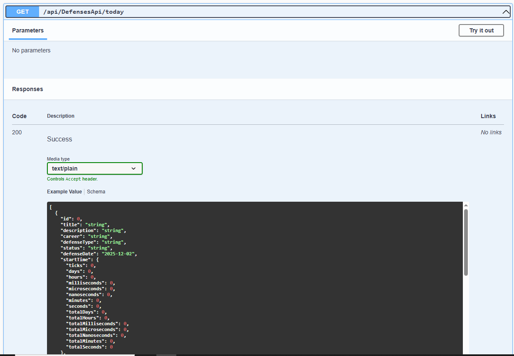
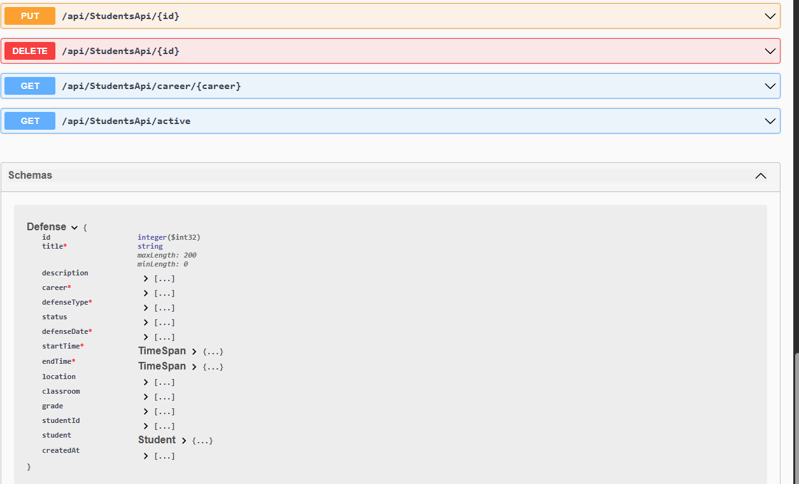

 ### Sistema de Gestión de Defensas Universitarias - Microevaluacion3
## 🎯 Descripción del Sistema

Este es un sistema web MVC completo para la gestión de defensas, tesis y trabajos de grado universitarios. Permite administrar estudiantes, evaluadores y programar defensas académicas de manera eficiente.

## ✨ Características Principales

Gestión de Defensas: Crear, editar, eliminar y visualizar defensas programadas

Gestión de Estudiantes: Administrar información de estudiantes

Gestión de Evaluadores: Registrar profesores y evaluadores externos

APIs RESTful: Interfaz de programación para integración con otros sistemas

Documentación Swagger: API documentada e interactiva

Base de Datos SQL Server: Almacenamiento seguro y robusto

## 🏗️ Arquitectura del Proyecto
text
Microevaluacion3/
├── Controllers/           # Controladores MVC y API
├── Models/               # Modelos de datos (Defense, Student, Evaluator)
├── Views/                # Vistas Razor
├── Services/             # Lógica de negocio y acceso a datos
├── Data/                 # Contexto de base de datos
├── Program.cs            # Configuración principal
└── appsettings.json     # Configuración de conexión

## 📋 Requisitos Previos

Software Necesario
.NET 8.0 SDK o superior

SQL Server (Express o Developer Edition)

Visual Studio 2022 o Visual Studio Code (opcional)

Navegador web (Chrome, Edge, Firefox)

Verificar Instalaciones
powershell
# Verificar .NET SDK
dotnet --version

# Verificar SQL Server
sqlcmd -S localhost\SQLEXPRESS -Q "SELECT @@VERSION"

## 🚀 Instalación y Configuración Rápida

## Paso 1: Clonar o Copiar el Proyecto
powershell
# Navegar a tu directorio de trabajo
cd "C:\TuDirectorio"
## Paso 2: Restaurar Paquetes
powershell
# Restaurar dependencias
```sh
dotnet restore

```
## Paso 3: Configurar Base de Datos
Edita el archivo appsettings.json para configurar tu conexión a SQL Server:

json
{
  "ConnectionStrings": {
    "DefaultConnection": "Server=localhost\\SQLEXPRESS;Database=Microevaluacion3DB;Trusted_Connection=True;TrustServerCertificate=true;"
  }
}
## Paso 4: Ejecutar el Sistema
powershell

# Opción 1: Ejecutar normalmente
```sh
dotnet run
```
# Opción 2: Ejecutar con recarga automática (para desarrollo)
```sh
dotnet watch run
```
### 🌐 Acceso al Sistema


# Interfaz Web (MVC)
# URL	Descripción
```sh
https://localhost:5001	Página principal
https://localhost:5001/Defenses	Gestión de defensas
https://localhost:5001/Students	Gestión de estudiantes
https://localhost:5001/Evaluators	Gestión de evaluadores
API REST (Swagger)
```
# URL	Descripción
```sh 
https://localhost:5001/swagger	Documentación interactiva de APIs
https://localhost:5001/api/DefensesApi	API de defensas
https://localhost:5001/api/StudentsApi	API de estudiantes
https://localhost:5001/api/EvaluatorsApi	API de evaluadores
```
## 📊 Estructura de la Base de Datos

El sistema crea automáticamente las siguientes tablas:

Tablas Principales
Students (Estudiantes)

```sh 
Id, Code, FirstName, LastName, Email, Career, Semester

Evaluators (Evaluadores)

Id, Code, FirstName, LastName, Title, Type, Department

Defenses (Defensas)

Id, Title, Description, Career, DefenseType, Status, DefenseDate
```

## 🔧 Comandos Útiles
Desarrollo powershell
# Compilar el proyecto
```sh
dotnet build
```
# Ejecutar pruebas (si existen)
```sh 
dotnet test
```
# Limpiar solución
```sh
dotnet clean
```
### Base de Datos
powershell
# Verificar conexión a SQL Server
sqlcmd -S localhost\SQLEXPRESS -d Microevaluacion3DB -Q "SELECT COUNT(*) FROM Students"

# Crear backup manual (desde SQL Server Management Studio)

BACKUP DATABASE Microevaluacion3DB TO DISK = 'C:\backup\Microevaluacion3DB.bak'

### Solución de Problemas
powershell

# Si hay errores de compilación
```sh 
dotnet clean
dotnet restore
dotnet build
```

# Verificar puertos en uso

netstat -ano | findstr :5001

# Forzar cierre de aplicación en puerto 5001
taskkill /F /PID [PID_NUMBER]
### 📱 Endpoints de la API
Defensas
http
GET    /api/DefensesApi              # Obtener todas las defensas
GET    /api/DefensesApi/{id}         # Obtener defensa por ID
POST   /api/DefensesApi              # Crear nueva defensa
PUT    /api/DefensesApi/{id}         # Actualizar defensa
DELETE /api/DefensesApi/{id}         # Eliminar defensa
GET    /api/DefensesApi/today        # Defensas de hoy
GET    /api/DefensesApi/student/{id} # Defensas por estudiante
Estudiantes
http
GET    /api/StudentsApi              # Obtener todos los estudiantes
GET    /api/StudentsApi/{id}         # Obtener estudiante por ID
POST   /api/StudentsApi              # Crear nuevo estudiante
PUT    /api/StudentsApi/{id}         # Actualizar estudiante
DELETE /api/StudentsApi/{id}         # Eliminar estudiante
GET    /api/StudentsApi/career/{name}# Estudiantes por carrera
Evaluadores
http
GET    /api/EvaluatorsApi            # Obtener todos los evaluadores
GET    /api/EvaluatorsApi/{id}       # Obtener evaluador por ID
POST   /api/EvaluatorsApi            # Crear nuevo evaluador
PUT    /api/EvaluatorsApi/{id}       # Actualizar evaluador
DELETE /api/EvaluatorsApi/{id}       # Eliminar evaluador
GET    /api/EvaluatorsApi/type/{type}# Evaluadores por tipo

### 🎨 Funcionalidades del Sistema
Para Administradores
Programar nuevas defensas

Asignar evaluadores a defensas

Registrar calificaciones finales

Generar reportes de actividad

Para Estudiantes
Ver defensas programadas

Consultar información de evaluadores

Revisar calendario académico

Para Evaluadores
Consultar asignaciones

Registrar evaluaciones

Revisar historial de defensas

### 🔒 Seguridad y Consideraciones
Desarrollo
Solo para entornos de desarrollo

Usar HTTPS en producción

Implementar autenticación para producción

Producción
Cambiar cadena de conexión

Habilitar HTTPS

Configurar logging apropiado

Implementar backup automático

🐛 Solución de Problemas Comunes
Error: "No se puede conectar a SQL Server"
powershell
# 1. Verificar que SQL Server esté ejecutándose
services.msc  # Buscar "SQL Server (SQLEXPRESS)"

# 2. Verificar conexión
sqlcmd -S localhost\SQLEXPRESS -E

# 3. Habilitar TCP/IP en SQL Server Configuration Manager
Error: "Puerto 5001 en uso"
powershell
# Cambiar puerto en Program.cs
```sh 
app.Urls.Add("https://localhost:5002");
Error: "Entity Framework no instalado"
```
powershell
# Instalar paquetes necesarios
```sh
dotnet add package Microsoft.EntityFrameworkCore.SqlServer
```
## Capturas de pantalla


## captura 2


## captura 3
