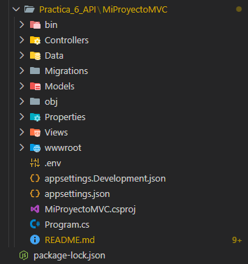
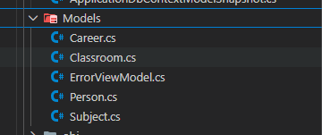
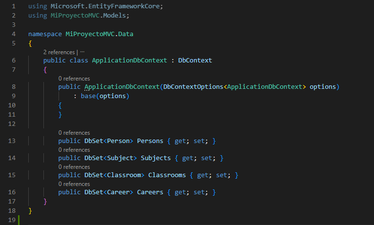
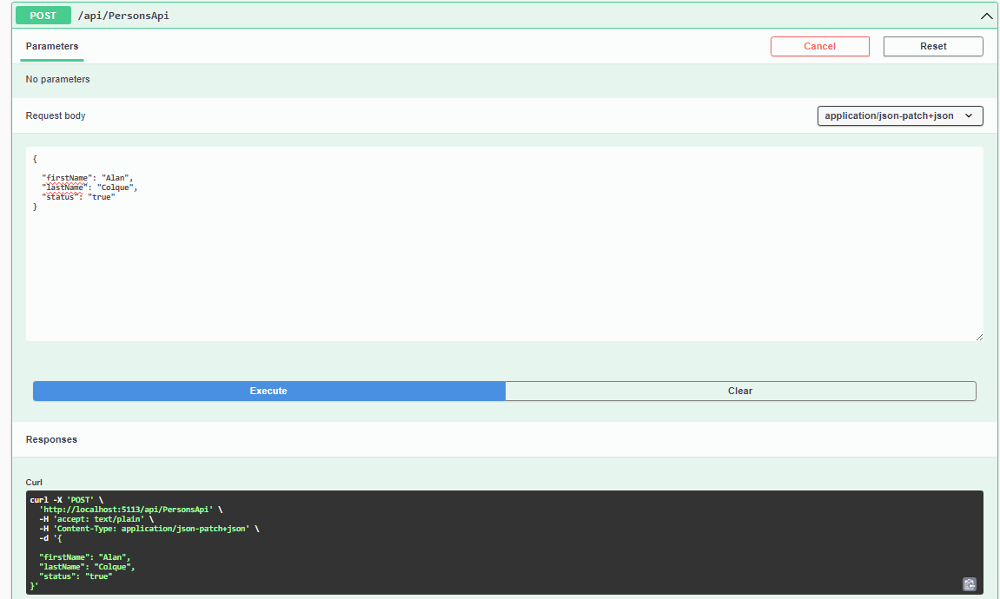
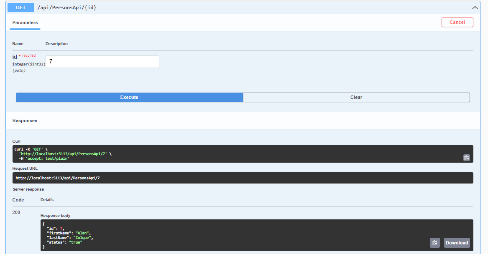

# Sistema de Gestión Escolar (School Management System)
Un sistema integral desarrollado con ASP.NET Core 9.0 que implementa una arquitectura híbrida: ofrece una interfaz web tradicional (MVC) y una API RESTful completa para integraciones externas.


## 📖 Descripción del Proyecto
Este sistema permite la administración académica de una institución educativa. Utiliza el patrón de diseño MVC (Modelo-Vista-Controlador) y Entity Framework Core con un enfoque Code-First para la gestión de base de datos.

Módulos Principales:

- 👥 Personas: Gestión de alumnos y personal.

- 🎓 Carreras: Administración de programas educativos.

- 📚 Materias: Catálogo de asignaturas.

- 🏫 Aulas: Gestión de infraestructura física.

## 🛠 Stack Tecnológico
El proyecto utiliza las últimas tecnologías del ecosistema .NET:

- Core: .NET 9.0 SDK 
- Base de Datos: SQL Server (Compatible con Express y LocalDB) 
- ORM: Entity Framework Core 8.0 
- API Documentation: Swagger / OpenAPI (Swashbuckle) 


Utilidades:

- DotNetEnv: Para seguridad de credenciales (.env).
- Newtonsoft.Json: Para manejo avanzado de serialización y evitar ciclos infinitos.


## 🏗 Historia de Construcción (Paso a Paso)

Esta sección documenta la arquitectura lógica para desarrolladores que deseen replicar el sistema.

1. Inicialización
Se creó una solución base utilizando la plantilla MVC:

```dotnet new mvc -n MiProyectoMVC --framework net9.0```



2. Definición de Modelos (Code-First)

Se diseñaron las clases POCO en la carpeta Models/ que representan las tablas de la BD:

Person.cs, Subject.cs, Classroom.cs, Career.cs.



3. Configuración del DataContext

Se implementó ApplicationDbContext heredando de DbContext, registrando los DbSet para cada entidad y configurando la conexión a SQL Server.



4. Ingeniería de Controladores

Se implementó una arquitectura dual en la carpeta Controllers/:

- Controladores MVC: (Ej. PersonController.cs) Generan Vistas Razor para el usuario final.

- Controladores API: (Ej. PersonsApiController.cs) Exponen endpoints JSON puros para consumo externo.

## 🚀 Guía de Instalación 

Sigue estos pasos si acabas de clonar el repositorio y no tienes nada configurado.

### 1. Para conectar con la Base de Datos (SQL Server): Estas librerías permiten que tu código C# hable con SQL Server.

```
dotnet add package Microsoft.EntityFrameworkCore.SqlServer --version 8.0.0
dotnet add package Microsoft.EntityFrameworkCore.Tools --version 8.0.0
dotnet add package Microsoft.EntityFrameworkCore.Design --version 8.0.0
```

### 2. Para generar código automáticamente (Scaffolding): Esta herramienta ayuda a crear los Controladores y Vistas automáticamente más adelante.


```dotnet add package Microsoft.VisualStudio.Web.CodeGeneration.Design --version 8.0.0```

### 3. Para el manejo avanzado de JSON: Necesaria para evitar errores cuando los datos de la API se "muerden la cola" (referencias circulares) y para formatear bien las respuestas.

```dotnet add package Microsoft.AspNetCore.Mvc.NewtonsoftJson --version 8.0.0```


### 4. Para la documentación de la API (Swagger): Genera la página web interactiva para probar tus endpoints.


```dotnet add package Swashbuckle.AspNetCore --version 6.5.0```

### 5. Configurar Credenciales (.env)
El sistema no incluye contraseñas por defecto. Debes crear un archivo llamado .env en la raíz del proyecto y pegar tu cadena de conexión:

```
DEFAULT_CONNECTION="Server=localhost;Database=MiProyectoMVC;Trusted_Connection=true;TrustServerCertificate=true;"
```

### 6: Crear la Base de Datos

Ejecuta las migraciones para que Entity Framework construya la base de datos automáticamente:

```dotnet ef database update```

Para iniciar el servidor, ejecuta:

```dotnet run```

La consola te mostrará dos direcciones (HTTP y HTTPS). Usa la HTTPS, por ejemplo: https://localhost:xxxx.

# Guía de Pruebas de API (Testing)

Una vez que el proyecto esté corriendo (dotnet run), usa Swagger para verificar que los "cerebros" (APIs) que creamos en el paso anterior funcionen correctamente.

Acceso: Entra a https://localhost:XXXX/swagger

## ✅ Prueba 1: PersonApi (Usuarios)

1. Busca la sección azul PersonsApi.

2. Usa el botón verde POST para crear una persona.

3. Body: Borra el id: 0 y llena firstName y lastName.



Usa el botón azul GET para ver si se guardó.


