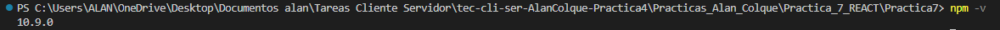
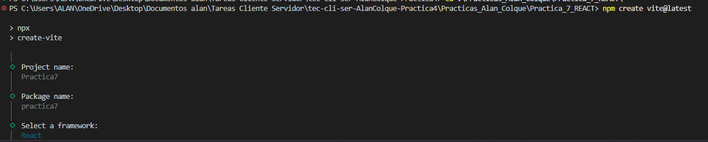
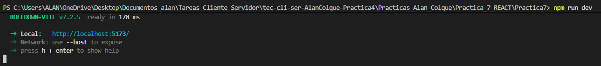
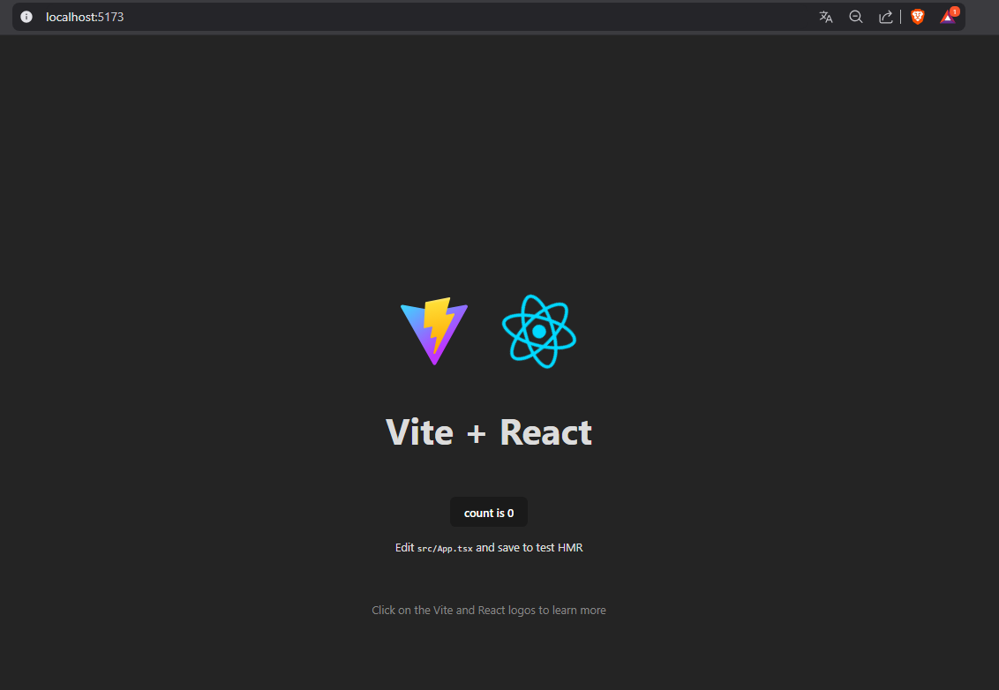

# Guía de Configuración: Entorno React + Vite
Esta documentación detalla los pasos para iniciar un nuevo proyecto de React utilizando Vite como empaquetador (bundler), debido a su velocidad y eficiencia.

## 📋 1. Requisitos Previos (Prerequisites)

Antes de escribir código, necesitas tener instalado el entorno de ejecución de JavaScript. Node.js: Se recomienda la versión LTS (Long Term Support).

Verificación: Abre tu terminal y escribe:

```
node -v
npm -v
```


Si ves números de versión (ej. v10.x.x), estás listo.

## 🛠️ 2. Creación del Proyecto

Utilizaremos el comando oficial de Vite para generar la estructura (scaffolding).

Abre tu terminal (CMD, PowerShell o Terminal de VS Code).

Navega a la carpeta donde quieres guardar tu proyecto (opcional):

```cd Documentos/Proyectos```

Ejecuta el comando de creación:

```npm create vite@latest```

Durante la instalación interactiva, selecciona:

Project name: Escribe el nombre de tu app (ej: mi-app-react).

Select a framework: Usa las flechas para elegir React.



Select a variant: Elige entre JavaScript o TypeScript (Recomendado: TypeScript si buscas escalabilidad, JavaScript si estás aprendiendo).

## 📦 3. Instalación de Dependencias

Una vez creado el proyecto, la carpeta existirá pero estará vacía de librerías. Debes entrar y descargarlas.

### Entrar a la carpeta del proyecto

```
cd mi-app-react
```

### Instalar las dependencias listadas en package.json

```
npm install
```

### Ejecución del Entorno de Desarrollo

Para ver tu aplicación funcionando en el navegador:

```
npm run dev
```

La terminal te mostrará una URL local, usualmente: http://localhost:5173/



Ctrl + Click en el enlace para abrirlo en tu navegador.



# Estructura de Carpetas
nombre-proyecto/
├── node_modules/           # Dependencias (no tocar)
├── public/                 # Archivos estáticos que no pasan por el bundler (favicon, robots.txt)
├── src/                    # 🟢 AQUÍ OCURRE LA MAGIA
│   ├── assets/             # Imágenes, fuentes, iconos (svg, png, jpg)
│   ├── components/         # Componentes reutilizables (Botones, Inputs, Cards)
│   │   ├── common/         # Componentes genéricos (Button.jsx, Modal.jsx)
│   │   └── layout/         # Componentes de estructura (Navbar.jsx, Footer.jsx, Sidebar.jsx)
│   ├── context/            # Estados globales (AuthContext, ThemeContext)
│   ├── hooks/              # Custom Hooks (useFetch.js, useForm.js)
│   ├── pages/              # Vistas completas que corresponden a rutas (Home.jsx, Login.jsx)
│   ├── routes/             # Configuración de rutas (AppRouter.jsx)
│   ├── services/           # Lógica de conexión con APIs (authService.js, axiosConfig.js)
│   ├── utils/              # Funciones auxiliares puras (formatDate.js, validators.js)
│   ├── styles/             # Archivos CSS globales o variables (si no usas Tailwind/CSS-in-JS)
│   ├── App.jsx             # Componente raíz
│   ├── main.jsx            # Punto de entrada (Renderizado del DOM)
│   └── index.css           # Estilos base/reset
├── .eslintrc.cjs           # Configuración de Linter
├── .gitignore              # Archivos ignorados por Git
├── index.html              # HTML principal
├── package.json            # Dependencias y scripts
├── README.md               # Documentación
└── vite.config.js          # Configuración de Vite