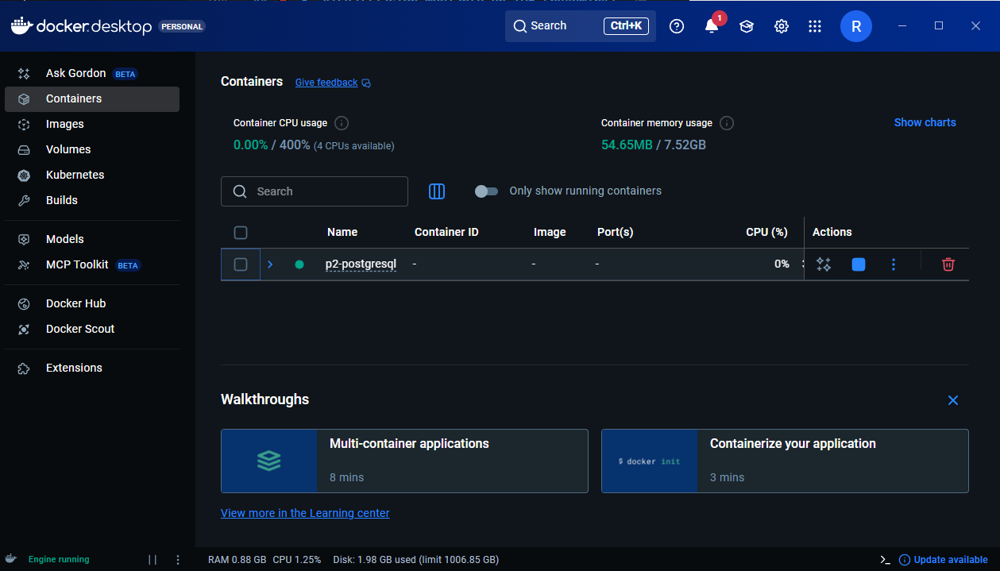
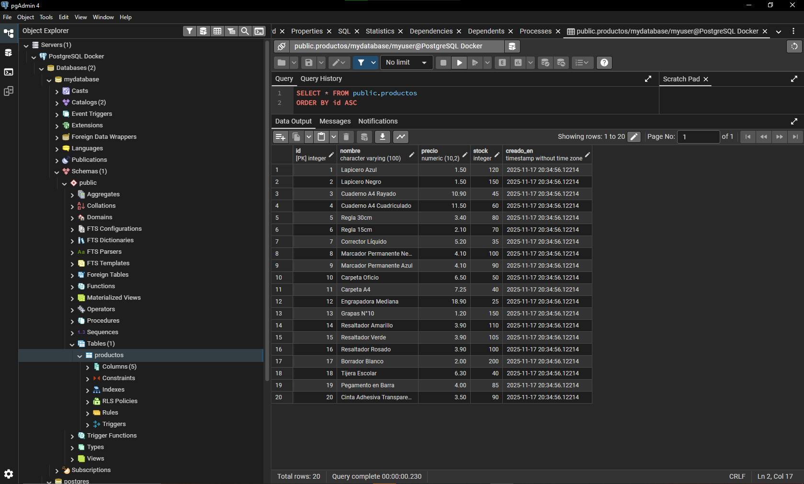

## Cómo usar
1. `docker compose up -d`
2. `docker exec -it postgres_example psql -U myuser -d mydatabase`
3. Dentro de psql: `\dt` y `SELECT * FROM productos;`

Credenciales:
- USER: myuser
- PASS: mypassword
- DB: mydatabase
- HOST: localhost:5432

---

# Docker Compose y Visualización mediante pgAdmin4

Este proyecto contiene la configuración necesaria para levantar una base de datos **PostgreSQL** usando **Docker Compose**, crear una tabla de ejemplo e interactuar con ella usando un IDE (pgAdmin4).  
Incluye documentación paso a paso e imágenes como evidencia.

---

## 📌 1. Crear el contenedor con Docker Compose

---

### ▶️ Archivo `docker-compose.yml`

Este archivo crea un servicio de PostgreSQL.

```yaml
cat > docker-compose.yml <<'YAML'
version: '3.8'

services:
  postgres:
    image: postgres:15
    container_name: postgres_example
    environment:
      POSTGRES_USER: myuser
      POSTGRES_PASSWORD: mypassword
      POSTGRES_DB: mydatabase
    ports:
      - "5432:5432"
    volumes:
      - postgres_data:/var/lib/postgresql/data

volumes:
  postgres_data:
````
---


### ▶️ Levantar el contenedor

```bash
docker compose up -d
```

Verificar que está corriendo:

```bash
docker ps
```

Debería aparecer:

```
postgres_example

## 📌 2. Documentación de la Base de Datos y Tabla

### ▶️ Entrar al contenedor

```bash
docker exec -it postgres_example psql -U myuser -d mydatabase
```

Cuando aparezca:

```
mydatabase=#
```

ya estás dentro de PostgreSQL.

---

### ▶️ Crear una tabla de ejemplo (`productos`)

```sql
CREATE TABLE productos (
    id SERIAL PRIMARY KEY,
    nombre VARCHAR(100) NOT NULL,
    precio NUMERIC(10,2) NOT NULL,
    stock INT NOT NULL DEFAULT 0,
    creado_en TIMESTAMP DEFAULT CURRENT_TIMESTAMP
);
```

---

### ▶️ Insertar registros de prueba

```sql
INSERT INTO productos (nombre, precio, stock) VALUES
('Lapicero Azul', 1.50, 120),
('Lapicero Negro', 1.50, 150),
('Cuaderno A4 Rayado', 10.90, 45),
('Cuaderno A4 Cuadriculado', 11.50, 60),
('Regla 30cm', 3.40, 80),
('Regla 15cm', 2.10, 70),
('Corrector Líquido', 5.20, 35),
('Marcador Permanente Negro', 4.10, 100),
('Marcador Permanente Azul', 4.10, 90),
('Carpeta Oficio', 6.50, 50),
('Carpeta A4', 7.25, 40),
('Engrapadora Mediana', 18.90, 25),
('Grapas N°10', 1.20, 150),
('Resaltador Amarillo', 3.90, 110),
('Resaltador Verde', 3.90, 105),
('Resaltador Rosado', 3.90, 100),
('Borrador Blanco', 2.00, 200),
('Tijera Escolar', 6.30, 40),
('Pegamento en Barra', 4.00, 85),
('Cinta Adhesiva Transparente', 3.50, 90);

```

---

### ▶️ Ver los datos

```sql
SELECT * FROM productos;
```
o
```sql
SELECT * FROM public.productos;
```

---

## 📌 3. Visualización mediante un IDE (pgAdmin4)

Para administrar gráficamente la base de datos usamos **pgAdmin4**. Comprobar si tenemos instalado, caso contrario: 
https://www.postgresql.org/ftp/pgadmin/pgadmin4/v9.10/windows/

### ▶️ Crear una nueva conexión

1. Abrir pgAdmin4
2. Clic derecho en *Servers* → **Register → Server**
3. Completar:

#### **General**

* Name: `PostgreSQL Docker`

#### **Connection**

* Hostname/address: `localhost`
* Port: `5432`
* Username: `myuser`
* Password: `mypassword`

Luego clic en **Save**.

---

### ▶️ Ver la tabla

Navegar a:

```
Servers
 └── PostgreSQL Docker
     └── Databases
         └── mydatabase
             └── Schemas
                 └── public
                     └── Tables
```

Clic derecho → **View / Edit Data → All Rows**

---

## 📌 4. Evidencias (Imágenes)

Agrega aquí tus capturas de pantalla:

### ▶️ Docker corriendo



### ▶️ Tabla creada en pgAdmin4



---

## Resumen

Este repositorio demuestra:

* Uso de Docker Compose para levantar PostgreSQL
* Creación de tablas y datos
* Conexión desde pgAdmin4
* Evidencias visuales del funcionamiento

```

```
