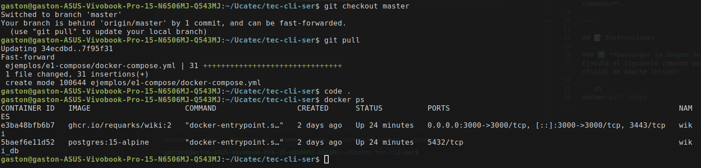

# Guía Rápida: Docker Compose y Verificación de Contenedores

## Levantar Servicios con Docker Compose

Para iniciar los servicios definidos en un archivo `docker-compose.yml`, usa el siguiente comando:

```sh
docker-compose up -d
```

### Explicación:
- `up`: Levanta los servicios definidos en el `docker-compose.yml`.
- `-d`: Ejecuta los contenedores en modo **desacoplado** (background).

## Verificar Contenedores en Ejecución

Para listar los contenedores en ejecución, utiliza:

```sh
docker ps
```

### Explicación:
- Muestra una lista de los contenedores activos.
- Incluye información como el **ID del contenedor**, **imagen**, **estado**, **puertos expuestos**, etc.

## Cargar una Imagen en Markdown

Para agregar una imagen en un archivo Markdown, usa la siguiente sintaxis:


