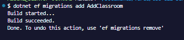
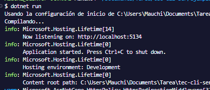

# Documentación del Proyecto Clashroom

Este archivo documenta el proceso de agregado el modelo `Clashroom` en la aplicación ASP.NET MVC


## 📦 Añadir Clashroom al Proyecto

### 1. Crear el Modelo Clashroom

En la carpeta `Models`, crear un archivo llamado `Clashroom.cs` con el siguiente contenido:


### 2. Añadir DbSet al Contexto

Editar el archivo `ApplicationDbContext.cs` y añadir la línea:


### 3. Crear y Aplicar Migraciones
Comando para crear una nueva migración, por ejemplo para añadir Clashroom
```
dotnet ef migrations add AddClashroom
```
Comando para crear el controlador automaticamente 
```
dotnet aspnet-codegenerator controller -name ClashroomController -m Clashroom -dc ApplicationDbContext -outDir Controllers -scripts
```

Compilar el proyecto
```
dotnet build
```


Ejecutar el proyecto
```
dotnet run
```


Para crear o actualizar la base de datos
```
dotnet ef database update
```


## 🧪 Resultado Final

Ingresar al host 
```
http://localhost:5134/Clashroom
```

---


**Fecha:** 20 de abril de 2025\
**Autor:** Mauricio Roa 

---

