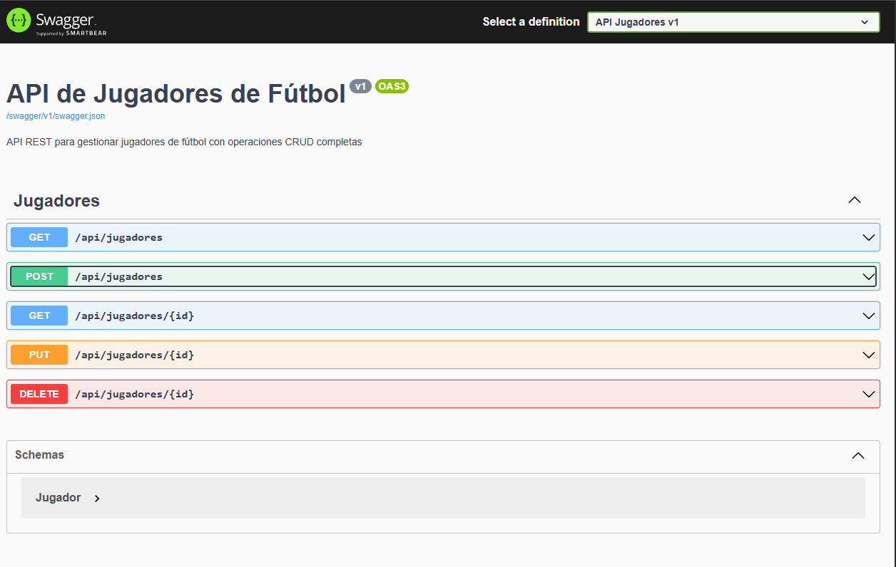
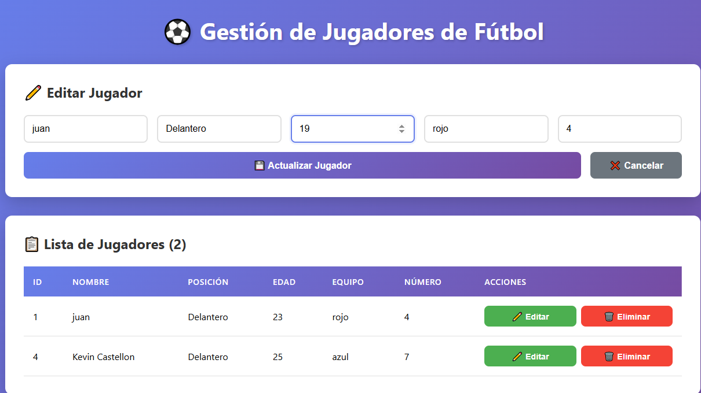

cd C:\Users\Usuario\Desktop\tec-cli-ser\examenFinalKevinCastellon\proyecto-futbol

@"
# ⚽ Sistema de Gestión de Jugadores de Fútbol

## 📋 Descripción del Proyecto

Sistema completo Cliente-Servidor para la gestión de jugadores de fútbol desarrollado con:
- **Backend**: API REST en C# (.NET 8) con SQL Server
- **Frontend**: React con diseño moderno y responsivo
- **Base de Datos**: SQL Server con Entity Framework Core
- **Documentación**: Swagger UI integrado

---

## 🎯 Funcionalidades

El sistema permite realizar operaciones CRUD completas sobre jugadores de fútbol:

✅ **Crear** nuevos jugadores  
✅ **Listar** todos los jugadores registrados  
✅ **Editar** información de jugadores existentes  
✅ **Eliminar** jugadores de la base de datos  
✅ **Visualización** en tiempo real con interfaz moderna  
✅ **API REST** documentada con Swagger  

---

## 🗂️ Estructura del Proyecto
```sh

proyecto-futbol/
├── backend/
│   └── FutbolAPI/
│       ├── Program.cs           # Configuración de la API y endpoints
│       ├── Jugador.cs           # Modelo de datos
│       ├── FutbolDb.cs          # Contexto de Entity Framework
│       ├── FutbolAPI.csproj     # Configuración del proyecto
│       └── appsettings.json     # Configuración de conexión
│
└── frontend/
    ├── src/
    │   ├── App.jsx              # Componente principal React
    │   └── App.css              # Estilos de la aplicación
    └── package.json             # Dependencias de Node.js

```
---

## 📊 Modelo de Datos

### Tabla: Jugadores

| Campo | Tipo | Descripción |
|-------|------|-------------|
| Id | int | Identificador único (auto-incremento) |
| Nombre | string | Nombre completo del jugador |
| Posicion | string | Posición en el campo (ej: Delantero) |
| Edad | int | Edad del jugador |
| Equipo | string | Nombre del equipo |
| Numero | int | Número de camiseta |

---

## 🚀 Instalación y Configuración

### Requisitos Previos

- ✅ .NET 8 SDK o superior
- ✅ Node.js v16 o superior
- ✅ SQL Server (Express o superior)
- ✅ Visual Studio Code (recomendado)

### Paso 1: Clonar o Descargar el Proyecto

```sh bash
cd proyecto-futbol
```

### Paso 2: Configurar el Backend


# Navegar a la carpeta del backend
```sh
cd backend/FutbolAPI
```
# Restaurar paquetes NuGet
```sh
dotnet restore
```
# Crear la base de datos con migraciones
```sh
dotnet ef migrations add InitialCreate
dotnet ef database update
```

### Paso 3: Configurar el Frontend


# Navegar a la carpeta del frontend
```sh
cd ../../frontend
```
# Instalar dependencias
```sh
npm install
```

---

## ▶️ Cómo Ejecutar el Sistema

### Terminal 1: Ejecutar el Backend (API)

```sh
cd backend/FutbolAPI
dotnet run --no-launch-profile --urls "http://localhost:5000"
```

**Salida esperada:**
```sh
🚀 API iniciada en http://localhost:5000
info: Microsoft.Hosting.Lifetime[14]
      Now listening on: http://localhost:5000
```

### Terminal 2: Ejecutar el Frontend (React)

```sh
cd frontend
npm start
```

**Se abrirá automáticamente:** \`http://localhost:3000\`

---

## 📸 Evidencias del Sistema

### 1. API con Swagger UI


**Descripción:** Interfaz de Swagger mostrando todos los endpoints disponibles de la API REST. Permite probar cada operación directamente desde el navegador.

**Endpoints disponibles:**
- GET \`/api/jugadores\` - Obtener todos los jugadores
- GET \`/api/jugadores/{id}\` - Obtener un jugador específico
- POST \`/api/jugadores\` - Crear nuevo jugador
- PUT \`/api/jugadores/{id}\` - Actualizar jugador
- DELETE \`/api/jugadores/{id}\` - Eliminar jugador

---

### 2. Base de Datos con Jugadores


**Descripción:** Vista de SQL Server Management Studio mostrando la tabla \`Jugadores\` con datos almacenados. Se observan los 5 campos principales: Id, Nombre, Posicion, Edad, Equipo y Numero.

---

### 3. Formulario de Edición


**Descripción:** Interfaz de usuario mostrando el formulario de edición de un jugador existente. Los campos se prellenan con los datos actuales y el botón cambia a "Actualizar Jugador".

**Funcionalidades:**
- Carga automática de datos en el formulario
- Validación de campos requeridos
- Botón de cancelar para deshacer cambios
- Feedback visual al usuario

---

### 4. Creación de Nuevo Jugador


**Descripción:** Vista del sistema después de agregar exitosamente un nuevo jugador. El formulario se limpia automáticamente y la tabla se actualiza en tiempo real.

**Proceso:**
1. Usuario completa el formulario
2. Click en "Agregar Jugador"
3. API recibe petición POST
4. Se guarda en SQL Server
5. Frontend actualiza la lista automáticamente

---

### 5. Lista Completa de Jugadores


**Descripción:** Tabla completa mostrando todos los jugadores registrados en el sistema con sus respectivos datos y botones de acción (Editar/Eliminar).

**Características de la tabla:**
- Diseño responsivo y moderno
- Hover effects en filas
- Botones de acción por jugador
- Actualización en tiempo real
- Contador de jugadores totales

---


## 🌐 Endpoints de la API

### Obtener Todos los Jugadores
```sh
GET http://localhost:5000/api/jugadores
```

**Respuesta:**
```sh
[
  {
    "id": 1,
    "nombre": "Lionel Messi",
    "posicion": "Delantero",
    "edad": 36,
    "equipo": "Inter Miami",
    "numero": 10
  }
]
```

### Crear Jugador
```sh
POST http://localhost:5000/api/jugadores
Content-Type: application/json

{
  "nombre": "Cristiano Ronaldo",
  "posicion": "Delantero",
  "edad": 38,
  "equipo": "Al Nassr",
  "numero": 7
}
```

### Actualizar Jugador
```sh
PUT http://localhost:5000/api/jugadores/1
Content-Type: application/json

{
  "id": 1,
  "nombre": "Lionel Messi",
  "posicion": "Delantero",
  "edad": 37,
  "equipo": "Inter Miami",
  "numero": 10
}
```

### Eliminar Jugador
```sh
DELETE http://localhost:5000/api/jugadores/1
```


## 🐛 Solución de Problemas Comunes

### Error: "No se puede conectar a SQL Server"

# Verificar que SQL Server esté corriendo
```sh
Get-Service -Name MSSQLSERVER
```
# Iniciar el servicio
```sh
Start-Service -Name MSSQLSERVER
```

### Error: "Puerto 5000 ya en uso"
```sh
# Usar otro puerto
dotnet run --urls "http://localhost:5001"
```


---


## ✅ Checklist de Entrega

- [x] Backend API en C# con .NET 8
- [x] Frontend en React
- [x] Base de datos SQL Server
- [x] CRUD completo funcional
- [x] Swagger UI documentado
- [x] Modelo con 5 campos (Jugador)
- [x] Consumo de APIs REST
- [x] Evidencias con capturas de pantalla
- [x] README con instrucciones completas

---
