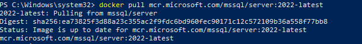
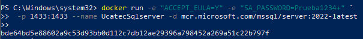
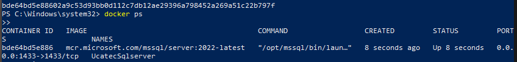
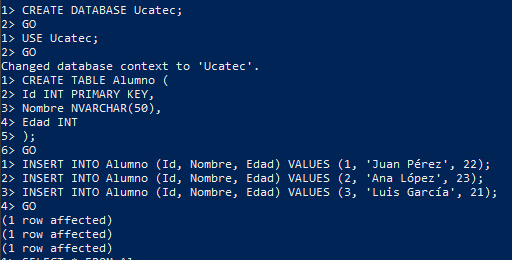
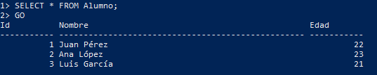
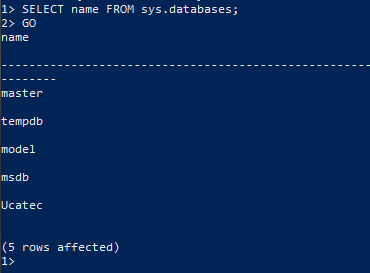

# 📘 Manual: Crear una Base de Datos en SQL Server

## ✅ Requisitos Previos

Antes de comenzar, asegúrate de tener los siguientes softwares instalados:

- 🔧 **Docker Desktop**: [Descargar Docker](https://www.docker.com/products/docker-desktop)

### Descargar sqlcmd
La solución rapida a este problema es descargar el cliente oficial de linea de comandos sqlcmd con este codigo:
```
winget install --id Microsoft.Sqlcmd --source winget
```
Esto instalará la versión oficial del cliente de línea de comandos sqlcmd luego reinicia el powershell para que lo detecte.

### Verifica que se instaló
Inserta el comando:
```
sqlcmd --version
```
Si ves información del comando, ¡estás listo!
---

## 🐳 Paso 1: Descargar la Imagen de SQL Server

SQL Server ofrece una imagen gratuita para desarrollo desde su Container Registry. Abre tu terminal y ejecuta:

```bash
docker pull mcr.microsoft.com/mssql/server:2022-latest
```


> 🔐 Esto descargara lo que es la imagen para poder ejecutar SQL Server en la terminal

---

## 🚀 Paso 2: Ejecutar el Contenedor

Una vez descargada la imagen, puedes levantar un contenedor con este comando:

```bash
docker run -e "ACCEPT_EULA=Y" -e "SA_PASSWORD=Prueba1234+" `
 -p 1433:1433 --name UcatecSqlserver -d mcr.microsoft.com/mssql/server:2022-latest
```

```bash
El acento grave (`) al final de la línea permite continuar el comando en otra línea en PowerShell. Si prefieres, puedes poner todo en una sola línea sin el acento.
```


## 🔍 Paso 3: Verificar que el contenedor esté corriendo

```bash
docker ps
```


Para hacer la conexion con la base de datos inserta el comando

```bash
sqlcmd -S localhost,1433 -U SA -P "Prueba1234+"
```


🟢 Si ves este prompt "1>" quiere decir que estas dentro del motor SQL

---

## 🧩 Paso 4: Crear la base de datos Ucatec

En el prompt de sqlcmd, ejecuta:
```bash
CREATE DATABASE Ucatec;
GO
USE Ucatec;
GO
CREATE TABLE Alumno (
    Id INT PRIMARY KEY,
    Nombre NVARCHAR(50),
    Edad INT
);
GO
INSERT INTO Alumno (Id, Nombre, Edad) VALUES (1, 'Juan Pérez', 22);
INSERT INTO Alumno (Id, Nombre, Edad) VALUES (2, 'Ana López', 23);
INSERT INTO Alumno (Id, Nombre, Edad) VALUES (3, 'Luis García', 21);
GO
```
Esto creara la base de datos, la tabla y la insersion de datos en la tabla




---

## 🧾 Paso 5: Consultar Tabla

Una vez conectado, puedes ejecutar los siguientes comandos SQL:

```sql
SELECT * FROM Alumno;
GO
```


---

## 📄 (Opcional): Ver las bases de datos

En lugar de usar un comando largo en terminal, puedes crea un archivo `docker-compose.yml` con esta configuracion dentro:

```sql
SELECT name FROM sys.databases;
GO
```


Eso es todo lo que tendrias que realizar para levantar SQL Server en Docker.
