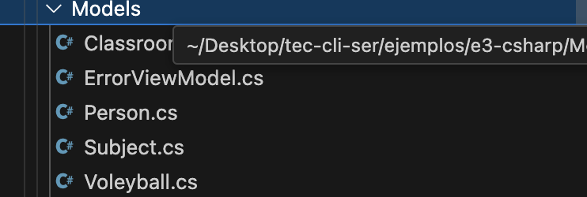
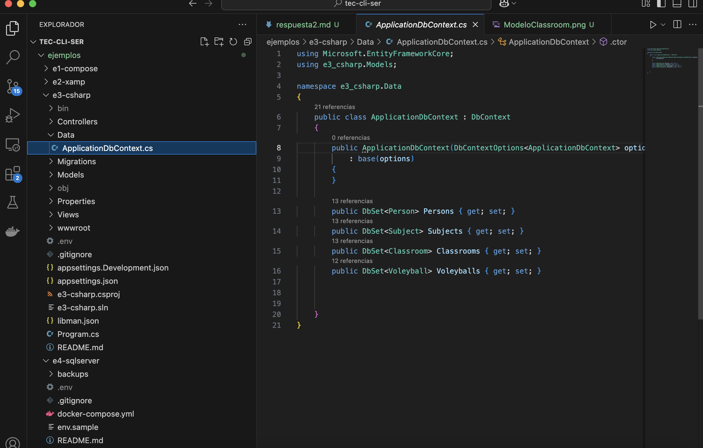
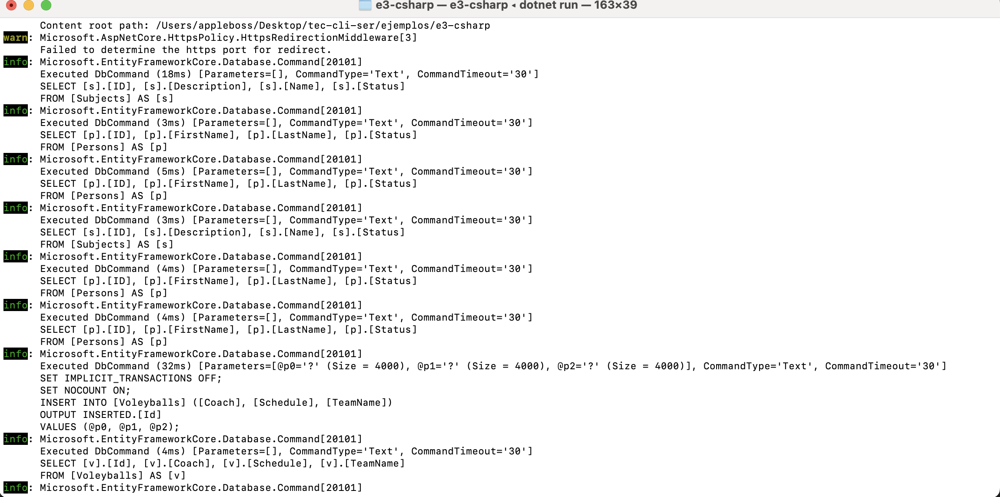
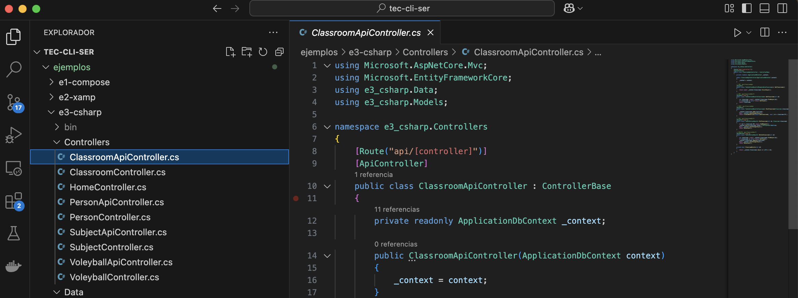
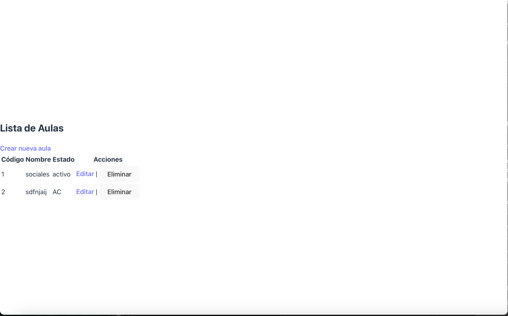
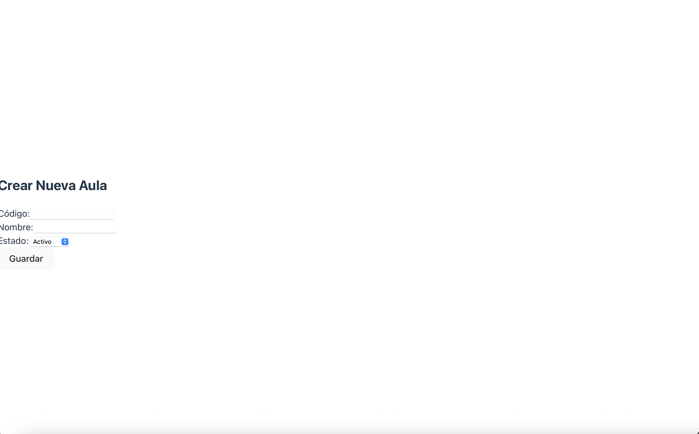
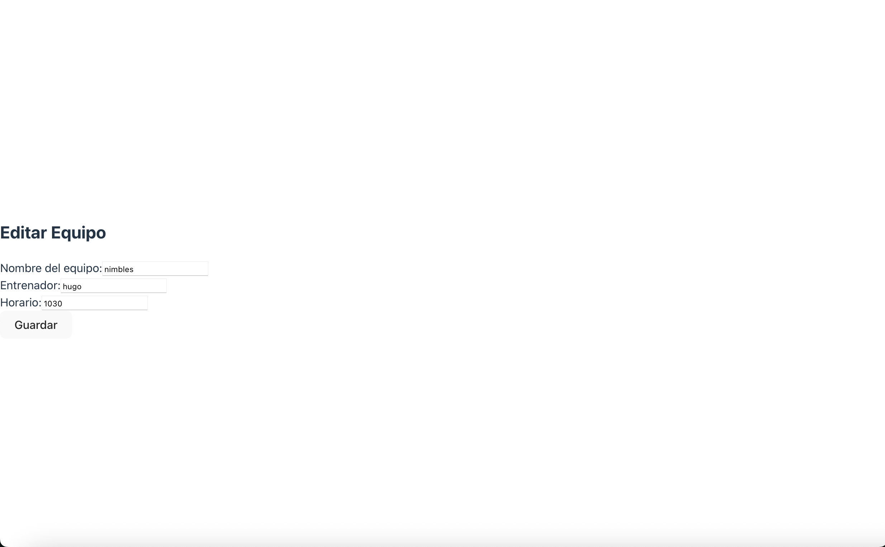
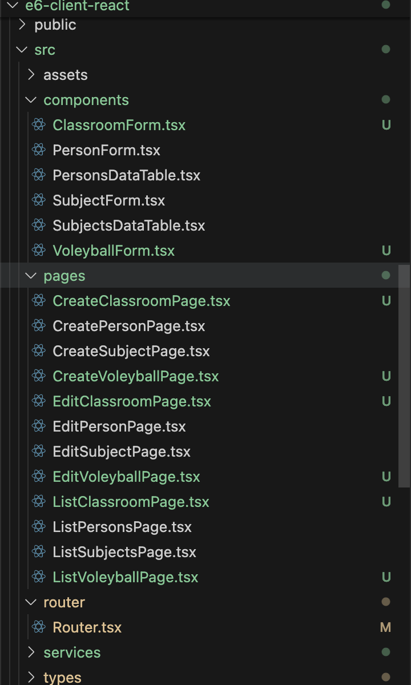

# 🏫 CRUD de Classroom en ASP.NET Core + React

Este proyecto implementa un módulo completo de **aulas (Classroom)** con backend en ASP.NET Core y frontend en React, incluyendo documentación de desarrollo, errores comunes y sus soluciones.

---

## 📂 Estructura del Proyecto

```
├── e6-client-react/         # Frontend en React
│   ├── src/
│   │   ├── components/      # Componentes como ClassroomForm
│   │   ├── pages/           # Vistas: Create, Edit, List
│   │   └── services/        # Axios services (ClassroomApi.ts)
│
└── e3-csharp/               # Backend ASP.NET Core
    ├── Controllers/         # ClassroomApiController.cs
    ├── Data/                # ApplicationDbContext.cs
    ├── Models/              # Classroom.cs
```

---

## 🛠️ Paso a Paso del Backend

### 📌 1. Modelo `Classroom.cs`

```csharp
public class Classroom
{
    public int ID { get; set; }
    public string Code { get; set; }
    public string Name { get; set; }
    public string Status { get; set; }
}
```

📸 **Captura de modelo:**  


---

### 📌 2. DbContext

```csharp
public DbSet<Classroom> Classrooms { get; set; }
```

📸 **Captura de DbContext:**  
`

---

### 📌 3. Migración y actualización de base de datos

```bash
dotnet ef migrations add AddClassroom
dotnet ef database update
```

📸 **Captura de migración:**  
`

---

### 📌 4. API Controller `ClassroomApiController.cs`

```csharp
[Route("api/[controller]")]
[ApiController]
public class ClassroomApiController : ControllerBase
```

📸 **Captura de controlador:**  
`

---

## 🎨 Frontend en React

### 📄 Vistas implementadas

- `/classrooms` → Lista
- `/classrooms/create` → Crear
- `/classrooms/edit/:id` → Editar

📸 **Captura de lista:**  


📸 **Captura de formulario crear:**  


📸 **Captura de formulario editar:**  


---

### 🧩 Componentes clave

- `ClassroomForm.tsx`
- `CreateClassroomPage.tsx`
- `EditClassroomPage.tsx`
- `ListClassroomPage.tsx`
- `services/ClassroomApi.ts`

---
📸 **Captura de componentes:**  



## ❗ Errores Comunes y Soluciones

### ❌ Error por conflicto de mayúsculas/minúsculas

```
El nombre de archivo "ClassroomApi.ts" ya incluido es diferente del nombre "classroomApi.ts"
```

✅ Solución:
- Asegurar que los nombres de archivo y los imports coincidan exactamente.
- Usar convención PascalCase: `ClassroomApi.ts`

---

### ❌ No carga datos al editar

Causa:
- El formulario no recibía `initialData`

✅ Solución:
- Pasar `initialData={classroom}` al componente `ClassroomForm`.

---

### ❌ React accede a puerto incorrecto (404)

Causa:
- Axios apuntaba a `/api` en el puerto de React (5173)

✅ Solución:
- Configurar correctamente `baseURL: 'http://localhost:5134/api'` en `api.ts`.

---

## ✅ Resultado final

El CRUD de aulas está operativo desde el backend hasta el frontend, y documentado con errores resueltos y código organizado.


## ✍️ Autor

- Santiago Alfredo Abasto Ortega
- Proyecto académico CRUD Classroom - UCATEC 2025
