# 🏐 CRUD de Voleyball en ASP.NET Core + React

Este módulo implementa la gestión completa de equipos de voleibol con backend en ASP.NET Core y frontend en React. Incluye modelo de datos, migraciones, controlador API, vistas en React, documentación de errores y su solución.

---

## 📂 Estructura del Proyecto

```
├── e6-client-react/           # Frontend en React
│   ├── src/
│   │   ├── components/        # VoleyballForm.tsx
│   │   ├── pages/             # List, Create, Edit
│   │   └── services/          # VoleyballApi.ts
│
└── e3-csharp/                 # Backend ASP.NET Core
    ├── Models/                # Voleyball.cs
    ├── Data/                  # ApplicationDbContext.cs
    └── Controllers/           # VoleyballApiController.cs
```

---

## 🛠️ Backend ASP.NET Core

### 📌 1. Modelo `Voleyball.cs`

```csharp
public class Voleyball
{
    public int Id { get; set; }
    public string TeamName { get; set; }
    public string Coach { get; set; }
    public string Schedule { get; set; }
}
```

📸 **Captura del modelo:**  
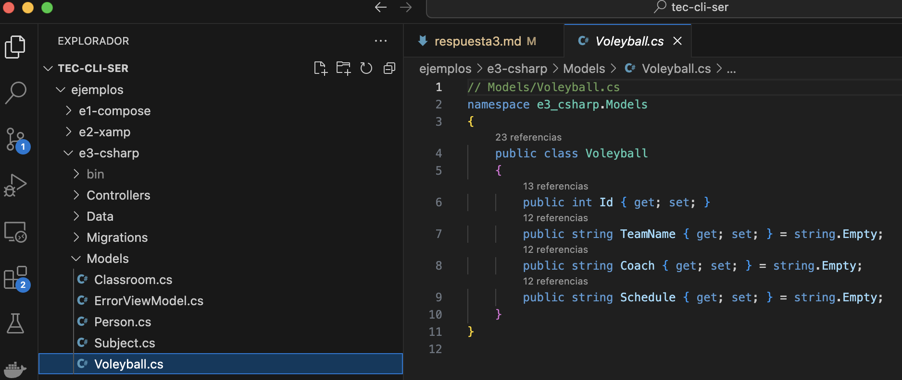

---

### 📌 2. DbContext

```csharp
public DbSet<Voleyball> Voleyballs { get; set; }
```

📸 **Captura de DbContext:**  
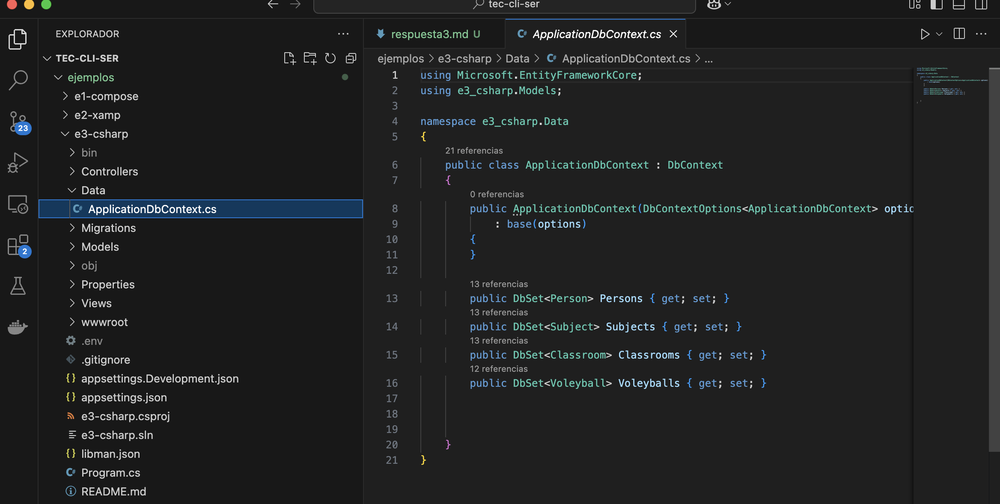

---

### 📌 3. Migración y actualización de base de datos

```bash
dotnet ef migrations add AddVoleyball
dotnet ef database update
```

📸 **Captura de migración:**  
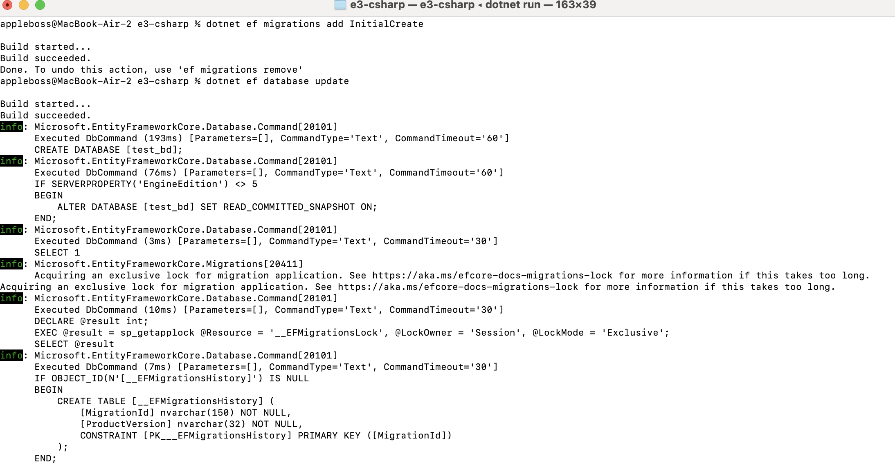

---

### 📌 4. Controlador API `VoleyballApiController.cs`

```csharp
[Route("api/[controller]")]
[ApiController]
public class VoleyballApiController : ControllerBase
{
    // Métodos: GET, POST, PUT, DELETE
}
```

📸 **Captura del controlador:**  
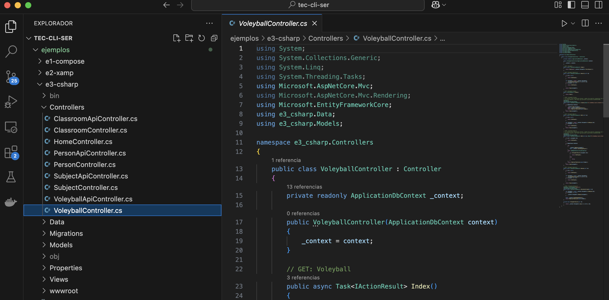

---

### 📌 5. Swagger

📸 **Captura del Swagger con endpoints:**  
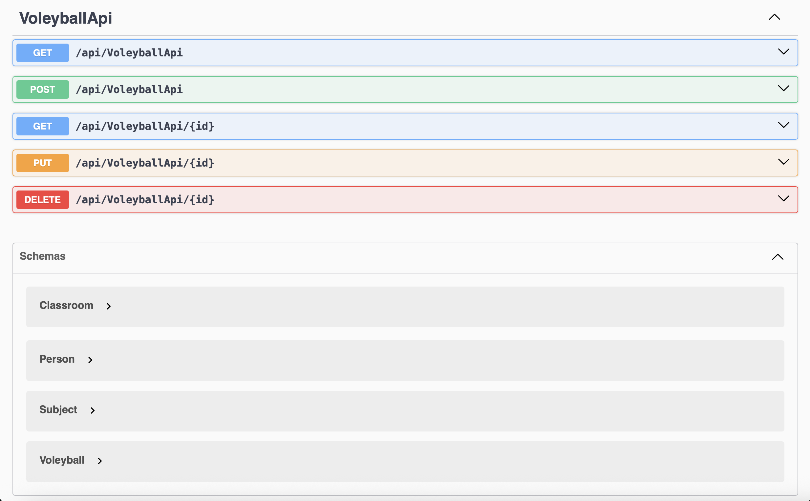

---
📸 **Captura del Swagger general:**  
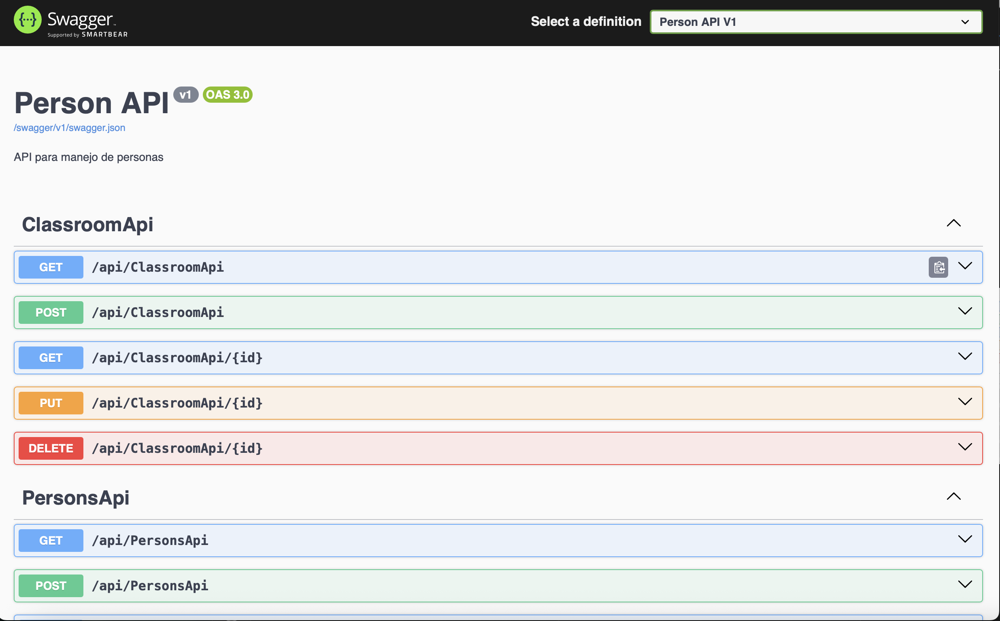

---

## 🎨 Frontend en React

### 📄 Páginas

- `/voleyballs` → Lista de equipos
- `/voleyballs/create` → Formulario de creación
- `/voleyballs/edit/:id` → Edición de equipo

📸 **Captura - Lista:**  
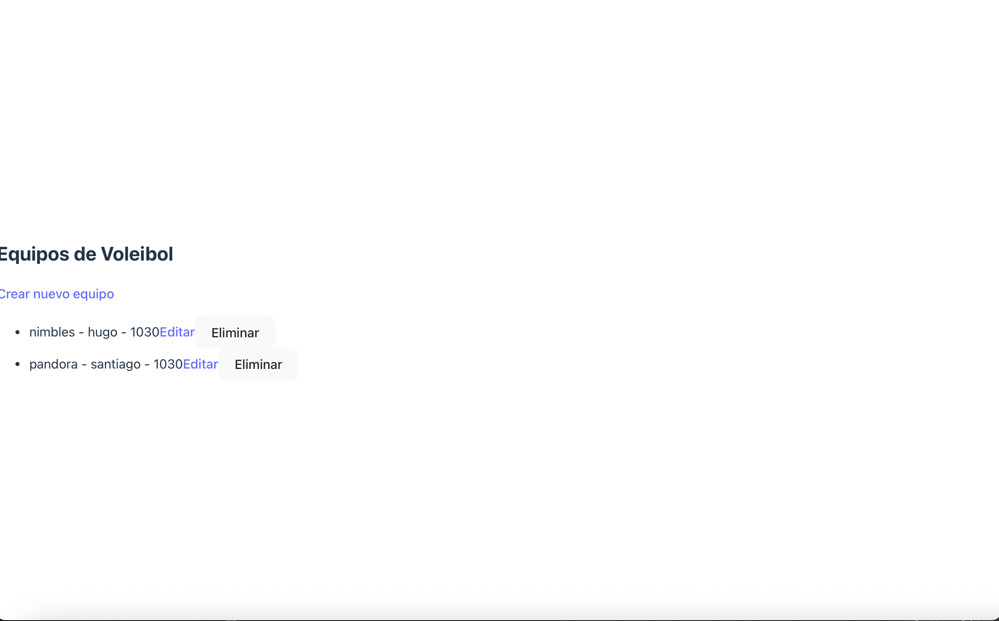

📸 **Captura - Crear:**  
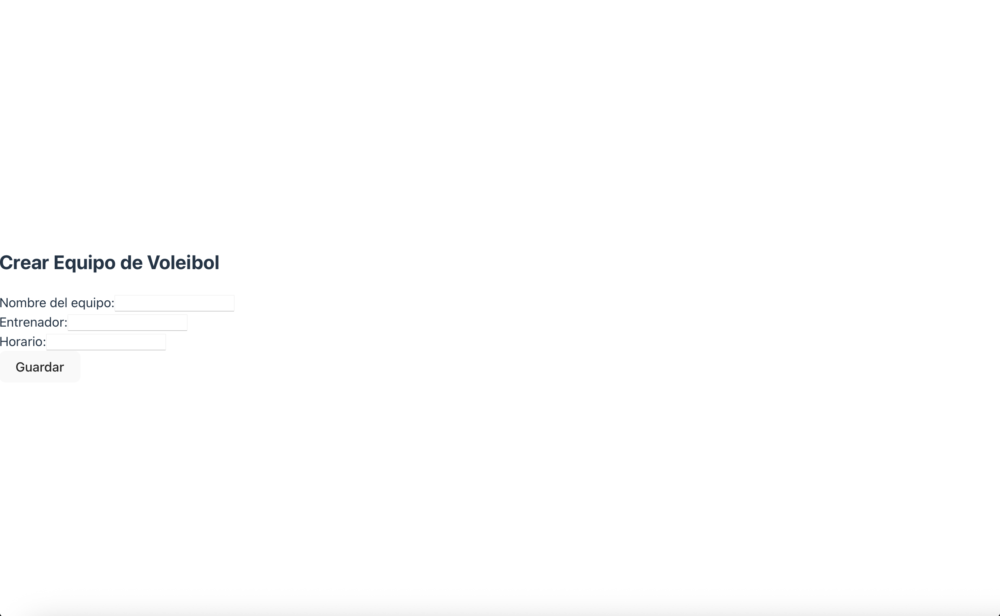

📸 **Captura - Editar:**  
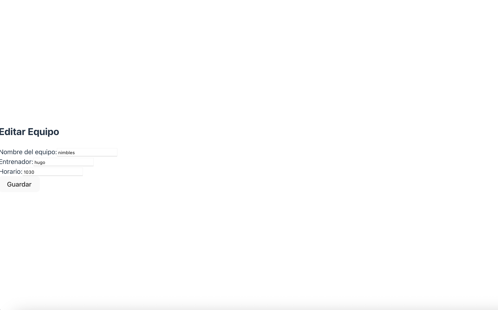

---

### 🧩 Componentes clave

- `components/VoleyballForm.tsx`
- `pages/ListVoleyballPage.tsx`
- `pages/CreateVoleyballPage.tsx`
- `pages/EditVoleyballPage.tsx`
- `services/VoleyballApi.ts`

---
📸 **Captura - componentes:**  
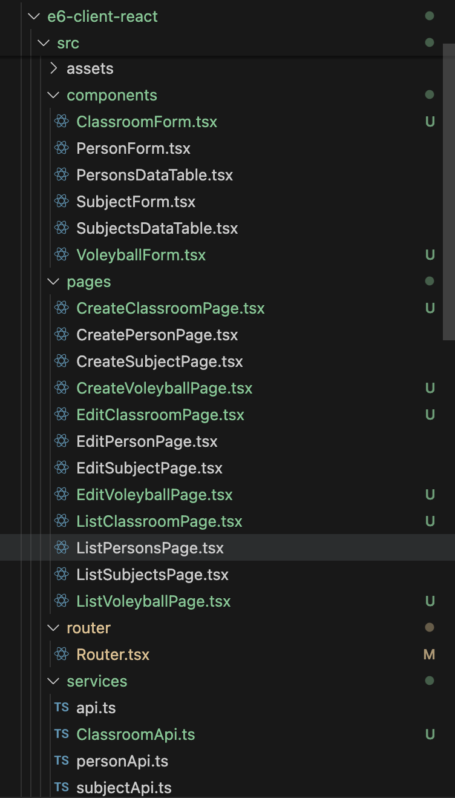
---
📸 **Captura - componentes:**  
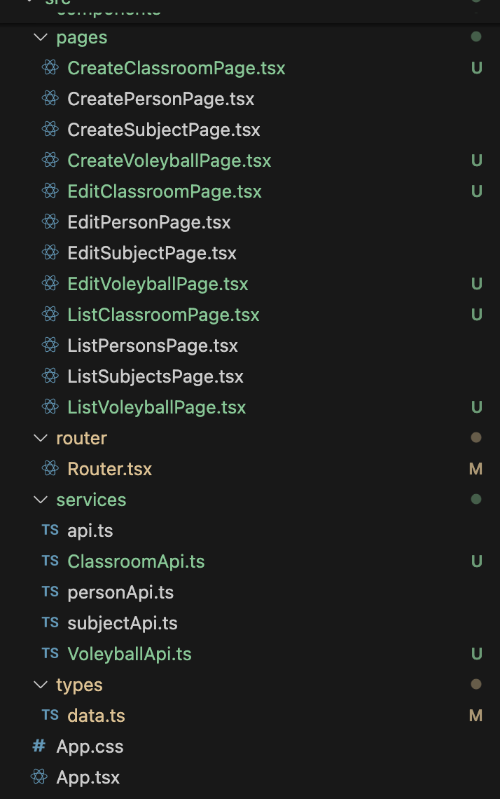

## ❗ Errores y soluciones

### ❌ Axios 404 con `/VoleyballApi`

**Causa:** El `baseURL` estaba apuntando a React (5173) y no al backend.

✅ **Solución:**  
```ts
baseURL: 'http://localhost:5134/api'
```

---

### ❌ No se cargan datos en editar

**Causa:** No se pasaba `initialData` al formulario.

✅ **Solución:**  
```tsx
<VoleyballForm initialData={team} onSubmit={handleUpdate} />
```

---

### ❌ Conflicto de nombres en imports

**Causa:** Uso inconsistente de mayúsculas/minúsculas.

✅ **Solución:**  
- Archivo: `VoleyballApi.ts`
- Importar siempre igual: `import { ... } from '../services/VoleyballApi';`

---

## ✅ Resultado final

Se implementó un CRUD completo para `Voleyball`, funcionando desde el backend hasta el frontend, con controladores, formularios y pruebas visuales en Swagger.

---

## ✍️ Autor

- Santiago Alfredo Abasto Ortega
- Proyecto académico UCATEC 2025 - Módulo Voleyball
