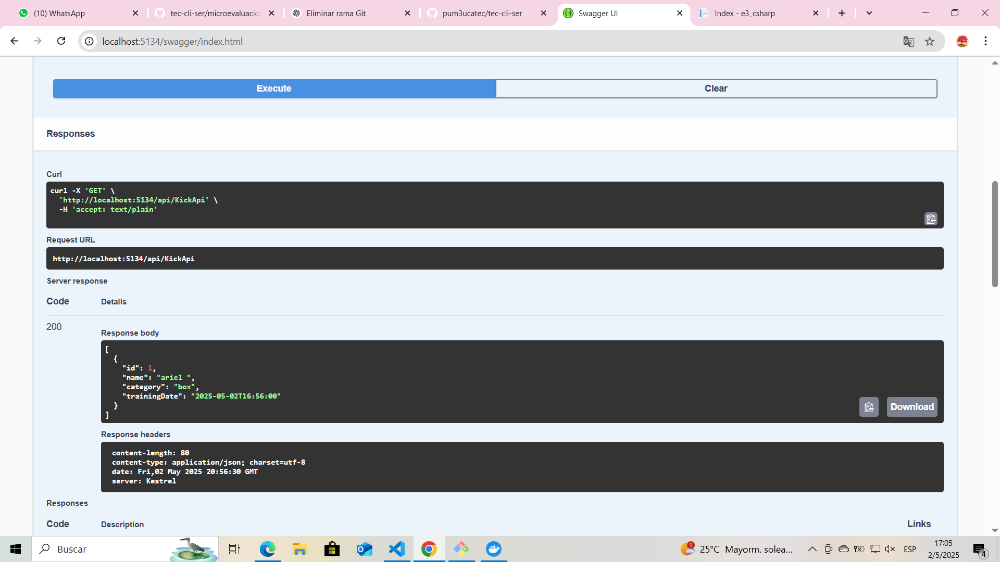
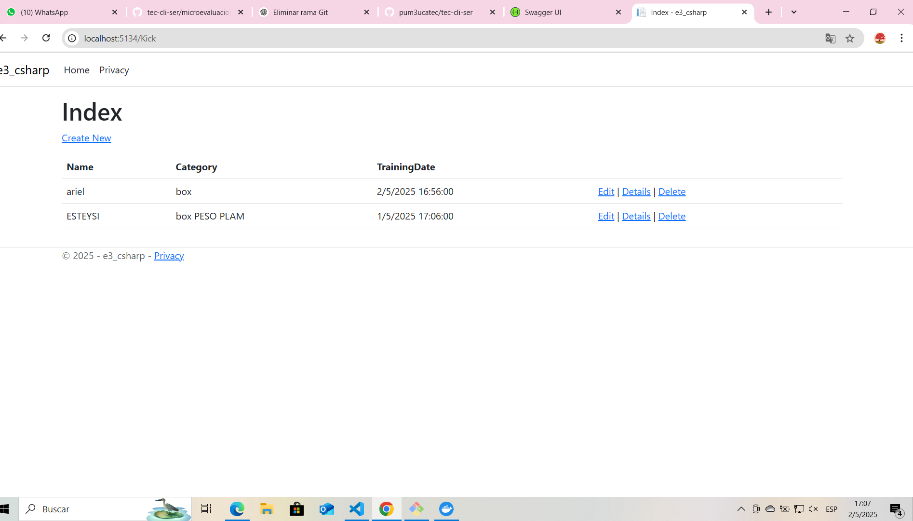
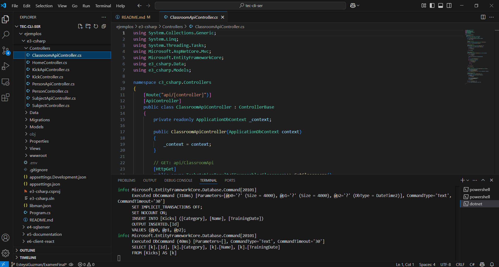
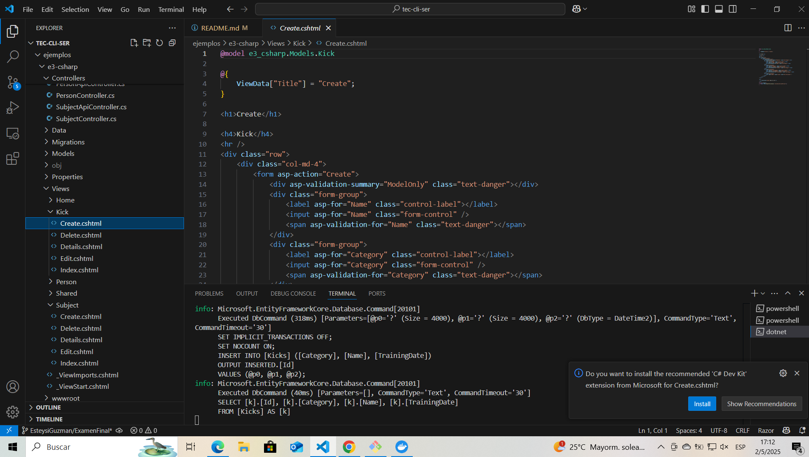
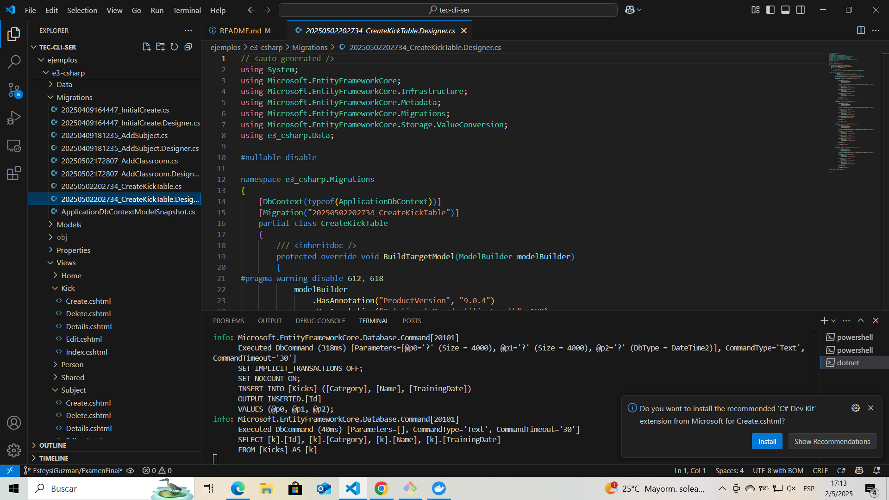
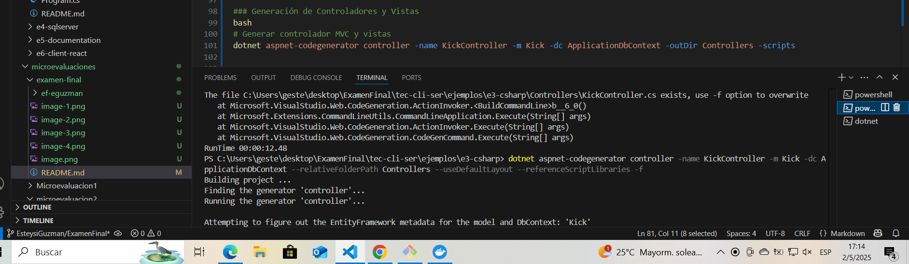
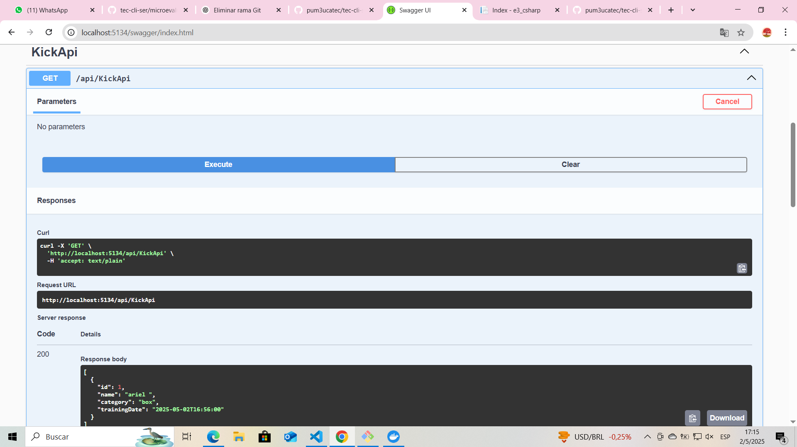
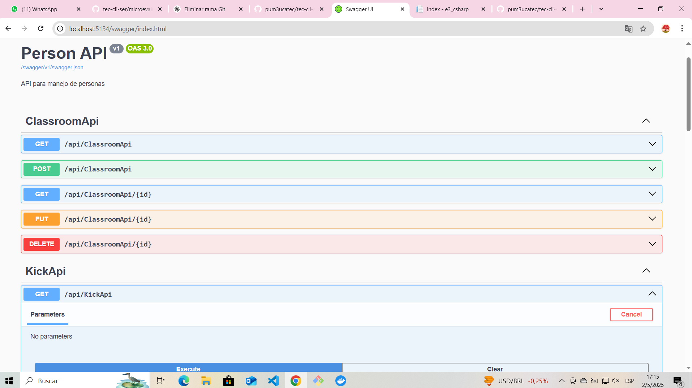
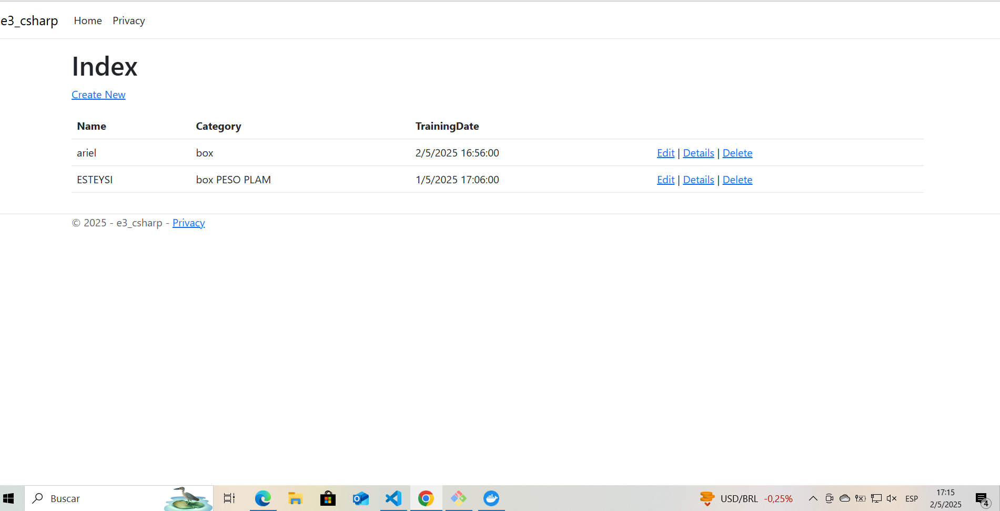

# 📘 RESPUESTA 3

TABLA  Y REALIZA API BACKED CON 3 CAMPOS.

---

## 🛠 Tecnologías utilizadas

- 🐳 **Docker Desktop** [Descargar Docker](https://www.docker.com/products/docker-desktop)
- ⚙️ **.NET SDK 9.0** [Descargar .NET](https://dotnet.microsoft.com/es-es/download)
- ⚙️ **Node.js LTS** [Descargar Node.js](https://nodejs.org/en)
---

## 📸 Capturas de Pantalla

### Página principal


### EXAMEN VISTA


---

## 💻 Cómo ejecutar el proyecto

```bash
# Clonar el repositorio
git clone https://github.com/pum3ucatec/tec-cli-ser.git

# Entrar al directorio
Y AQUI ME CREE LA RAMA DE Examen 

# Implementación de Kick (Kinboxing) en e3-csharp

## Estructura de la Tabla Kick
La tabla Kick fue implementada con los siguientes campos:
- Id (int, Primary Key)
- Name (string, Required)
- Category (string, Required)
- TrainingDate (DateTime)

## Componentes Implementados

### 1. Modelo (Models/Kick.cs)
csharp
public class Kick
{
    public int Id { get; set; }
    public string Name { get; set; } = string.Empty;
    public string Category { get; set; } = string.Empty;
    public DateTime TrainingDate { get; set; }
}


### 2. Controladores
Se implementaron dos controladores:

#### KickController (MVC)
- Index: Lista todos los entrenamientos
- Details: Muestra detalles de un entrenamiento
- Create: Crea nuevo entrenamiento
- Edit: Modifica entrenamiento existente
- Delete: Elimina entrenamiento

#### KickApiController (API REST)
- GET /api/Kick: Obtiene todos los entrenamientos
- GET /api/Kick/{id}: Obtiene un entrenamiento específico
- POST /api/Kick: Crea nuevo entrenamiento
- PUT /api/Kick/{id}: Actualiza entrenamiento
- DELETE /api/Kick/{id}: Elimina entrenamiento

### 3. Vistas

Se generaron las siguientes vistas en Views/Kick:
- Index.cshtml: Lista de entrenamientos
- Create.cshtml: Formulario de creación
- Edit.cshtml: Formulario de edición
- Delete.cshtml: Confirmación de eliminación

### 4. Migración

Se creó la migración 20250502202734_CreateKickTable que:
- Crea la tabla Kicks
- Define las columnas y sus tipos
- Establece las restricciones necesarias

## Comandos Utilizados

### Creación del Modelo y Migración
bash
# Crear migración para la tabla Kick
dotnet ef migrations add CreateKickTable

# Aplicar migración a la base de datos
dotnet ef database update


### Generación de Controladores y Vistas
bash
# Generar controlador MVC y vistas
dotnet aspnet-codegenerator controller -name KickController -m Kick -dc ApplicationDbContext -outDir Controllers -scripts


## Imágenes del Proceso

### Estructura de la Base de Datos


### Interfaz de Usuario



## Notas Adicionales
- La tabla Kick está relacionada con el sistema de gestión de entrenamientos
- Se implementó tanto una interfaz web (MVC) como una API REST
- Los datos incluyen nombre, categoría y fecha del entrenamiento

## Referencias
- GUID del Proyecto: C3038BE5-58A7-4D6E-D141-D55989755244
- GUID de la Solución: E169EE97-E6F5-4925-A4E1-65F19BB76982
