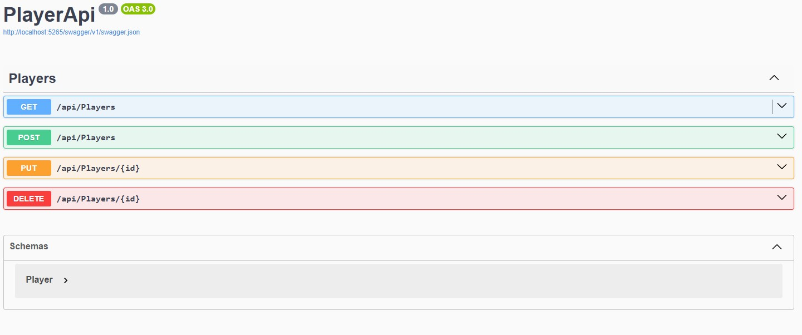
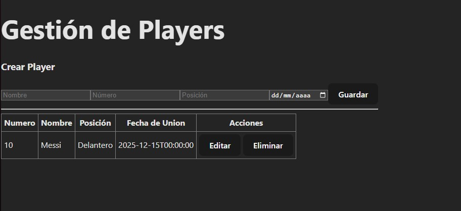

# Proyecto simple Cliente-Servidor

Este proyecto demuestra una arquitectura **Cliente–Servidor** usando:

* **Backend**: ASP.NET Core Web API (C#)
* **Base de datos**: SQL Server
* **Cliente**: React
* **Documentación de API**: Swagger

Se trabajará con una sola tabla de prueba llamada **Player**.

---


## Base de datos (SQL Server)

### Tabla Player

```sql
CREATE TABLE Player (
    Id INT IDENTITY PRIMARY KEY,
    Nombre NVARCHAR(100) NOT NULL,
    Numero INT NOT NULL,
    Posicion NVARCHAR(50) NOT NULL,
    FechaUnion DATE NOT NULL
);
```

---

## Backend – ASP.NET Core Web API

### Crear el proyecto

```bash
dotnet new webapi -n Backend
dotnet add package Microsoft.EntityFrameworkCore.SqlServer
dotnet add package Microsoft.EntityFrameworkCore.Tools
dotnet add package DotNetEnv
```

---

### Modelo (Models/Player.cs)

```csharp
namespace Models
{
    public class Player
    {
        public int Id { get; set; }
        public string Nombre { get; set; }
        public int Numero { get; set; }
        public string Posicion { get; set; }
        public DateTime FechaUnion { get; set; }
    }
}
```

---

### DbContext (Data/AppDbContext.cs)

```csharp
using Microsoft.EntityFrameworkCore;
using Models;

namespace Data
{
    public class AppDbContext : DbContext
    {
        public AppDbContext(DbContextOptions<AppDbContext> options)
            : base(options)
        {
        }

        public DbSet<Player> Players { get; set; }
    }
}

```

---

### Configuración (appsettings.json)

```json
{
  "Logging": {
    "LogLevel": {
      "Default": "Information",
      "Microsoft.AspNetCore": "Warning"
    }
  },
  "AllowedHosts": "*"
}
```
Usa un `.env`para la configuracion de la conexion a base de datos.

---

### Program.cs

```csharp
using Backend.Data;
using Microsoft.EntityFrameworkCore;

var builder = WebApplication.CreateBuilder(args);

builder.Services.AddControllers();
builder.Services.AddDbContext<AppDbContext>(options =>
    options.UseSqlServer(builder.Configuration.GetConnectionString("DefaultConnection")));

builder.Services.AddEndpointsApiExplorer();
builder.Services.AddSwaggerGen();
builder.Services.AddCors();

var app = builder.Build();

app.UseSwagger();
app.UseSwaggerUI();

app.UseCors(x => x.AllowAnyOrigin().AllowAnyMethod().AllowAnyHeader());

app.UseAuthorization();
app.MapControllers();
app.Run();
```

---

### Controlador (Controllers/PlayersController.cs)

```csharp
using Microsoft.AspNetCore.Mvc;
using Data;
using Models;


[ApiController]
[Route("api/[controller]")]
public class PlayersController : ControllerBase
{
private readonly AppDbContext _context;


public PlayersController(AppDbContext context)
{
_context = context;
}


[HttpGet]
public IActionResult Get() => Ok(_context.Players.ToList());


[HttpPost]
public IActionResult Post(Player player)
{
_context.Players.Add(player);
_context.SaveChanges();
return Ok(player);
}


[HttpPut("{id}")]
public IActionResult Put(int id, Player player)
{
var p = _context.Players.Find(id);
if (p == null) return NotFound();


p.Nombre = player.Nombre;
p.Numero = player.Numero;
p.Posicion = player.Posicion;
p.FechaUnion = player.FechaUnion;


_context.SaveChanges();
return Ok(p);
}


[HttpDelete("{id}")]
public IActionResult Delete(int id)
{
var p = _context.Players.Find(id);
if (p == null) return NotFound();


_context.Players.Remove(p);
_context.SaveChanges();
return Ok();
}
}
```

---

### Swagger

Al ejecutar:

```bash
dotnet run
```

Acceder a:

```
https://localhost:5001/swagger
```

La vista deberia verse asi:



---

## Frontend – React

### Instalación de herramientas

1. **Node.js** (incluye npm)

   * Descargar desde [https://nodejs.org](https://nodejs.org)
2. **Crear proyecto React**

```bash
npm create vite@latest Frontend -- --template react
cd Frontend
npm install
npm run dev
```

---

### API helper (src/api/playerApi.js)

```javascript
const API_URL = "http://localhost:5001/api/players";

export const getPlayers = async () => {
  const res = await fetch(API_URL);
  if (!res.ok) {
    const errorText = await res.text();
    console.error("Error desde la API:", errorText);
    throw new Error(`HTTP ${res.status} - ${errorText}`);
  }
  return res.json();
};

export const createPlayer = async (player) => {
  const res = await fetch(API_URL, {
    method: "POST",
    headers: { "Content-Type": "application/json" },
    body: JSON.stringify(player)
  });
  if (!res.ok) {
    const errorText = await res.text();
    throw new Error(`HTTP ${res.status} - ${errorText}`);
  }
  return res.json();
};

export const updatePlayer = async (id, player) => {
  const res = await fetch(`${API_URL}/${id}`, {
    method: "PUT",
    headers: { "Content-Type": "application/json" },
    body: JSON.stringify(player)
  });
  if (!res.ok) {
    const errorText = await res.text();
    throw new Error(`HTTP ${res.status} - ${errorText}`);
  }
  return res.json();
};

export const deletePlayer = async (id) => {
  const res = await fetch(`${API_URL}/${id}`, { method: "DELETE" });
  if (!res.ok) {
    const errorText = await res.text();
    throw new Error(`HTTP ${res.status} - ${errorText}`);
  }
};

```

---

### Lista (components/PlayerList.jsx)

```jsx
import { useEffect, useState } from "react";
import { getPlayers } from "../api/playerApi";


export default function PlayerList() {
const [players, setPlayers] = useState([]);


useEffect(() => {
getPlayers().then(setPlayers);
}, []);


return (
<ul>
{players.map(p => (
<li key={p.id}>{p.numero} - {p.nombre} - {p.posicion} - {p.fechaUnion}</li>
))}
</ul>
);
}
```

---

### Crear (components/PlayerCreate.jsx)

```jsx
import { useState } from "react";
import { createPlayer } from "../api/playerApi";


export default function PlayerCreate({ onCreated }) {
const [player, setPlayer] = useState({
nombre: "",
numero: 0,
posicion: "",
fechaUnion: ""
});


const handleChange = e => {
setPlayer({ ...player, [e.target.name]: e.target.value });
};


const handleSubmit = async e => {
e.preventDefault();
await createPlayer(player);
onCreated && onCreated();
};


return (
<form onSubmit={handleSubmit}>
<h3>Crear Player</h3>
<input name="nombre" placeholder="Nombre" onChange={handleChange} />
<input name="numero" type="number" placeholder="Número" onChange={handleChange} />
<input name="posicion" placeholder="Posición" onChange={handleChange} />
<input name="fechaUnion" type="date" onChange={handleChange} />
<button type="submit">Guardar</button>
</form>
);
}
```

---

### Editar (components/PlayerEdit.jsx)

```jsx
import { useState } from "react";
import { updatePlayer } from "../api/playerApi";


export default function PlayerEdit({ player, onUpdated }) {
const [form, setForm] = useState(player);


const handleChange = e => {
setForm({ ...form, [e.target.name]: e.target.value });
};


const handleSubmit = async e => {
e.preventDefault();
await updatePlayer(form.id, form);
onUpdated && onUpdated();
};


return (
<form onSubmit={handleSubmit}>
<h3>Editar Player</h3>
<input name="nombre" value={form.nombre} onChange={handleChange} />
<input name="numero" type="number" value={form.numero} onChange={handleChange} />
<input name="posicion" value={form.posicion} onChange={handleChange} />
<input name="fechaUnion" type="date" value={form.fechaUnion?.substring(0,10)} onChange={handleChange} />
<button type="submit">Actualizar</button>
</form>
);
}
```

---

### Eliminar (components/PlayerDelete.jsx)

```jsx
import { deletePlayer } from "../api/playerApi";


export default function PlayerDelete({ id, onDeleted }) {
const handleDelete = async () => {
if (confirm("¿Eliminar este jugador?")) {
await deletePlayer(id);
onDeleted && onDeleted();
}
};


return (
<button onClick={handleDelete}>Eliminar</button>
);
}
```

---

### App.jsx (orquestador CRUD)

Este componente actúa como **controlador del frontend**, mostrando la lista y dirigiendo a las funciones CRUD.

```jsx
import { useEffect, useState } from "react";
import PlayerList from "./components/PlayerList";
import PlayerCreate from "./components/PlayerCreate";
import PlayerEdit from "./components/PlayerEdit";
import PlayerDelete from "./components/PlayerDelete";
import { getPlayers } from "./api/playerApi";

function App() {
  const [players, setPlayers] = useState([]);
  const [selected, setSelected] = useState(null);

  const loadPlayers = () => {
    getPlayers().then(setPlayers);
    setSelected(null);
  };

  useEffect(() => {
    loadPlayers();
  }, []);

  return (
    <div>
      <h1>Gestión de Players</h1>

      <PlayerCreate onCreated={loadPlayers} />

      <hr />

      <table border="1" cellPadding="5" style={{ borderCollapse: "collapse" }}>
        <thead>
          <tr>
            <th>Numero</th>
            <th>Nombre</th>
            <th>Posición</th>
            <th>Fecha de Union</th>
            <th>Acciones</th>
          </tr>
        </thead>
        <tbody>
          {players.map((p) => (
            <tr key={p.id}>
              <td>{p.numero}</td>
              <td>{p.nombre}</td>
              <td>{p.posicion}</td>
              <td>{p.fechaUnion}</td>
              <td>
                <button onClick={() => setSelected(p)}>Editar</button>{" "}
                <PlayerDelete id={p.id} onDeleted={loadPlayers} />
              </td>
            </tr>
          ))}
        </tbody>
      </table>

      {selected && (
        <>
          <hr />
          <PlayerEdit player={selected} onUpdated={loadPlayers} />
        </>
      )}
    </div>
  );
}

export default App;

```

---

## Ejecución del proyecto

1. Iniciar SQL Server y crear la base de datos
2. Ejecutar Backend

   ```bash
   dotnet run
   ```
3. Ejecutar Frontend

   ```bash
   npm run dev
   ```
4. Ve a la direccion especificada en VITE.

Una vez dentro, deberia verse de la siguiente forma:



---


