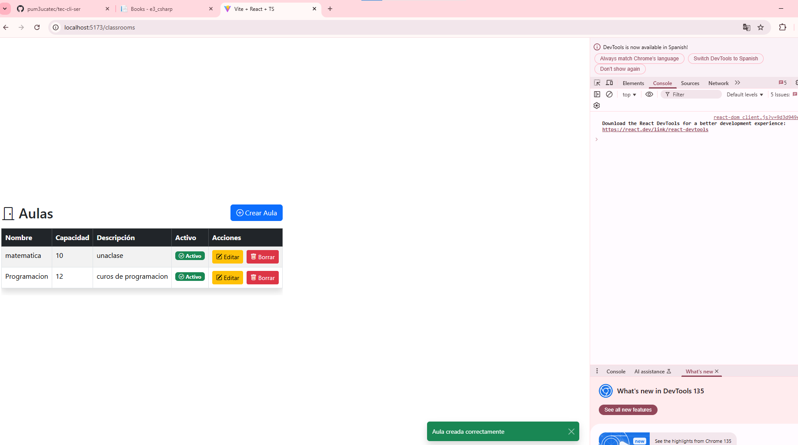
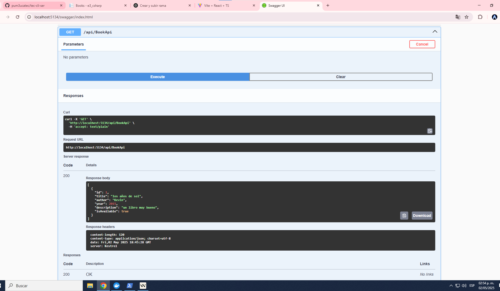

## EXAMEN FINAL - AMERICO LOVERA

## Pregunta - 2 - Creación de la tabla Classroom y CRUD React

### 1. Creación del modelo Classroom en .NET
El modelo Classroom se encuentra en `Models/Classroom.cs`:

```csharp
public class Classroom
{
    [Key]
    public int Id { get; set; }
    [Required]
    [StringLength(50)]
    public string Name { get; set; } = string.Empty;
    [Required]
    public int Capacity { get; set; }
    [StringLength(200)]
    public string Description { get; set; } = string.Empty;
    [Required]
    public bool IsActive { get; set; } = true;
}
```

### 2. Registro en el DbContext
En `Data/ApplicationDbContext.cs`:
```csharp
public DbSet<Classroom> Classrooms { get; set; }
```

### 3. Migraciones y actualización de la base de datos
```bash
dotnet ef migrations add AddClassroomTable
dotnet ef database update
```

### 4. Creación del CRUD en React

#### a) Tabla de aulas (ClassroomTable)
- Ubicación: `src/components/ClassroomTable.tsx`
- Permite listar, crear, editar y eliminar aulas.
- Utiliza Bootstrap para el diseño visual.
- Muestra badges de estado (Activo/Inactivo) y botones con iconos para Editar y Borrar.
- Llama a la API RESTful de .NET (`/api/ClassroomApi`).

#### b) Formulario de aula (ClassroomForm)
- Ubicación: `src/components/ClassroomForm.tsx`
- Formulario reutilizable para crear y editar aulas.
- Validación de campos requeridos.

#### c) Experiencia de usuario
- Al crear, editar o eliminar, se muestra un toast (notificación) con el resultado.
- El diseño es responsivo y moderno gracias a Bootstrap y Bootstrap Icons.
---

---
#### e) Integración CORS
- Se configuró CORS en el backend para permitir peticiones desde React (puerto 5173).

---

## Pregunta - 3 - Creación y pruebas de la tabla Book en .NET (e3)

### 1. Creación del modelo Book
El modelo Book se define en `Models/Book.cs`:

```csharp
public class Book
{
    [Key]
    public int Id { get; set; }

    [Required]
    [StringLength(100)]
    public string Title { get; set; } = string.Empty;

    [Required]
    [StringLength(100)]
    public string Author { get; set; } = string.Empty;

    [Required]
    public int Year { get; set; }

    [StringLength(500)]
    public string Description { get; set; } = string.Empty;

    [Required]
    public bool IsAvailable { get; set; } = true;
}
```

### 2. Registro en el DbContext
En `Data/ApplicationDbContext.cs` se agrega:

```csharp
public DbSet<Book> Books { get; set; }
```

### 3. Creación de la migración y actualización de la base de datos
Para crear la migración y aplicar los cambios ejecuta:

```bash
dotnet ef migrations add AddBookTable
dotnet ef database update
```

Esto genera la tabla `Books` en la base de datos.

### 4. Pruebas de los endpoints Book con Swagger
Con el backend en modo desarrollo, accede a:

```
http://localhost:5134/swagger
```

Ahí puedes probar los endpoints:
- `GET /api/BookApi` (listar libros)
- `POST /api/BookApi` (crear libro)
- `PUT /api/BookApi/{id}` (actualizar libro)
- `DELETE /api/BookApi/{id}` (eliminar libro)

Swagger permite enviar datos, ver respuestas y validar el correcto funcionamiento de la API Book.

---

---
**Resumen:**
- Se creó el modelo Book y se registró en el DbContext..
---