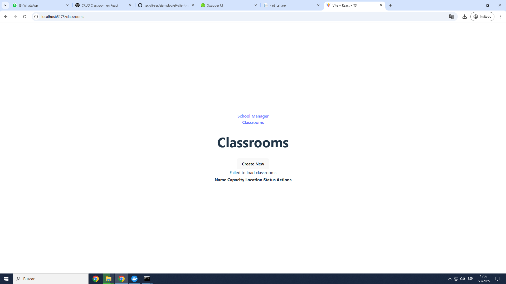
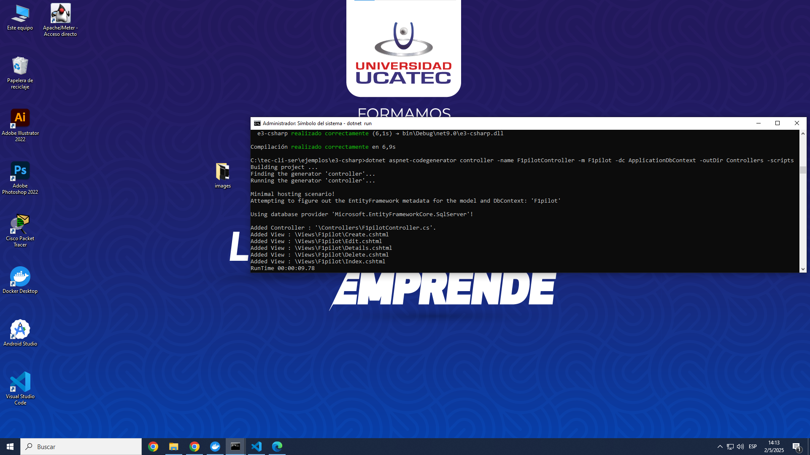
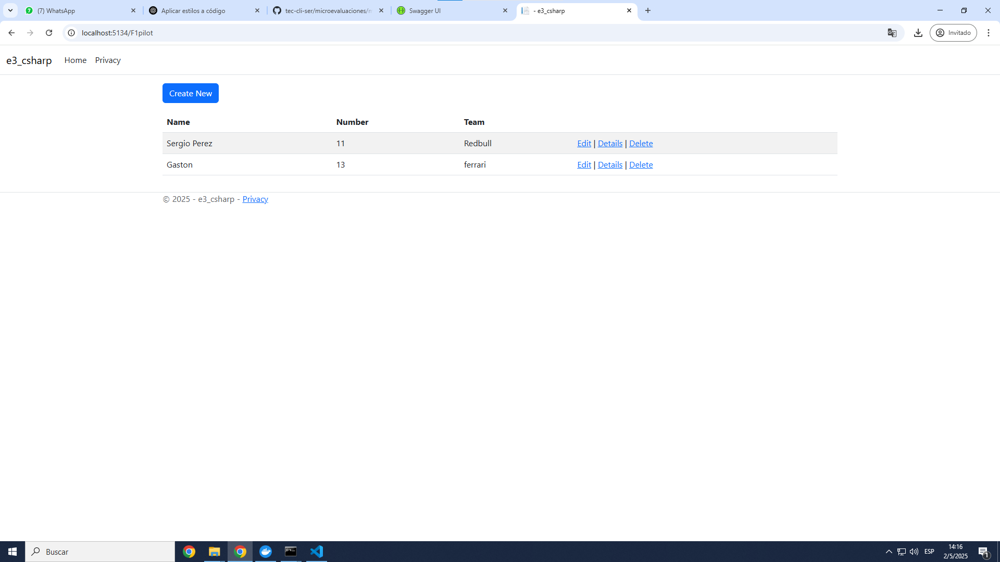
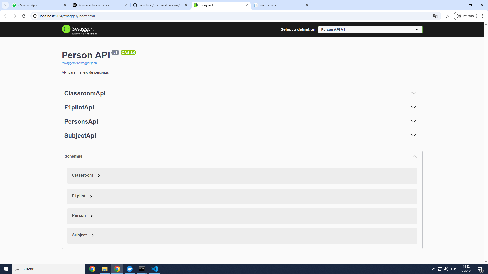
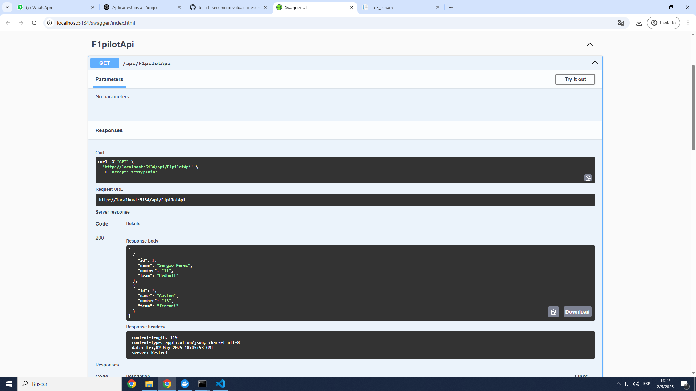

# 📘 Guía: Examen Final


## ✅ Requisitos Previos

Antes de comenzar, asegurate de tener instalado lo siguiente:

- 🐳 **Docker Desktop** [Descargar Docker](https://www.docker.com/products/docker-desktop)
- ⚙️ **.NET SDK 9.0** [Descargar .NET](https://dotnet.microsoft.com/es-es/download)
- ⚙️ **Node.js LTS** [Descargar Node.js](https://nodejs.org/en)

---
# 📘 Inciso 2

Añadimos los distintos modulos para classroom:


Aqui esta la vista de vite:


## Al final no dio bien :c

# 📘 Inciso 3
## 📝  Paso 1: Crear el Modelo F1pilot

Primero, creamos el modelo `F1pilot` dentro de la carpeta `Models`. Crea el archivo `Models/F1pilot.cs` con el siguiente contenido:

```csharp
namespace e3_csharp.Models;
public class F1pilot
{
    public int ID { get; set; }
    public string Name { get; set; } = string.Empty;
    public string Number { get; set; } = string.Empty;
    public string Team { get; set; } = "AC";
}
```
📌 Este modelo representa una "Clase" con sus propiedades: `ID`, `Name`, `Number`, y `Team`.

---

## 🔄 Paso 2: Agregar el Modelo al DbContext

A continuación, agregamos el modelo `F1pilot` al `DbContext`. Abre el archivo `Data/ApplicationDbContext.cs` y agrega lo siguiente dentro de la clase `applicationDbContext`:

```csharp
public DbSet<F1pilot> F1pilots { get; set; }
```
📌 Esto permitirá a Entity Framework rastrear y gestionar las tablas relacionadas con `F1pilot` en la base de datos.

---

## 🛠️ Paso 3: Generar el Controlador y la Vista

Después de agregar el modelo al contexto, compilamos nuevamente el proyecto para asegurarnos de que todo esté en orden:

```bash
dotnet build
```

Luego generamos automáticamente el controlador y las vistas CRUD para el modelo `F1pilot` usando el generador de scaffolding:

```bash
dotnet aspnet-codegenerator controller -name F1pilotController -m F1pilot -dc ApplicationDbContext -outDir Controllers -scripts
```
📌 Este comando hace lo siguiente:

- Crea un controlador llamado `F1pilotController.cs` en la carpeta `Controllers`.

- Genera automáticamente las vistas asociadas (Create, Read, Update, Delete).

- Usa el modelo `F1pilot` y el contexto `ApplicationDbContext`.




🔧 Asegúrate de tener instalado el generador si el comando no te funciona. Lo puedes instalar con:

```bash
dotnet tool install -g dotnet-aspnet-codegenerator
```

---

## 🗓️ Paso 4: Crear Migración y Actualizar la Base de Datos

Después de generar el controlador y las vistas, compilamos nuevamente el proyecto:

```bash
dotnet build
```


Luego creamos una migración para aplicar los cambios del modelo F1pilot a la base de datos:

```bash
dotnet ef migrations add AddF1pilot
```

Y actualizamos la base de datos con:

```bash
dotnet ef database update
```

Finalmente, ejecutamos el proyecto:

```bash
dotnet run
```


✅ Ahora la tabla `F1pilots` debería estar creada en la base de datos, y podés acceder a la vista desde el navegador, en `localhost:5134/F1pilot`.

---

## 📅 Paso 5: Ver las Vistas Generadas

Una vez en ejecución, podés acceder a las siguiente vista desde el navegador:

- 📄`localhost:5134/F1pilot`



Cada vista permite operaciones CRUD completas sobre su modelo correspondiente.

---

# Proyecto API para F1Pilots

## Descripción
Este proyecto es una API en ASP.NET Core que permite gestionar información de **F1pilots** (Subjects) utilizando controladores API (`ApiController`) y Entity Framework Core.

## Pasos Realizados

### 1. Creación de Controladores API
Se crearon los siguientes controladores en la carpeta `Controllers/`:
- `F1pilotApiController`


Estos controladores exponen los endpoints necesarios para CRUD básico de las tablas `F1pilots`.

### 2. Código de los controladores

#### Código de `F1pilotApiController.cs`
```csharp
using System.Collections.Generic;
using System.Linq;
using System.Threading.Tasks;
using Microsoft.AspNetCore.Mvc;
using Microsoft.EntityFrameworkCore;
using e3_csharp.Data;
using e3_csharp.Models;

namespace e3_csharp.Controllers
{
    [Route("api/[controller]")]
    [ApiController]
    public class F1pilotApiController : ControllerBase
    {
        private readonly ApplicationDbContext _context;

        public F1pilotApiController(ApplicationDbContext context)
        {
            _context = context;
        }

        // GET: api/F1pilotApi
        [HttpGet]
        public async Task<ActionResult<IEnumerable<F1pilot>>> GetF1pilots()
        {
            return await _context.F1pilots.ToListAsync();
        }

        // GET: api/F1pilotApi/5
        [HttpGet("{id}")]
        public async Task<ActionResult<F1pilot>> GetF1pilot(int id)
        {
            var pilot = await _context.F1pilots.FindAsync(id);

            if (pilot == null)
            {
                return NotFound();
            }

            return pilot;
        }

        // PUT: api/F1pilotApi/5
        [HttpPut("{id}")]
        public async Task<IActionResult> PutF1pilot(int id, F1pilot pilot)
        {
            if (id != pilot.ID)
            {
                return BadRequest();
            }

            _context.Entry(pilot).State = EntityState.Modified;

            try
            {
                await _context.SaveChangesAsync();
            }
            catch (DbUpdateConcurrencyException)
            {
                if (!F1pilotExists(id))
                {
                    return NotFound();
                }
                else
                {
                    throw;
                }
            }

            return NoContent();
        }

        // POST: api/F1pilotApi
        [HttpPost]
        public async Task<ActionResult<F1pilot>> PostF1pilot(F1pilot pilot)
        {
            _context.F1pilots.Add(pilot);
            await _context.SaveChangesAsync();

            return CreatedAtAction("GetF1pilot", new { id = pilot.ID }, pilot);
        }

        // DELETE: api/F1pilotApi/5
        [HttpDelete("{id}")]
        public async Task<IActionResult> DeleteF1pilot(int id)
        {
            var pilot = await _context.F1pilots.FindAsync(id);
            if (pilot == null)
            {
                return NotFound();
            }

            _context.F1pilots.Remove(pilot);
            await _context.SaveChangesAsync();

            return NoContent();
        }

        private bool F1pilotExists(int id)
        {
            return _context.F1pilots.Any(e => e.ID == id);
        }
    }
}

```

### 3. Comandos ejecutados paso a paso

#### 3.1. Compilar el proyecto
Este comando verifica que no haya errores de compilación:
```bash
dotnet build
```

#### 3.2. Crear una nueva migración
Este comando genera una migración basada en los modelos actualizados:
```bash
dotnet ef migrations add NombreDeLaMigracion
```

> Reemplaza `NombreDeLaMigracion` por un nombre descriptivo como `AddSubjectAndF1pilotTables`


#### 3.3. Aplicar la migración a la base de datos
Este comando actualiza la base de datos con la nueva migración:
```bash
dotnet ef database update
```

#### 3.4. Ejecutar el proyecto
Este comando inicia el servidor web y expone las rutas API:
```bash
dotnet run
```

Con esto, la tabla `F1pilot` están disponibles a través de sus respectivas APIs en la rutas:
- `/api/F1pilotApi`

### 4. Capturas del Swagger
A continuación se puede observar el Swagger UI mostrando:
- La ruta general de la API (`/swagger`)
- Los endpoints de `F1pilot`.



#### F1pilotApi



