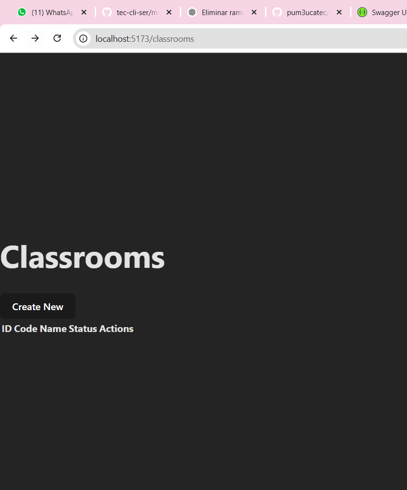

# Frontend de Classroom en React

Este documento explica cómo se implementó el CRUD de **Classroom** en React, los comandos utilizados y deja espacios para agregar capturas de pantalla del proceso y la aplicación funcionando.

---

## 1. Creación del Proyecto React

Se utilizó Vite para crear un proyecto React moderno con TypeScript:

```bash
npm create vite@latest e6-client-react -- --template react-ts
cd e6-client-react
npm install
```

---

## 2. Instalación de Dependencias

Se instalaron las siguientes dependencias para el desarrollo del CRUD:

```bash
npm install axios react-router-dom
npm install --save-dev @types/react @types/react-dom @types/react-router-dom
```

---

## 3. Definición del Modelo Classroom

Se creó la interfaz `Classroom` en `src/types/data.ts`:

```ts
export interface Classroom {
  id: number;
  code: string;
  name: string;
  status: string;
}
```

---

## 4. Servicio de API para Classroom


Se creó el archivo `src/services/classroomApi.ts` para manejar las peticiones HTTP al backend:

```ts
import axios from 'axios';
import { Classroom } from '../types/data';

const API_URL = 'http://localhost:5134/api/ClassroomApi';

export const getClassrooms = async () => { /* ... */ };
export const getClassroom = async (id: number) => { /* ... */ };
export const createClassroom = async (classroom: Omit<Classroom, 'id'>) => { /* ... */ };
export const updateClassroom = async (id: number, classroom: Classroom) => { /* ... */ };
export const deleteClassroom = async (id: number) => { /* ... */ };
```

---

## 5. Componentes y Páginas

- **Formulario reutilizable:** `src/components/ClassroomForm.tsx`
- **Tabla de datos:** `src/components/ClassroomsDataTable.tsx`
- **Páginas:**
  - Listar: `src/pages/ListClassroomsPage.tsx`
  - Crear: `src/pages/CreateClassroomPage.tsx`
  - Editar: `src/pages/EditClassroomPage.tsx`
  - Detalles: `src/pages/DetailsClassroomPage.tsx`

---

## 6. Enrutamiento


Se agregaron las rutas en `src/router/Router.tsx`:

```ts
{
  path: "/classrooms",
  element: <ListClassroomsPage />,
},
{
  path: "/classrooms/create",
  element: <CreateClassroomPage />,
},
{
  path: "/classrooms/edit/:id",
  element: <EditClassroomPage />,
},
{
  path: "/classrooms/details/:id",
  element: <DetailsClassroomPage />,
},
```

---

## 7. Ejecución del Proyecto

Para correr el frontend:

```bash
npm run dev
```

La aplicación estará disponible en `http://localhost:5173/classrooms`.

---

## 8. Espacios para Imágenes

### Imagen 1: Estructura del proyecto


### Imagen 2: Listado de Classrooms



### Imagen 3: Formulario de Crear Classroom


---

## Notas
- Asegúrate de que el backend esté corriendo y accesible en `http://localhost:5134`.
- Si tienes problemas de CORS, revisa la configuración del backend. 