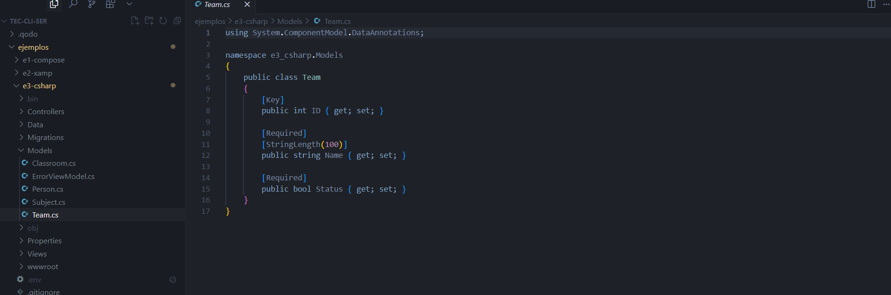
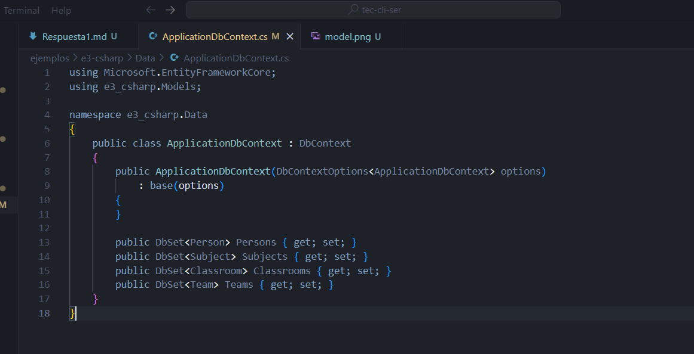
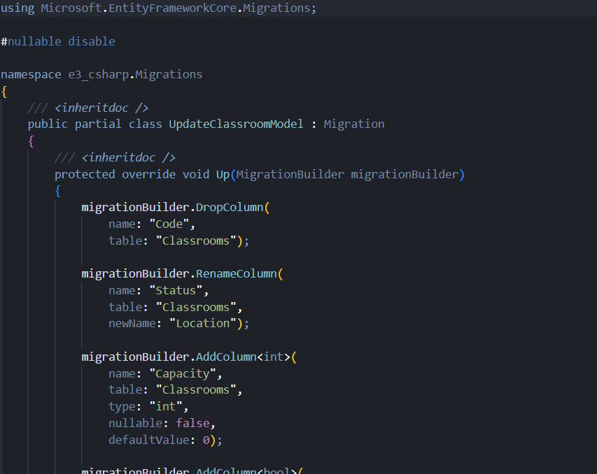
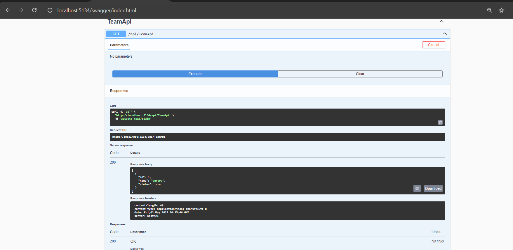
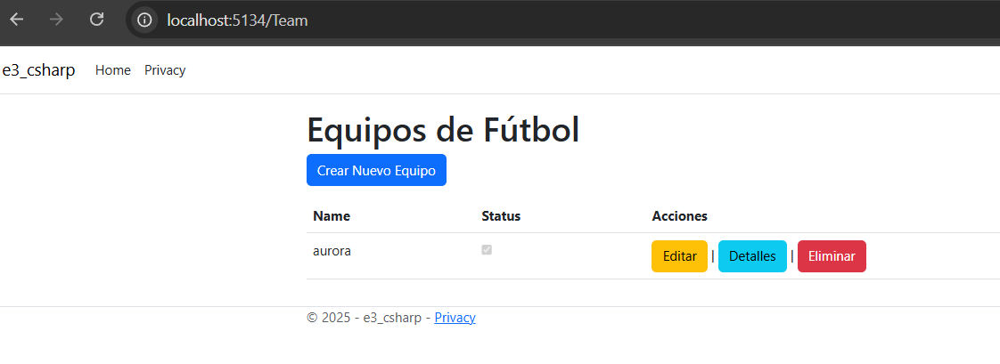

# Backend - School Management System (ASP.NET Core MVC)

## Requisitos Previos
- .NET 8.0 SDK
- SQL Server Express
- Visual Studio 2022 o Visual Studio Code

## Configuración Inicial

1. Instalar herramientas de Entity Framework
```bash
dotnet tool install --global dotnet-ef
```

2. Restaurar paquetes del proyecto
```bash
dotnet restore
```

3. Agregar paquetes necesarios
```bash
dotnet add package Microsoft.EntityFrameworkCore.SqlServer
dotnet add package Microsoft.EntityFrameworkCore.Design
dotnet add package Microsoft.EntityFrameworkCore.Tools
```

## Estructura del Proyecto
```
e3-csharp/
├── Controllers/
│   ├── TeamApiController.cs    # API endpoints para Teams
│   └── TeamController.cs       # Controlador MVC para Teams
├── Models/
│   └── Team.cs                 # Modelo de Team
├── Data/
│   └── ApplicationDbContext.cs # Contexto de base de datos
└── Migrations/                 # Migraciones de Entity Framework
```

## Pasos para crear la tabla Team

1. Crear el modelo Team
```csharp
public class Team
{
    public int ID { get; set; }
    public string Name { get; set; }
    public string Location { get; set; }
    public bool IsActive { get; set; }
}
```




2. Agregar el DbSet en ApplicationDbContext
```csharp
public DbSet<Team> Teams { get; set; }
```



3. Crear la migración
```bash
dotnet ef migrations add CreateTeamTable
```



4. Aplicar la migración a la base de datos
```bash
dotnet ef database update
```

## API Endpoints

### TeamApiController
- GET /api/TeamApi - Obtener todos los equipos
- GET /api/TeamApi/{id} - Obtener un equipo por ID
- POST /api/TeamApi - Crear un nuevo equipo
- PUT /api/TeamApi/{id} - Actualizar un equipo existente
- DELETE /api/TeamApi/{id} - Eliminar un equipo



## Ejecutar el Proyecto

1. Navegar al directorio del backend
```bash
cd ejemplos/e3-csharp
```

2. Ejecutar el proyecto
```bash
dotnet run
```

El backend estará disponible en: http://localhost:5134

## Solución de Problemas

1. Si hay problemas con las migraciones:
```bash
dotnet ef database update --force
```

2. Si hay problemas con los paquetes:
```bash
dotnet clean
dotnet restore
```


