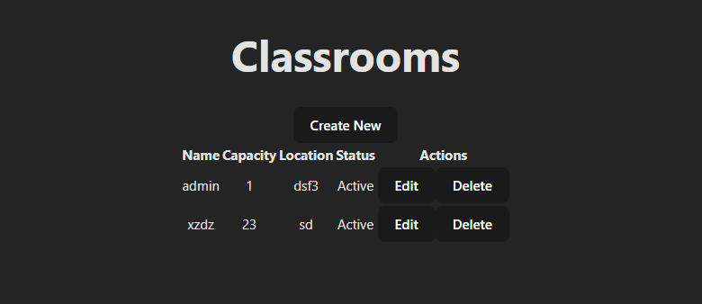
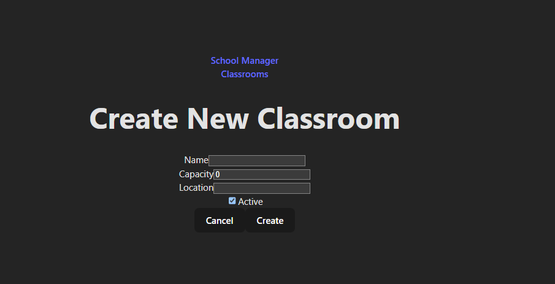
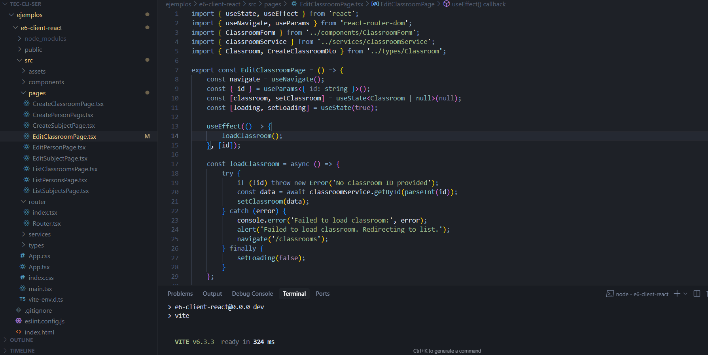
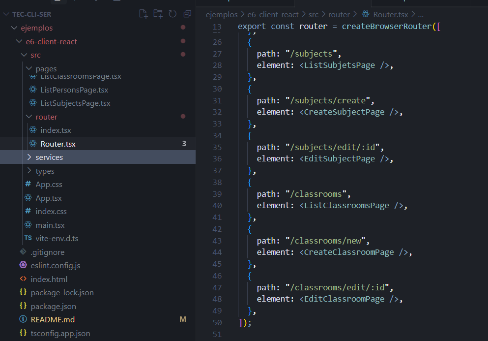
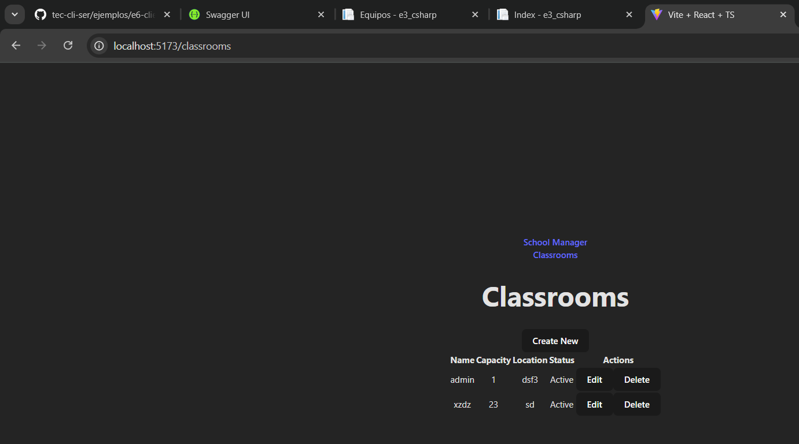
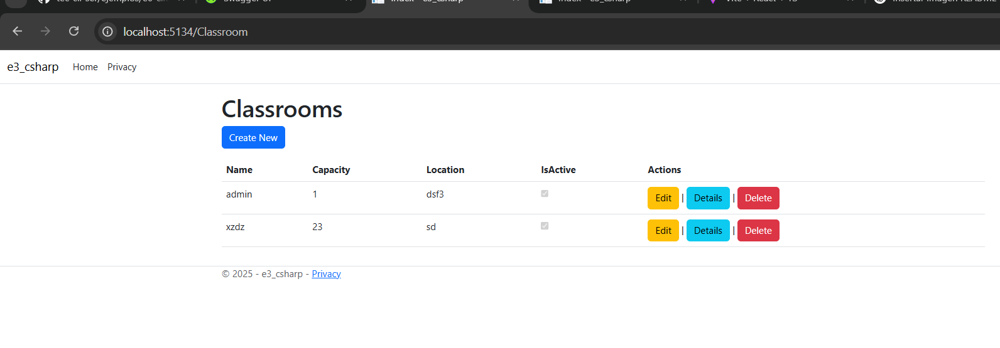

# Implementación de Vista Classroom - School Management System

## Estructura de Archivos
```
e6-client-react/src/
├── components/
│   └── ClassroomForm.tsx       # Formulario para crear/editar aulas
├── pages/
│   ├── ListClassroomsPage.tsx  # Lista de aulas
│   ├── CreateClassroomPage.tsx # Crear aula
│   └── EditClassroomPage.tsx   # Editar aula
├── services/
│   └── classroomService.ts     # Servicios para llamadas API
└── types/
    └── Classroom.ts            # Definiciones de tipos
```

## Implementación de Tipos
```typescript
// types/Classroom.ts
export interface Classroom {
    id: number;
    name: string;
    capacity: number;
    location: string;
    isActive: boolean;
}

export interface CreateClassroomDto {
    name: string;
    capacity: number;
    location: string;
    isActive: boolean;
}

export interface UpdateClassroomDto {
    id: number;
    name: string;
    capacity: number;
    location: string;
    isActive: boolean;
}
```
## Servicio de API
```typescript
// services/classroomService.ts
const API_URL = 'http://localhost:5134/api/ClassroomApi';

export const classroomService = {
    getAll: async (): Promise<Classroom[]> => {
        const response = await fetch(API_URL);
        if (!response.ok) {
            throw new Error('Failed to fetch classrooms');
        }
        return response.json();
    },

    getById: async (id: number): Promise<Classroom> => {
        const response = await fetch(`${API_URL}/${id}`);
        if (!response.ok) {
            throw new Error('Failed to fetch classroom');
        }
        return response.json();
    },

    create: async (classroom: CreateClassroomDto): Promise<Classroom> => {
        const response = await fetch(API_URL, {
            method: 'POST',
            headers: {
                'Content-Type': 'application/json',
            },
            body: JSON.stringify(classroom),
        });
        if (!response.ok) {
            throw new Error('Failed to create classroom');
        }
        return response.json();
    },

    update: async (classroom: UpdateClassroomDto): Promise<void> => {
        const response = await fetch(`${API_URL}/${classroom.id}`, {
            method: 'PUT',
            headers: {
                'Content-Type': 'application/json',
            },
            body: JSON.stringify(classroom),
        });
        if (!response.ok) {
            throw new Error('Failed to update classroom');
        }
    },

    delete: async (id: number): Promise<void> => {
        const response = await fetch(`${API_URL}/${id}`, {
            method: 'DELETE',
        });
        if (!response.ok) {
            throw new Error('Failed to delete classroom');
        }
    },
};
```

## Componentes

### Formulario de Aula
```typescript
// components/ClassroomForm.tsx
interface ClassroomFormProps {
    classroom?: Classroom;
    onSubmit: (classroom: CreateClassroomDto) => void;
    onCancel: () => void;
}

export const ClassroomForm: React.FC<ClassroomFormProps> = ({
    classroom,
    onSubmit,
    onCancel,
}) => {
    // ... implementación del formulario
};
```

### Lista de Aulas
```typescript
// pages/ListClassroomsPage.tsx
export const ListClassroomsPage = () => {
    const [classrooms, setClassrooms] = useState<Classroom[]>([]);
    // ... implementación de la lista
};
```



### Crear Aula
```typescript
// pages/CreateClassroomPage.tsx
export const CreateClassroomPage = () => {
    const navigate = useNavigate();
    // ... implementación de la creación
};
```



### Editar Aula
```typescript
// pages/EditClassroomPage.tsx
export const EditClassroomPage = () => {
    const { id } = useParams<{ id: string }>();
    // ... implementación de la edición
};
```



## Configuración de Rutas
```typescript
// router/index.tsx
export const router = createBrowserRouter([
    {
        path: '/',
        element: <Layout />,
        children: [
            {
                index: true,
                element: <ListClassroomsPage />,
            },
            {
                path: 'classrooms',
                element: <ListClassroomsPage />,
            },
            {
                path: 'classrooms/create',
                element: <CreateClassroomPage />,
            },
            {
                path: 'classrooms/edit/:id',
                element: <EditClassroomPage />,
            },
        ],
    },
]);
```



## Características Implementadas

1. **Lista de Aulas**
   - Muestra todas las aulas en una tabla
   - Botones para editar y eliminar
   - Indicador visual del estado (activo/inactivo)

2. **Crear Aula**
   - Formulario con validación
   - Campos: nombre, capacidad, ubicación y estado
   - Botón para cancelar y volver a la lista

3. **Editar Aula**
   - Carga los datos existentes del aula
   - Permite modificar todos los campos
   - Validación de formulario

4. **Eliminar Aula**
   - Confirmación antes de eliminar
   - Actualización automática de la lista


## Solución de Problemas

1. Si la API no responde:
   - Verificar que el backend esté corriendo en http://localhost:5134
   - Revisar la consola del navegador para errores CORS

2. Si los formularios no funcionan:
   - Verificar que todos los campos requeridos estén completos
   - Revisar la consola para errores de validación

3. Si la lista no se actualiza:
   - Verificar la conexión con la API
   - Revisar los logs del backend


