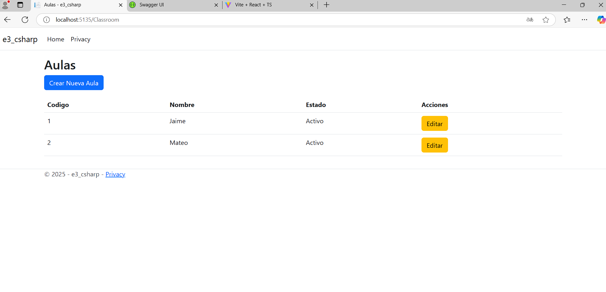
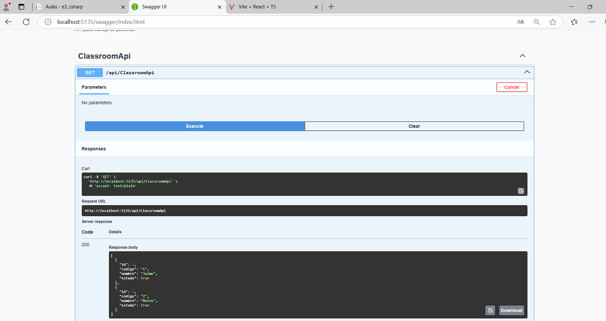
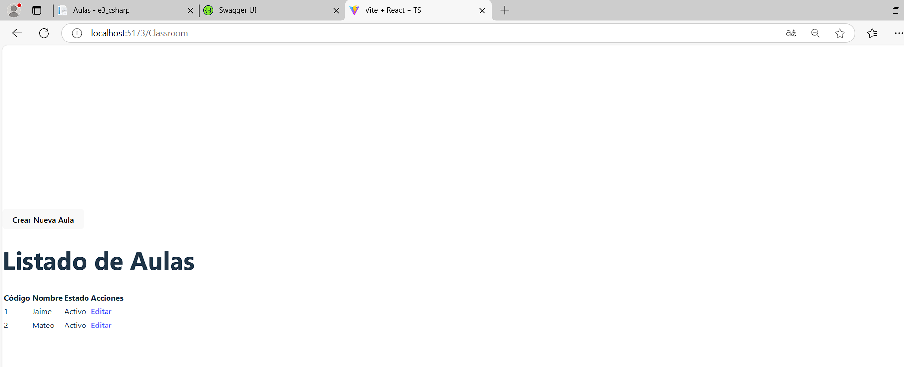

# 🏫 Sistema de Gestión de Aulas

Frontend desarrollado en **React** para la administración eficiente de aulas académicas.

## 📂 Estructura del Proyecto

```plaintext
src/
├── api/
│   └── classroomApi.ts          # Conexión con backend
├── components/
│   ├── classroom/
│   │   ├── ClassroomDataTable.tsx  # Tabla de aulas
│   │   └── ClassroomForm.tsx       # Formulario CRUD
├── pages/
│   ├── classroom/
│   │   ├── CreateClassroomPage.tsx # Creación
│   │   ├── EditClassroomPage.tsx   # Edición
│   │   └── ListClassroomPage.tsx   # Listado
```

## 🧱 Modelo de Datos

```typescript
interface Aula {
  id: number;
  codigo: string;    // Código único (requerido)
  nombre: string;    // Nombre descriptivo (requerido)
  estado: boolean;   // Activo/Inactivo
}
```

## 🛠 Componentes Principales

### 📊 ClassroomDataTable.tsx
- Tabla paginada con ordenamiento.
- Filtros por código y nombre.
- Acciones rápidas:
  - ✏️ Editar
  - 🔄 Cambiar estado
  - 👁️ Ver detalles

### 📝 ClassroomForm.tsx
```jsx
<ClassroomForm 
  initialData={aulaData} 
  onSubmit={handleSubmit}
  isEditing={true/false}
/>
```
- Validaciones integradas.
- Modo creación/edición.
- Diseño responsive.

## 🌐 Páginas Disponibles

| Página   | Ruta             | Descripción                            |
|----------|------------------|----------------------------------------|
| Listado  | `/aulas`         | Muestra todas las aulas con paginación |
| Creación | `/aulas/nuevo`   | Formulario para nueva aula             |
| Edición  | `/aulas/editar/:id` | Edición de aula existente           |

## 🔌 API Service

Métodos disponibles en `classroomApi.ts`:

```typescript
{
  obtenerAulas(): Promise<Aula>;             // GET /aulas
  obtenerAula(id: number): Promise<Aula>;    // GET /aulas/{id}
  crearAula(aula: Aula): Promise<void>;      // POST /aulas
  actualizarAula(id: number, aula: Aula): Promise<void>; // PUT /aulas/{id}
  cambiarEstado(id: number): Promise<void>;  // PATCH /aulas/{id}/estado
}
```

## 🚀 Instalación

1. Clonar el repositorio

```bash
git clone https://tu-repositorio.com
```

2. Instalar dependencias

```bash
npm install
```

3. Configurar variables de entorno

```bash
cp .env.example .env
```

4. Iniciar la aplicación

```bash
npm start
```

## 📦 Dependencias Principales

| Paquete           | Versión    | Uso                  |
|-------------------|------------|-----------------------|
| React             | ^18.2.0    | Core del proyecto     |
| Axios             | ^1.5.0     | Cliente HTTP          |
| React Hook Form   | ^7.45.0    | Manejo de formularios |
| Material UI       | ^5.14.0    | Componentes UI        |

## 📌 Requisitos

- Node.js v16 o superior
- npm v8 o superior
- Backend API activo

## 🎨 Características Adicionales

✔️ Internacionalización (i18n) preparada  
✔️ Esquema de colores configurable  
✔️ Soporte para temas claro/oscuro  
✔️ Optimizado para móviles  

---

© [Tu Nombre o Equipo] – 2025  
Proyecto desarrollado con ❤️ usando React

## Resultado de la tabla Classroom

# En el csharp


# En el swagger


# En el react
