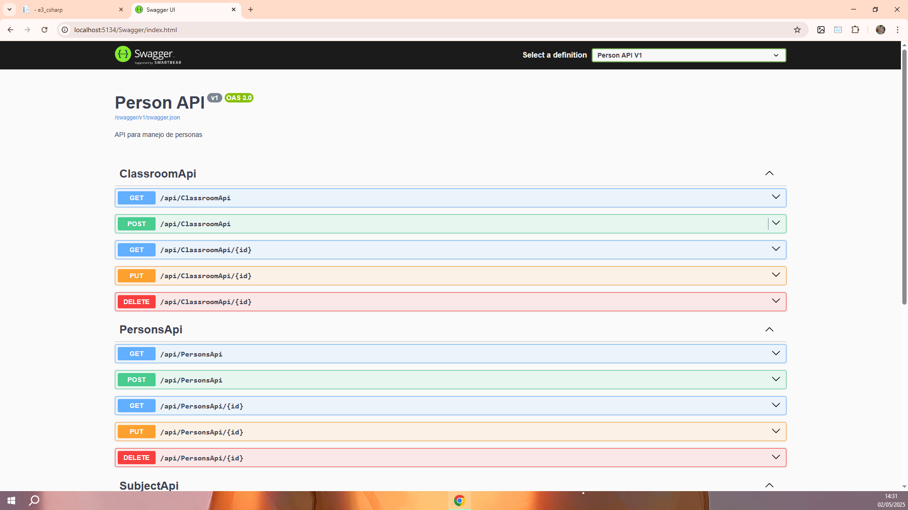
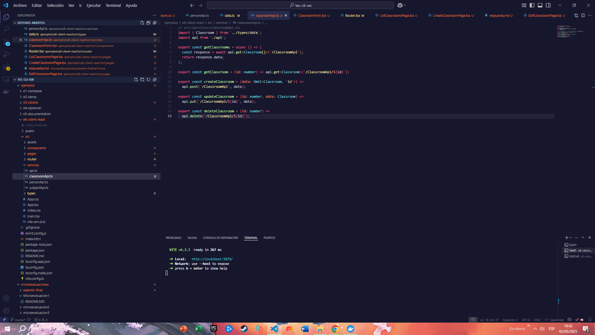
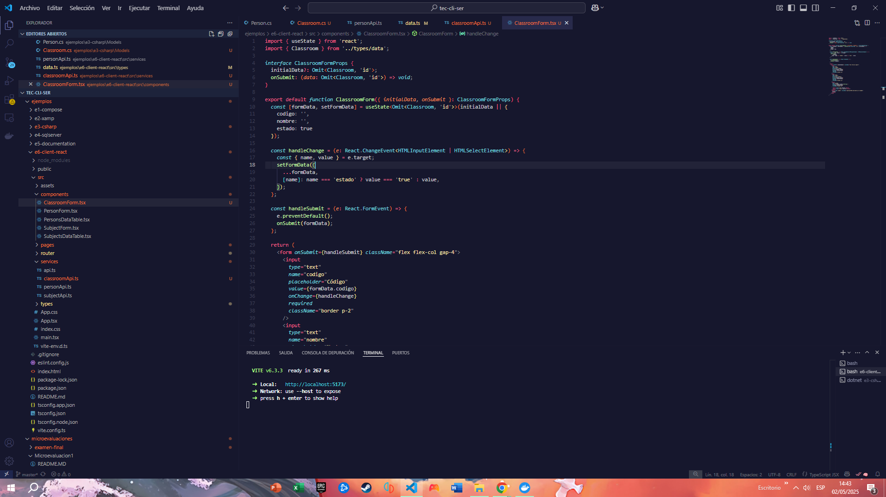
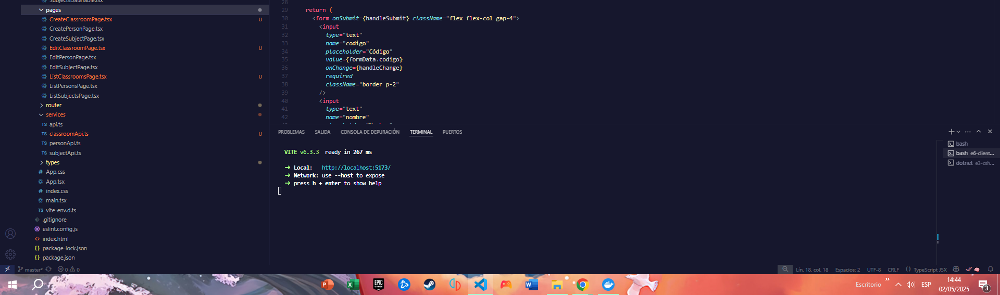
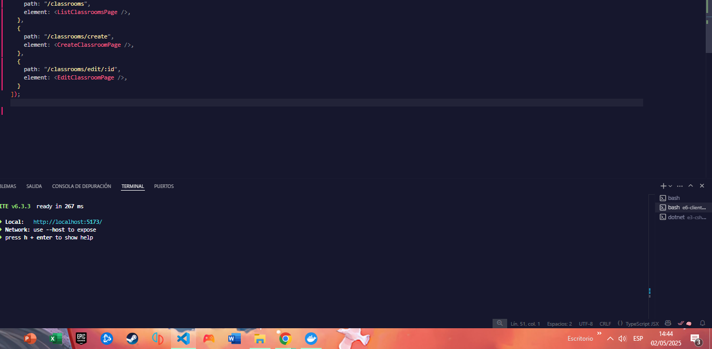
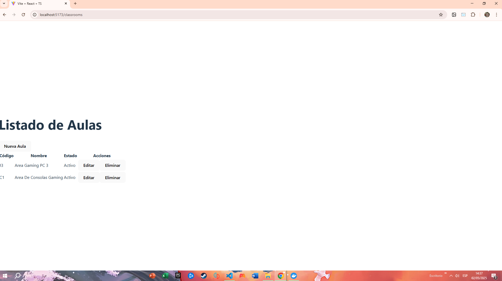
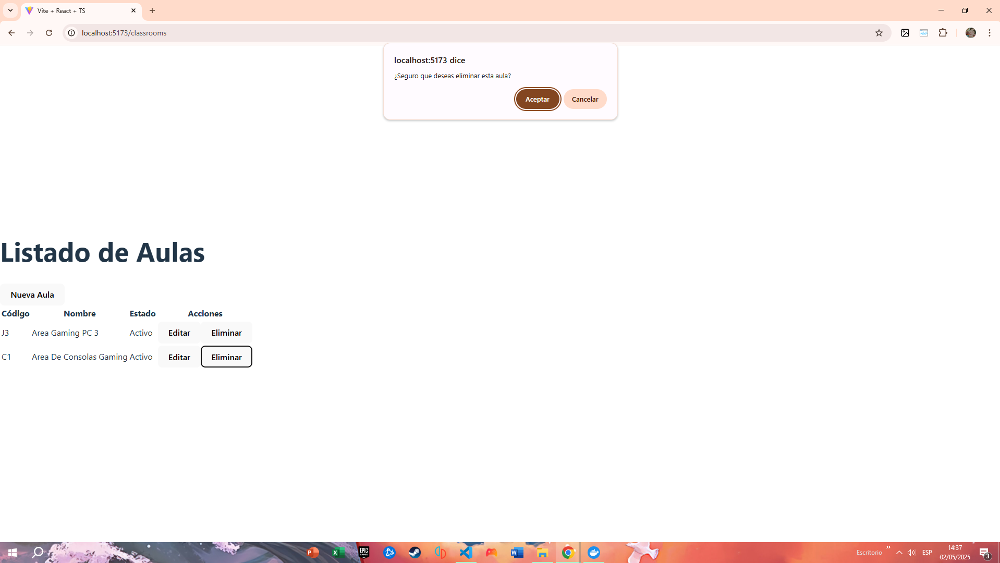
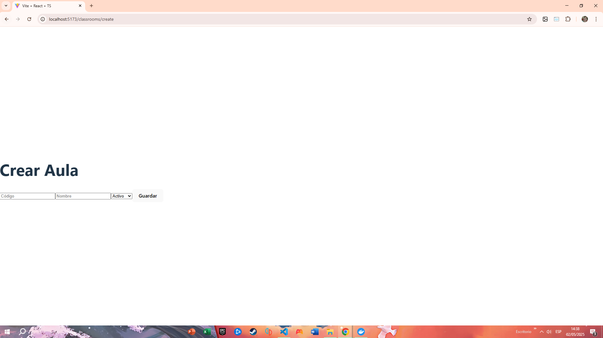

# 🏫 Examen Final Classroom - CRUD Fullstack con React + .NET + Docker + Swagger
Estudiante: Mauricio Roa

Este proyecto implementa un sistema de gestión de aulas (Classroom) usando un stack moderno:  
**React** para el frontend, **.NET Web API** para el backend y **Docker** para la base de datos.

---

## 🚀 Paso a paso del desarrollo

### 🐳 1. Levantar base de datos con Docker Compose

Primero, levantamos el contenedor con la base de datos (por ejemplo, SQL Server o PostgreSQL):

```bash
docker-compose up -d
```
✅ Esto crea y ejecuta un contenedor que aloja nuestra base de datos de desarrollo.

### ⚙️ 2. Crear el ClassroomApiController en el backend
Luego, en el proyecto backend con .NET, se creó el controlador:

📄 Controllers/ClassroomApiController.cs
```
Este controlador contiene las rutas necesarias para el CRUD:

GET /ClassroomApi → Lista todas las aulas

GET /ClassroomApi/{id} → Obtiene una aula por ID

POST /ClassroomApi → Crea una nueva aula

PUT /ClassroomApi/{id} → Actualiza un aula

DELETE /ClassroomApi/{id} → Elimina un aula
```



### 🌐 3. Crear frontend en React (e6-client-react)
En el proyecto React, se integró el frontend con el backend. Aquí los pasos principales:


## Se implemento ClassroomApi.ts



## El archivo de ClassroomForm



### 🧩 4. Componentes principales
```
ListClassroomsPage.tsx
```
Muestra una tabla con todos los registros. Permite editar o eliminar.

CreateClassroomPage.tsx
```
Contiene el formulario para crear una nueva aula.
```

EditClassroomPage.tsx
```
Carga datos del aula existente y permite su edición.
```

ClassroomForm.tsx
```
Formulario reutilizable que se adapta a creación o edición.
```


🔁 React Router
Se añadieron estas rutas en Router.tsx:

```
{
  path: "/classrooms",
  element: <ListClassroomsPage />,
},
{
  path: "/classrooms/create",
  element: <CreateClassroomPage />,
},
{
  path: "/classrooms/edit/:id",
  element: <EditClassroomPage />,
}
```


### 🧪 5. Probar en el navegador
Levantar el frontend con:


📄 http://localhost:5173/classrooms → Listado de aulas

➕ http://localhost:5173/classrooms/create → Crear nueva aula

✏️ http://localhost:5173/classrooms/edit/1 → Editar aula con ID 1

✅ Resultado Final
API funcional con Swagger para probar endpoints 🎯

Interfaz bonita con React + Tailwind CSS 🎨

CRUD completo con rutas protegidas y navegación intuitiva 🌍

¡Y listo! 🎉 Ya tienes tu propio sistema CRUD para Aulas funcionando de extremo a extremo.


 Tambien se puede eliminar
 

 y crear 
 