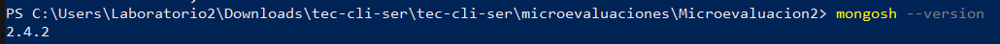
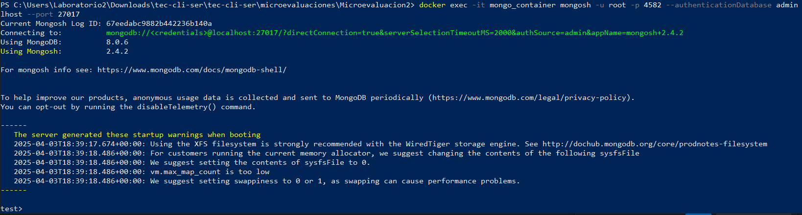

# Guía para configurar y trabajar con MongoDB, Docker.

Esta guía cubre todo el proceso para instalar MongoDB, configurar Docker para ejecutar MongoDB, usar Mongo Compass para interactuar con la base de datos y acceder a los datos desde la terminal usando `mongosh`.

## Requisitos previos

Antes de empezar, asegúrate de tener lo siguiente instalado en tu sistema:

- **Docker**: Para crear y gestionar contenedores.
- **MongoDB**: Para gestionar las bases de datos.
- **Mongo Compass**: Herramienta gráfica para interactuar con MongoDB.
- **mongosh**: Shell interactivo de MongoDB.
- **Sistema operativo**: Esta guía está orientada a sistemas Windows, pero puede aplicarse a otros con algunas variaciones.

## Paso 1: Instalar MongoDB y Docker

### Instalar Docker
1. Descarga e instala Docker desde su [sitio oficial](https://www.docker.com/products/docker-desktop).
2. Sigue las instrucciones según tu sistema operativo.
3. Verifica la instalación con el siguiente comando en tu terminal o PowerShell:
   ```bash
   docker --version
   ```


### Instalar MongoDB
1. **Mongo Compass**: Descarga e instala Mongo Compass desde [aquí](https://www.mongodb.com/try/download/compass).
2. **Mongo Shell (`mongosh`)**: Asegúrate de instalar Mongo Shell siguiendo las instrucciones de [MongoDB Documentation](https://www.mongodb.com/try/download/shell).

### Instalar y configurar `mongosh`:
1. Abre el terminal de PowerShell y verifica la instalación de `mongosh`:
   ```bash
   mongosh --version
   ```

## Paso 2: Crear un contenedor Docker con MongoDB

1. Crea un archivo `docker-compose.yml` en tu proyecto con el siguiente contenido:
   ```yaml
   version: '3.8'

   services:
   mongo:
      image: mongo:latest
      container_name: mongo
      restart: always
      ports:
         - "27017:27017"
      environment:
         MONGO_INITDB_ROOT_USERNAME: root
         MONGO_INITDB_ROOT_PASSWORD: 4582
      volumes:
         - mongo_data:/data/db

   mongo-express:
      image: mongo-express:latest
      container_name: mongo-express
      restart: always
      ports:
         - "8081:8081"
      environment:
         ME_CONFIG_MONGODB_SERVER: mongo
         ME_CONFIG_MONGODB_PORT: 27017
         ME_CONFIG_MONGODB_ENABLE_ADMIN: "true"
         ME_CONFIG_MONGODB_AUTH_DATABASE: admin
         ME_CONFIG_MONGODB_USERNAME: root
         ME_CONFIG_MONGODB_PASSWORD: 4582
         ME_CONFIG_BASICAUTH_USERNAME: admin
         ME_CONFIG_BASICAUTH_PASSWORD: admin123

   volumes:
   mongo_data:


   ```

2. En la misma carpeta donde guardaste el archivo `docker-compose.yml`, abre la terminal y ejecuta:
   ```bash
   docker-compose up -d
   ```

   Esto descargará la imagen de MongoDB y creará un contenedor llamado `mongo_container`.

3. Verifica que el contenedor está corriendo:
   ```bash
   docker ps
   ```


## Paso 3: Crear una base de datos en MongoDB desde Mongo Compass

1. Abre **Mongo Compass** e ingresa los siguientes detalles de conexión:
   - **Hostname**: `localhost`
   - **Puerto**: `27017`
   - **Autenticación**: Selecciona "Username/Password" y usa:
     - Usuario: `root`
     - Contraseña: `4582`
   - **Base de Datos de Autenticación**: `admin`

   
   
2. Conéctate al contenedor de MongoDB y, una vez conectado, crea la base de datos `Ucatec` y una colección `alumnos` para almacenar los datos.

   **Pasos en Mongo Compass**:
   - En la interfaz de Mongo Compass, selecciona "Crear base de datos".
   - Crea la base de datos `Ucatec` y agrega una colección llamada `alumnos`.

   

## Paso 4: Insertar datos en Mongo Compass

Desde Mongo Compass, inserta algunos documentos de ejemplo en la colección `alumnos`. Aquí tienes un ejemplo de cómo insertar datos:

```json
{
   "nombre": "Juan Pérez",
   "edad": 21,
   "carrera": "Ingeniería",
   "promedio": 8.5
}
```

Repite el proceso para agregar más datos de alumnos si lo deseas.


## Paso 5: Acceder a MongoDB desde la terminal (PowerShell) usando `mongosh`

1. Accede al contenedor Docker donde se está ejecutando MongoDB:
   ```bash
   docker exec -it mongo_container mongosh -u root -p 4582 --authenticationDatabase admin --host localhost --port 27017
   ```


   Este comando te permitirá ingresar al shell de MongoDB (`mongosh`) de tu contenedor.

2. **Ver las bases de datos**:
   Una vez dentro de `mongosh`, puedes ver las bases de datos disponibles con:
   ```javascript
   show dbs
   ```


3. **Acceder a la base de datos "Ucatec"**:
   Si la base de datos `Ucatec` ya está creada, puedes seleccionarla con:
   ```javascript
   use Ucatec
   ```


4. **Ver las colecciones**:
   Para listar las colecciones dentro de `Ucatec`, ejecuta:
   ```javascript
   show collections
   ```


5. **Consultar los documentos de la colección "alumnos"**:
   Para ver todos los documentos de la colección `alumnos`, usa:
   ```javascript
   db.alumnos.find().pretty()
   ```
   

## Conclusión

Con esta guía, has aprendido a configurar MongoDB en un contenedor Docker, crear una base de datos y una colección desde Mongo Compass, insertar datos y consultarlos desde la terminal usando `mongosh`. Esta es una forma práctica de trabajar con MongoDB en entornos de desarrollo locales utilizando Docker.

¡Ahora estás listo para continuar trabajando con MongoDB de manera eficiente!

```