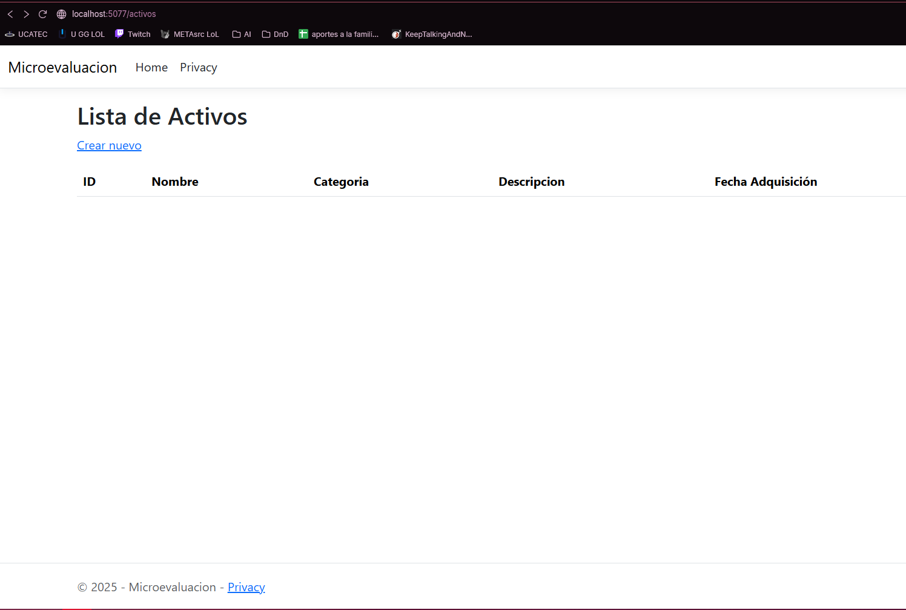
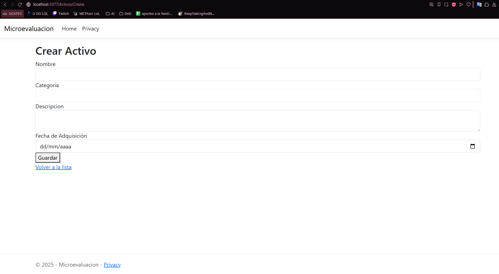

# Guía — Proyecto ASP.NET Core MVC 


---

# 1. Crear el proyecto

```bash
# crear proyecto MVC y entrar en la carpeta
dotnet new mvc -n MiProyectoActivos
cd MiProyectoActivos
```

---

# 2. Añadir paquetes NuGet

```bash
dotnet add package Microsoft.Data.SqlClient
dotnet add package DotNetEnv
dotnet add package Microsoft.EntityFrameworkCore
dotnet add package Microsoft.EntityFrameworkCore.SqlServer
dotnet add package Microsoft.EntityFrameworkCore.Design
dotnet add package Microsoft.EntityFrameworkCore.Tools
```

**:warning: Nota:** para ejecutar comandos EF (migrations / database update) instala la herramienta global si no la tienes:

```bash
dotnet tool install --global dotnet-ef
# si ya la tenías, puedes actualizar:
dotnet tool update --global dotnet-ef
```

---

# 3. `.env` — formato recomendado (general)

Crea un archivo `.env` en la raíz del proyecto. **No lo comprometas** en git (`.gitignore`).

Formato genérico recomendando explícitamente host/puerto:

```
# .env (plantilla genérica)
# Use la forma: Server=HOST,PORT  (SQL Server usa coma para puerto)
DB_CONNECTION="Server=HOST,PORT;Database=DB_NAME;User Id=DB_USER;Password=DB_PASSWORD;TrustServerCertificate=True;MultipleActiveResultSets=true"
```

Ejemplos (ajusta a tu entorno):

* Con puerto explícito:
  `Server=localhost,1433;...`
* Sin puerto (usar puerto por defecto 1433):
  `Server=localhost;...`

> **Regla general importante:** para SQL Server local/contenerizado usa `Server=host,port` (coma entre host y puerto). Si no usas puerto, omítelo. Siempre verifica que el host/puerto realmente expone SQL Server (ver `docker ps` o configuración del servidor).

Añade a `.gitignore`:

```
.env
```

---

# 4. Cargar `.env` en `Program.cs` 

Asegúrate de cargar `.env` **antes** de registrar el `DbContext`:

```csharp
using DotNetEnv;
using Microsoft.EntityFrameworkCore;
using MiProyectoActivos.Data;

var builder = WebApplication.CreateBuilder(args);

// Cargar .env (archivo en la raíz del proyecto)
Env.Load(); // ó Env.Load(".env");

// Obtener la cadena
var connectionString = Environment.GetEnvironmentVariable("DB_CONNECTION");
if (string.IsNullOrEmpty(connectionString))
{
    throw new Exception("DB_CONNECTION no está definida en .env");
}

builder.Services.AddDbContext<AppDbContext>(options =>
    options.UseSqlServer(connectionString));

builder.Services.AddControllersWithViews();
var app = builder.Build();
// ... pipeline (UseHttpsRedirection, UseStaticFiles, Routing, etc.)
app.Run();
```

---

# 5. Modelo `Activo` (tabla genérica `Activos`)

Crea `Models/Activo.cs`:

```csharp
using System;
using System.ComponentModel.DataAnnotations;
using System.ComponentModel.DataAnnotations.Schema;

namespace MiProyectoActivos.Models
{
    [Table("Activos")]
    public class Activo
    {
        [Key]
        public int Id { get; set; }                // PK

        [Required, MaxLength(200)]
        public string Nombre { get; set; }         // nombre/etiqueta genérica

        [MaxLength(100)]
        public string Categoria { get; set; }      // Vehículo, Terreno, Electrónico, etc.

        [MaxLength(500)]
        public string Descripcion { get; set; }    // detalles: marca, modelo, ubicacion...

        public DateTime FechaAdquisicion { get; set; } // fecha de adquisición/registro
    }
}
```

Estos 5 campos permiten representar cualquier tipo de activo con propiedades genéricas.

---

# 6. `DbContext`

Crea `Data/AppDbContext.cs`:

```csharp
using Microsoft.EntityFrameworkCore;
using MiProyectoActivos.Models;

namespace MiProyectoActivos.Data
{
    public class AppDbContext : DbContext
    {
        public AppDbContext(DbContextOptions<AppDbContext> options)
            : base(options) { }

        public DbSet<Activo> Activos { get; set; }

        protected override void OnModelCreating(ModelBuilder modelBuilder)
        {
            base.OnModelCreating(modelBuilder);
            modelBuilder.Entity<Activo>(entity =>
            {
                entity.HasKey(e => e.Id);
                entity.Property(e => e.Nombre).HasMaxLength(200).IsRequired();
                entity.Property(e => e.Categoria).HasMaxLength(100);
                entity.Property(e => e.Descripcion).HasMaxLength(500);
            });
        }
    }
}
```

---

# 7. Migraciones y crear la base de datos

Comandos para generar la migración inicial y aplicar a la base de datos:

```bash
# crear migración inicial
dotnet ef migrations add InitialCreate

# aplicar migraciones (crear DB + tablas)
dotnet ef database update
```

Si `dotnet ef database update` da error de conexión revisa la sección de solución de problemas abajo.

---

# 8. Controller básico (CRUD)

Ejemplo `Controllers/ActivosController.cs` (básico, con Create/Index/Edit/Details/Delete):

```csharp
using Microsoft.AspNetCore.Mvc;
using Microsoft.EntityFrameworkCore;
using MiProyectoActivos.Data;
using MiProyectoActivos.Models;
using System.Threading.Tasks;

namespace MiProyectoActivos.Controllers
{
    public class ActivosController : Controller
    {
        private readonly AppDbContext _context;
        public ActivosController(AppDbContext context) => _context = context;

        public async Task<IActionResult> Index() => View(await _context.Activos.ToListAsync());

        public IActionResult Create() => View();

        [HttpPost]
        [ValidateAntiForgeryToken]
        public async Task<IActionResult> Create(Activo activo)
        {
            if (ModelState.IsValid)
            {
                _context.Add(activo);
                await _context.SaveChangesAsync();
                return RedirectToAction(nameof(Index));
            }
            return View(activo);
        }

        // Edit, Details, Delete similares (usar scaffolding si prefieres)
    }
}
```

---

# 9. Vistas simples 

Crea las siguientes vistas en `Views/Activos/`.

### Index.cshtml

```cshtml
@model IEnumerable<MiProyectoActivos.Models.Activo>

<h2>Lista de Activos</h2>

<p><a asp-action="Create">Crear nuevo</a></p>

<table class="table">
    <thead>
        <tr><th>ID</th><th>Nombre</th><th>Categoria</th><th>Descripcion</th><th>Fecha</th><th></th></tr>
    </thead>
    <tbody>
        @foreach (var item in Model) {
            <tr>
                <td>@item.Id</td>
                <td>@item.Nombre</td>
                <td>@item.Categoria</td>
                <td>@item.Descripcion</td>
                <td>@item.FechaAdquisicion.ToShortDateString()</td>
                <td>
                    <a asp-action="Details" asp-route-id="@item.Id">Detalles</a> |
                    <a asp-action="Edit" asp-route-id="@item.Id">Editar</a> |
                    <a asp-action="Delete" asp-route-id="@item.Id">Eliminar</a>
                </td>
            </tr>
        }
    </tbody>
</table>
```

### Create.cshtml (y Edit/Details/Delete siguen la misma estructura)

```cshtml
@model MiProyectoActivos.Models.Activo

<h2>Crear Activo</h2>

<form asp-action="Create" method="post">
    <div><label>Nombre</label><input asp-for="Nombre" class="form-control" /></div>
    <div><label>Categoria</label><input asp-for="Categoria" class="form-control" /></div>
    <div><label>Descripcion</label><textarea asp-for="Descripcion" class="form-control"></textarea></div>
    <div><label>Fecha de Adquisición</label><input asp-for="FechaAdquisicion" type="date" class="form-control" /></div>
    <button type="submit">Guardar</button>
</form>

<p><a asp-action="Index">Volver a la lista</a></p>
```


---

# 10. Prueba local

```bash
dotnet run
# abrir URL que muestre la consola (ej. https://localhost:5001) y navegar a /Activos
```
Si se realizó correctamente, se deberia ver de la siguiente forma:

## Vista de la tabla



## Vista al crear datos


---

# 11. Solución de problemas de conexión 

Si `dotnet ef database update` falla con error de conexión, revisa:

1. **Cadena de conexión (`DB_CONNECTION`)**

   * Asegúrate de que `Server=HOST,PORT` está correcto. SQL Server usa **coma** para puerto: `Server=localhost,1433`.
   * Si usas la configuración por defecto 1433, `Server=localhost` suele bastar.

2. **¿Docker o servicio local?**

   * Si usas Docker, confirma `docker ps` y la sección `PORTS` (p.ej. `0.0.0.0:1433->1433/tcp`) y usa ese puerto.
   * Si usas `docker-compose.yml` con `- "1433:1433"` entonces la cadena puede usar `Server=localhost,1433` o sólo `localhost`.

3. **Probar conexión desde tu host**

   * `sqlcmd` (si lo tienes):

     ```bash
     sqlcmd -S HOST,PORT -U DB_USER -P "DB_PASSWORD" -Q "SELECT name FROM sys.databases"
     ```
   * Si `sqlcmd` falla, no es EF: es la conexión / puerto / firewall / SQL Server no arrancado.

4. **Verificar que `.env` se carga**

   * Agrega `Console.WriteLine(connectionString)` temporalmente en `Program.cs` para ver la cadena real que EF usa.

5. **Named Pipes vs TCP/IP**

   * Si conectas a una instancia con nombre o pipes, la Data Source/Server puede necesitar `Server=.\INSTANCENAME` o `np:\\.\pipe\...` — en entornos simples prefiero exponer TCP (1433).

6. **Mensajes con `--verbose`**

   ```bash
   dotnet ef database update --verbose
   ```

   Esto muestra la cadena y más detalles que ayudan a depurar.

---

