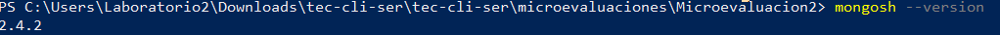
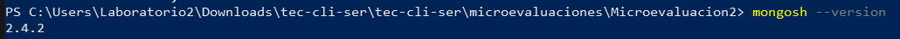
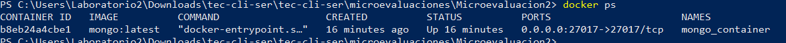
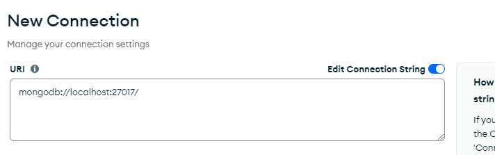
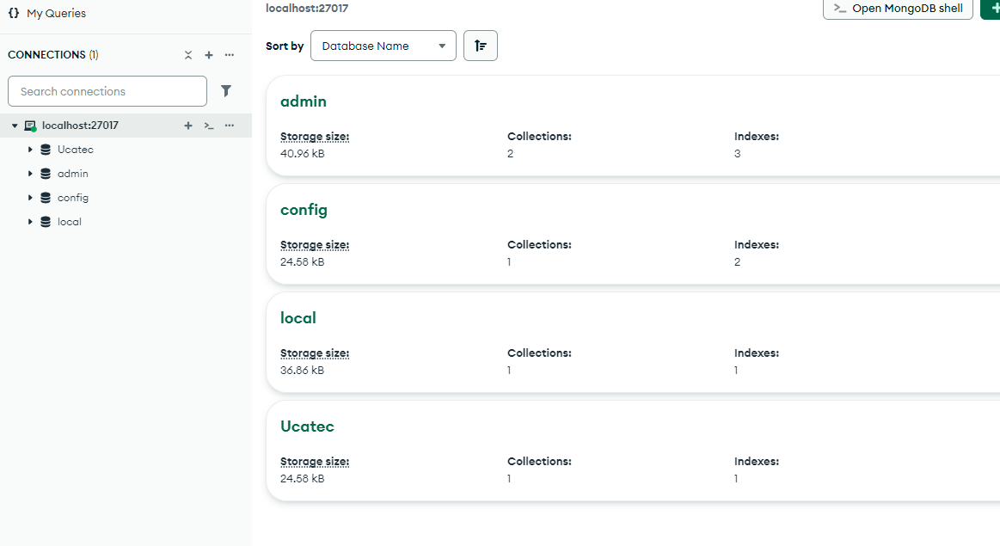
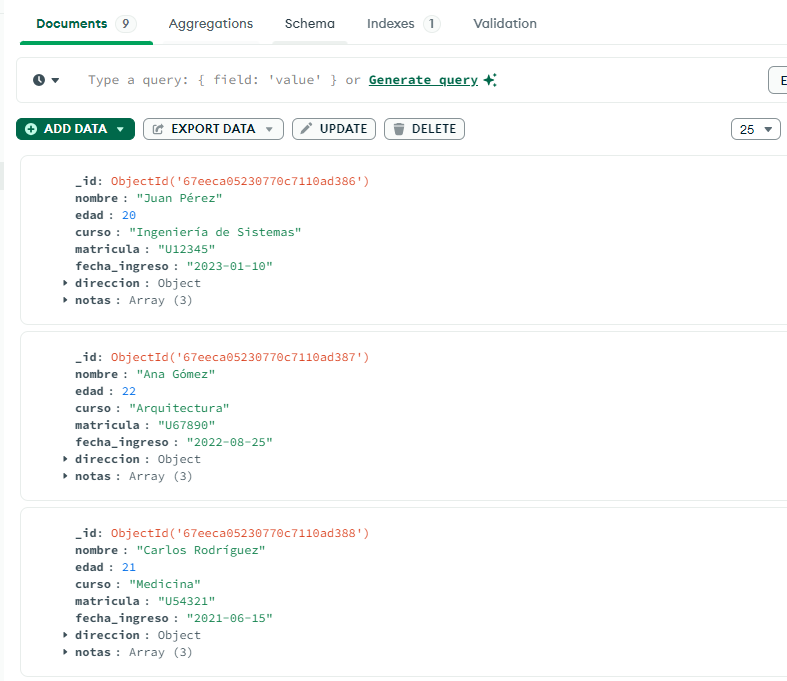
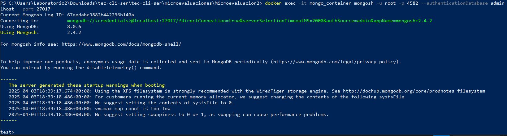

# 🚀 PostgreSQL y PgAdmin con Docker en Windows

Este proyecto describe paso a paso cómo instalar y configurar PostgreSQL y PgAdmin utilizando Docker en un entorno Windows, evitando conflictos con instalaciones locales. La base de datos `ucatecdb` se crea dentro del contenedor de PostgreSQL, y se accede a ella desde PgAdmin.

---

## 🧱 Requisitos

- Docker Desktop instalado y en ejecución
- PowerShell o terminal compatible
- Visual Studio Code (opcional, pero recomendado)
- Puerto `5434` libre para evitar conflictos con PostgreSQL local

---
## 🧩 Instalaciones necesarias

Antes de comenzar, asegúrate de tener los siguientes programas instalados:

---

### 🐳 Docker Desktop

Docker nos permite crear contenedores donde correr PostgreSQL de forma aislada.

🔗 **Descargar Docker Desktop para Windows**:  
👉 [https://www.docker.com/products/docker-desktop](https://www.docker.com/products/docker-desktop)

Pasos:

1. Descarga el instalador desde el enlace anterior.
2. Ejecuta como administrador.
3. Acepta los términos y sigue los pasos de instalación.
4. Reinicia el equipo si es necesario.
5. Asegúrate de que Docker esté corriendo (icono de la ballena en la barra de tareas).

---

### 🐘 PostgreSQL (opcional, instalación local)

Puedes tener PostgreSQL instalado de forma local si lo necesitas para otro proyecto. En este caso, usamos **Docker para ejecutarlo**, pero este es el instalador oficial si lo deseas:

🔗 **Descargar PostgreSQL**:  
👉 [https://www.postgresql.org/download/windows/](https://www.postgresql.org/download/windows/)

---

### 🧠 PgAdmin (cliente gráfico para conectarse a PostgreSQL)

PgAdmin es una interfaz gráfica para conectarse y gestionar bases de datos PostgreSQL.

🔗 **Descargar PgAdmin**:  
👉 [https://www.pgadmin.org/download/](https://www.pgadmin.org/download/)

Pasos:

1. Descarga el instalador desde el enlace.
2. Ejecuta e instala como cualquier software de Windows.
3. Una vez instalado, ábrelo y espera a que cargue el entorno web.
4. Úsalo para conectarte a la base de datos que creamos en Docker.

---

### 💡 (Opcional) Visual Studio Code

Para editar archivos de forma cómoda desde Windows, puedes usar Visual Studio Code.

🔗 **Descargar VS Code**:  
👉 [https://code.visualstudio.com/](https://code.visualstudio.com/)

---

### 🐚 Terminal / Consola

Puedes usar **PowerShell**, **CMD** o **Git Bash** para ejecutar los comandos Docker.


## 📦 Paso 1: Descargar las imágenes necesarias

```bash
docker pull postgres:latest
docker pull dpage/pgadmin4
```

---

## 🐘 Paso 2: Crear y ejecutar el contenedor PostgreSQL

```bash
docker run --name postgres1 -e POSTGRES_PASSWORD=Ucatec2025 -d -p 5434:5432 postgres:latest
```

Esto crea un contenedor llamado `postgres1`, expone el puerto `5432` del contenedor al puerto `5434` del host y define la contraseña del usuario `postgres`.

---

## 🗃️ Paso 3: Crear la base de datos `ucatecdb`

Accede al contenedor:

```bash
docker exec -it postgres1 bash
```

Dentro del contenedor:

```bash
psql -U postgres
CREATE DATABASE ucatecdb;
\l  -- Para listar las bases de datos
\q  -- Para salir de PostgreSQL
exit  -- Para salir del contenedor
```

---

## 📝 Paso 4: Permitir conexiones desde PgAdmin (opcional si se requiere acceso externo)

Instala `nano` para editar archivos dentro del contenedor:

```bash
apt update
apt install nano -y
```

Edita los archivos de configuración:

```bash
nano /var/lib/postgresql/data/pg_hba.conf
nano /var/lib/postgresql/data/postgresql.conf
```


Asegúrate de:

- En `pg_hba.conf`, agregar (si es necesario):
  ```
  host all all 0.0.0.0/0 md5
  ```

- En `postgresql.conf`, modificar:
  ```
  listen_addresses = '*'
  ```

Guarda, sal y reinicia el contenedor:

```bash
docker restart postgres1
```

---

## 🖥️ Paso 5: Iniciar PgAdmin

```bash
docker run --name pgadmin -p 5050:80 -e PGADMIN_DEFAULT_EMAIL=admin@admin.com -e PGADMIN_DEFAULT_PASSWORD=admin -d dpage/pgadmin4
```

Accede a PgAdmin desde tu navegador en: [http://localhost:5050](http://localhost:5050)

---

## 🔌 Paso 6: Conectar PgAdmin con PostgreSQL

1. Abre PgAdmin y accede con:
   - Usuario: `admin@admin.com`
   - Contraseña: `admin`

2. Crea un nuevo servidor con los siguientes datos:

   - **Name**: PostgreSQL Docker
   - **Host**: `host.docker.internal` *(o `localhost` si falla)*
   - **Port**: `5434`
   - **Username**: `postgres`
   - **Password**: `Ucatec2025`

3. Guarda y ¡listo!

---
## 🧠 Paso 7: Crear base de datos y tablas desde PgAdmin 4

1. Abrir **PgAdmin 4**.
2. Conectar al servidor PostgreSQL en `localhost:5434` con:
   - **Usuario**: `postgres`
   - **Contraseña**: `admin`
3. Crear la base de datos llamada: `ucatecdb`.
4. Crear la siguiente tabla (como ejemplo):

```sql
CREATE TABLE estudiantes (
  id_estudiante SERIAL PRIMARY KEY,
  nombre VARCHAR(50),
  apellido VARCHAR(50),
  fecha_nacimiento DATE,
  carrera VARCHAR(50)
);


---
## 🐘 Paso 8: Conexión a PostgreSQL desde el contenedor

Una vez dentro del contenedor Docker, conecta a la base de datos `ucatecdb` con el usuario `postgres`:

```bash
root@944234574e2f:/# psql -U postgres --db ucatecdb --password
Password:
psql (17.4 (Debian 17.4-1.pgdg120+2))
Type "help" for help.

Consulta las tablas disponibles:

ucatecdb=# \d

ucatecdb=# SELECT * FROM estudiantes;

Consulta los datos de la tabla estudiantes:

---
## 🧪 Verifica conexiones

En PowerShell, puedes verificar qué proceso escucha el puerto 5434:

```bash
netstat -a -n -o | findstr :5434
```

---

## 🧼 Limpieza (si necesitas reiniciar desde cero)

```bash
docker stop postgres1 pgadmin
docker rm postgres1 pgadmin
```

---

## 📚 Notas adicionales

- Evitamos el puerto `5432` ya que PostgreSQL local lo está utilizando.
- El contenedor PostgreSQL se configuró correctamente en `5434`.
- La base de datos `ucatecdb` ya está creada y lista para usarse.

---

## 🛠️ Autores

- Configuración realizada por: [Tu Nombre Aquí ✍️]

---
