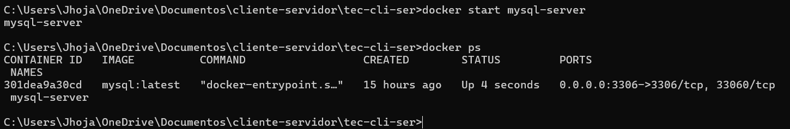
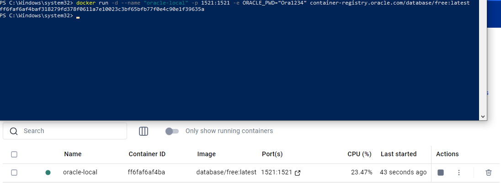
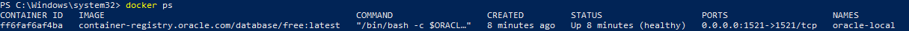
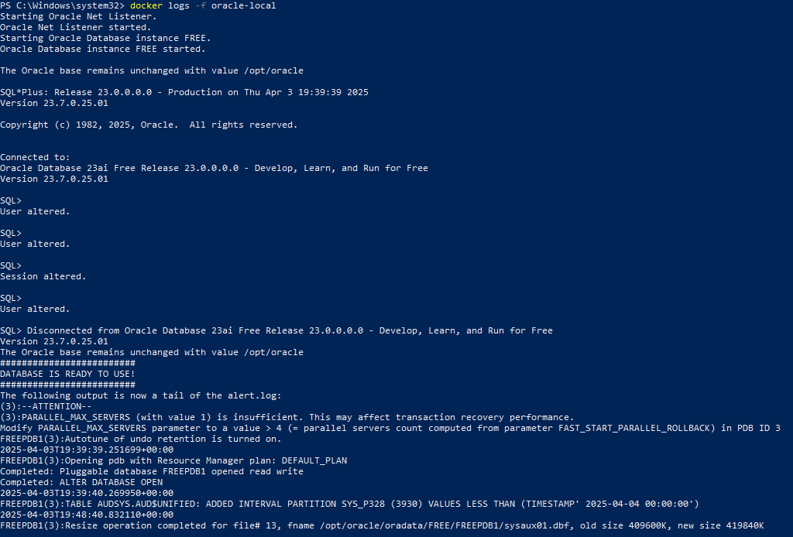

# 📘 Manual: Crear una Base de Datos Oracle con Docker

## ✅ Requisitos Previos

Antes de comenzar, asegúrate de tener los siguientes softwares instalados:

- 🔧 **Docker Desktop**: [Descargar Docker](https://www.docker.com/products/docker-desktop)
- 🧠 **Oracle SQL Developer**: [Descargar SQL Developer](https://www.oracle.com/database/sqldeveloper/technologies/download)

---

## 🐳 Paso 1: Descargar la Imagen de Oracle

Oracle ofrece una imagen gratuita para desarrollo desde su Container Registry. Abre tu terminal y ejecuta:

```bash
docker pull container-registry.oracle.com/database/free:latest
```


> 🔐 Nota: Es posible que debas iniciar sesión en [container-registry.oracle.com](https://container-registry.oracle.com) y aceptar los términos de uso.

---

## 🚀 Paso 2: Ejecutar el Contenedor

Una vez descargada la imagen, puedes levantar un contenedor con este comando:

```bash
docker run -d --name "oracle-local" -p 1521:1521 -e ORACLE_PWD="Ora1234" container-registry.oracle.com/database/free:latest
```


📌 Parámetros importantes:

- --name oracle-local: Nombre del contenedor.

- -p 1521:1521: Expone el puerto 1521, que es el puerto por defecto para Oracle DB.

- -e ORACLE_PWD="Ora1234": Define la contraseña del usuario SYS y SYSTEM.

---

## 🔍 Paso 3: Verificar que el contenedor esté corriendo

```bash
docker ps
```


Puedes ver los logs del contenedor con:

```bash
docker logs -f oracle-local
```


🟢 Espera el mensaje: `DATABASE IS READY TO USE!`

---

## 🧩 Paso 4: Conectarse desde SQL Developer

1. Abrir SQL Developer.
2. Crear nueva conexión:

   | Campo           | Valor        |
   |------------------|-------------|
   | Usuario         | SYSTEM       |
   | Contraseña      | Ora1234      |
   | Hostname        | localhost    |
   | Puerto          | 1521         |
   | SID             | FREE         |

---

## 🧾 Paso 5: Crear y Consultar una Tabla

```sql
CREATE TABLE persona (
  id VARCHAR2(10),
  nombre VARCHAR2(30),
  edad NUMBER
);

INSERT INTO persona(id, nombre, edad) VALUES ('1', 'Juan Perez', 25);

SELECT * FROM persona;
```

---

## 💾 Paso 6: Habilitar Persistencia de Datos

```bash
docker run -d \
  --name oracle-local \
  -p 1521:1521 \
  -e ORACLE_PWD="Ora1234" \
  -v oracle_data:/opt/oracle/oradata \
  container-registry.oracle.com/database/free:latest
```

---

## 📄 Paso 7: Usar Docker Compose

Crea un archivo `docker-compose.yml` con el siguiente contenido:

```yaml
version: '3.9'

services:
  oracle-db:
    image: container-registry.oracle.com/database/free:latest
    container_name: oracle-local
    ports:
      - "1521:1521"
    environment:
      - ORACLE_PWD=Ora1234
    volumes:
      - oracle_data:/opt/oracle/oradata
    restart: always

volumes:
  oracle_data:
```

### ▶️ Comandos útiles:

- Levantar contenedor:

  ```bash
  docker-compose up -d
  ```

- Ver estado:

  ```bash
  docker-compose ps
  ```

- Ver logs:

  ```bash
  docker-compose logs -f
  ```

- Detener:

  ```bash
  docker-compose down
  ```

---

## 🛠 Problemas Comunes

- ❌ No conecta desde SQL Developer:
  - Verifica que el contenedor esté corriendo (`docker ps`).
  - Asegúrate de usar el SID correcto: `FREE`.

- ❌ Error de contraseña:
  - Verifica la variable `ORACLE_PWD` usada al iniciar el contenedor.

---

## 📦 Extras Útiles

- Ingresar al contenedor:

  ```bash
  docker exec -it oracle-local bash
  ```

- Conectarse con SQL*Plus:

  ```bash
  sqlplus SYSTEM/Ora1234@//localhost:1521/FREE
  ```

---

## 🧠 Recomendaciones

- Usa Docker Compose para facilitar la gestión del entorno.
- No uses esta imagen en producción.
- Puedes automatizar pruebas SQL dentro del contenedor para desarrollo.

---

