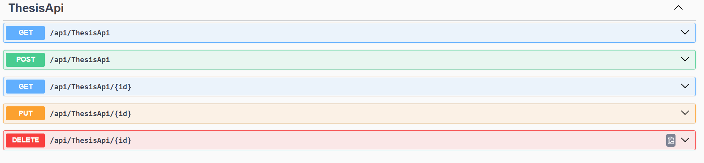
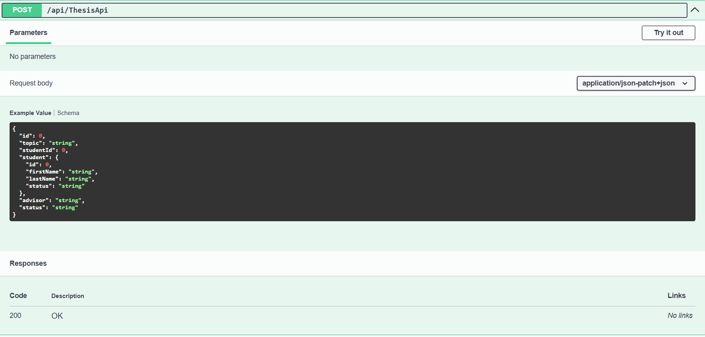

## 📝 1. Crear el Modelo Thesis

Crear archivo:

```
Models/Thesis.cs
```

```csharp
public class Thesis
{
    public int ID { get; set; }
    public string Topic { get; set; }

    public int StudentId { get; set; }
    public Person Student { get; set; }

    public string Advisor { get; set; }
    public string Status { get; set; }
}
```

---

## 🏗️ 2. Registrar el DbSet en el AppDbContext

Abrir:

```
Data/AppDbContext.cs
```

Agregar:

```csharp
public DbSet<Thesis> Thesis { get; set; }
```

> 💡 Esto permite que EF Core cree la tabla en la base de datos.

---

## 🧱 3. Crear Migración y Actualizar BD

Ejecutar:

```bash
dotnet ef migrations add AddThesis
dotnet ef database update
```

Esto crea la tabla `Thesis` con sus columnas.

---

## 🧭 4. Crear Controladores

Tienes **dos opciones**: generados automáticamente o creados manualmente.

---

# ⚙️ **Opción A: Generar Controlador y Vistas Automáticamente**

Usar scaffolding:

```bash
dotnet aspnet-codegenerator controller \
  -name ThesisController \
  -m Thesis \
  -dc AppDbContext \
  --relativeFolderPath Controllers \
  --useDefaultLayout \
  --referenceScriptLibraries
```

Esto genera:

✔ ThesisController
✔ Vistas: Index, Create, Edit, Delete, Details

> Ideal si necesitas CRUD rápido.

---

# ✍️ **Opción B: Crear Controlador Manualmente**

Crear archivo:

```
Controllers/ThesisController.cs
```

Agregar un CRUD completo:

* Index()
* Create() + POST
* Edit() + POST
* Delete() + POST
* Details()

Usando EF Core:

```csharp
var list = await _context.Thesis.Include(t => t.Student).ToListAsync();
```

> Ventaja: control total sobre la lógica y validaciones.

---

# 🌐 5. Crear APIController (Opcional pero recomendado)

En:

```
Controllers/Api/ThesisApiController.cs
```

CRUD REST:

* `GET /api/thesis`
* `GET /api/thesis/{id}`
* `POST /api/thesis`
* `PUT /api/thesis/{id}`
* `DELETE /api/thesis/{id}`

Permite integrar frontends externos o JavaScript/AJAX.

---

# 🖼️ 6. Crear las Vistas

También tienes dos opciones.

---

## 🧩 **Opción A: Vistas Generadas por Scaffolding**

El comando del paso 4 genera:

* Index.cshtml
* Create.cshtml
* Edit.cshtml
* Delete.cshtml
* Details.cshtml

Estas vistas ya funcionan sin modificar nada.

---

## 🎨 **Opción B: Vistas Manuales**

Crear los archivos en:

```
Views/Thesis/
```

Ejemplos:

### **Index.cshtml**

Tabla mostrando todas las tesis.

### **Create.cshtml**

Formulario con dropdown de Students:

```cshtml
<select asp-for="StudentId">
    @foreach (var s in ViewBag.Students)
    {
        <option value="@s.ID">@s.FirstName @s.LastName</option>
    }
</select>
```

### **Edit.cshtml**

Formulario para actualizar datos.

### **Details.cshtml**

Vista de solo lectura.

### **Delete.cshtml**

Confirmación de eliminación.

> Ventaja: control total sobre estilos, HTML y flujo.

---

# 📡 7. Integración Final

1. Asegurarse de que la tabla `Persons` contiene estudiantes.
2. Confirmar que `ViewBag.Students` se carga en **Create** y **Edit**.
3. Probar CRUD en `/Thesis`.
4. Probar API en `/swagger/index.html`.

Vista de APIs


Ejemplo Metodo POST



