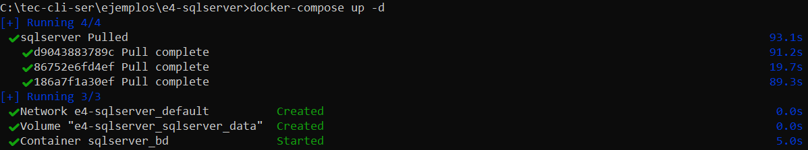
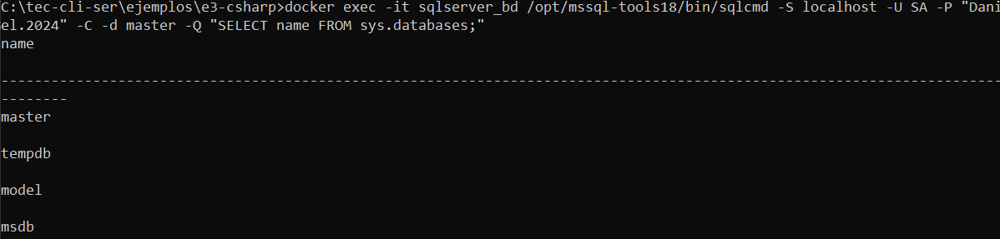
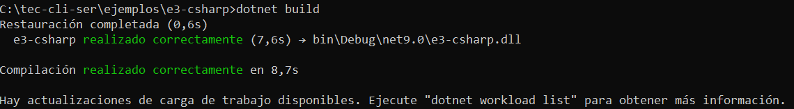
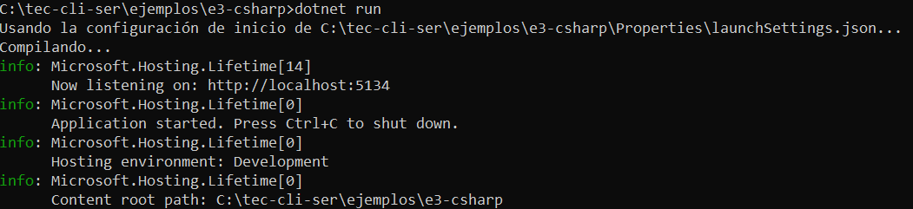
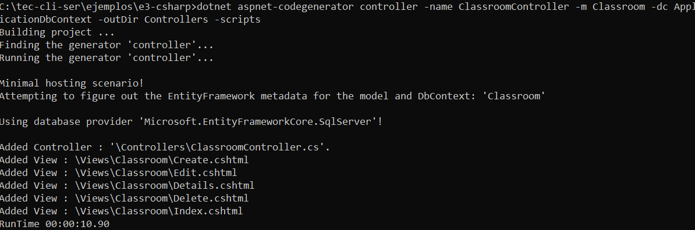
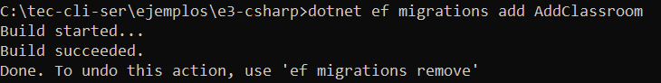
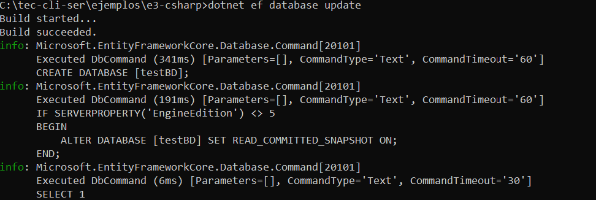
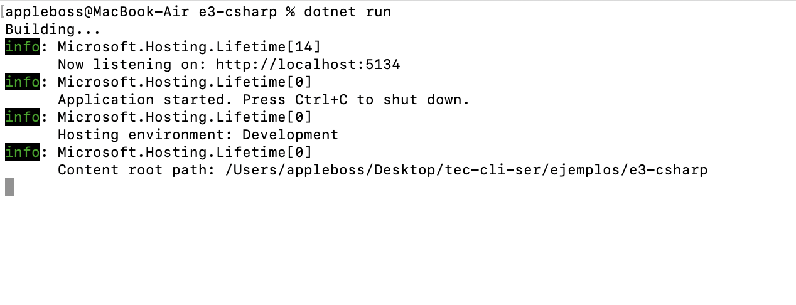
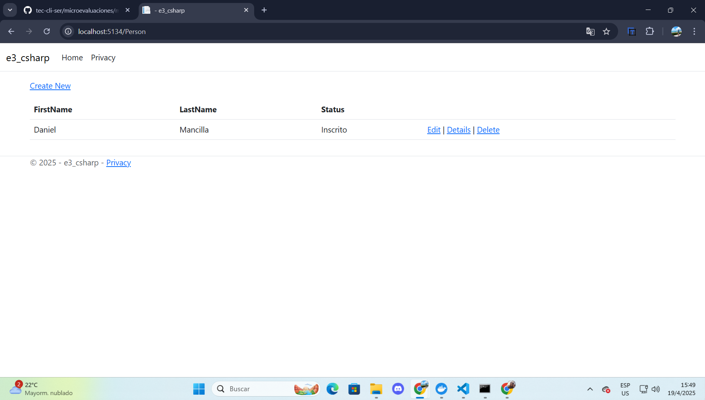

# 📘 Guía: Crear y Ejecutar un Proyecto MVC en C# con .NET + SQL Server

Este documento explica paso a paso cómo configurar un entorno de desarrollo para una aplicación MVC en C# usando .NET 9.0, SQL Server, Docker y Entity Framework Core.

---

## ✅ Requisitos Previos

Antes de comenzar, asegurate de tener instalado lo siguiente:

- 🐳 **Docker Desktop** [Descargar Docker](https://www.docker.com/products/docker-desktop)
- ⚙️ **.NET SDK 9.0** [Descargar .NET](https://dotnet.microsoft.com/es-es/download)

---

## 🐳 Paso 1: Configurar la Base de Datos SQL Server con Docker

1. Dentro de la carpeta `e4-sqlserver`, creamos un archivo `.env` con la siguiente variable:

```env
SA_PASSWORD="your_password"
```

2. Ejecutamos el siguiente comando para levantar el contenedor:

```bash
docker-compose up -d
```

Contenido del archivo `docker-compose.yml`:

```yaml
services:
  sqlserver:
    image: mcr.microsoft.com/mssql/server:2022-latest
    container_name: sqlserver_bd
    platform: linux/amd64
    ports:
      - "1433:1433"
    environment:
      SA_PASSWORD: ${SA_PASSWORD}
      ACCEPT_EULA: "Y"
    volumes:
      - sqlserver_data:/var/opt/mssql
      - ./backups:/var/opt/mssql/backups
    restart: "no"

volumes:
  sqlserver_data:
```



---

## ⚙️ Paso 2: Crear Conexión a la Base de Datos

Ahora vamos a configurar la cadena de conexión para nuestro proyecto en C#.

1. Navegamos a la carpeta `e3-csharp`y creamos un archivo `.env` con la siguiente variable:

```env
DEFAULT_CONNECTION="Server=tu_servidor;Database=NombreBD;User Id=usuario;Password=contraseña;Encrypt=False;TrustServerCertificate=True;"
```
📌 Asegúrate de reemplazar los valores por los correctos según tu configuración (puerto, usuario y contraseña del contenedor).

2. Luego verificamos que la base de datos en el contenedor esté funcionando correctamente ejecutando el siguiente comando:

```bash
docker exec -it sqlserver_bd /opt/mssql-tools18/bin/sqlcmd -S localhost -U SA -P "your_password" -C -d master -Q "SELECT name FROM sys.databases;"
```
✅ Este comando debería mostrarte una lista de las bases de datos disponibles, confirmando que la conexión fue exitosa.



---

## 📦 Paso 3: Instalar Paquetes Necesarios

Para poder trabajar con SQL Server y Entity Framework en nuestro proyecto MVC, instalamos los siguientes paquetes desde la terminal:

```bash
dotnet add package Microsoft.Data.SqlClient
dotnet add package DotNetEnv
dotnet add package Microsoft.EntityFrameworkCore
dotnet add package Microsoft.EntityFrameworkCore.SqlServer
dotnet add package Microsoft.EntityFrameworkCore.Design
dotnet add package Microsoft.EntityFrameworkCore.Tools
```
📌 Estos paquetes permiten:

- Conectarse a SQL Server (`Microsoft.Data.SqlClient`)

- Leer variables desde `.env` (`DotNetEnv`)

- Usar Entity Framework Core para trabajar con la base de datos.

---

## 🚀 Paso 4: Compilar y Ejecutar el Proyecto

Una vez que todo está configurado, compilamos el proyecto con:

```bash
dotnet build
```



Si la compilación no muestra errores, ejecutamos el proyecto con:

```bash
dotnet run
```



✅ Esto levanta el servidor y nos indica en qué dirección se está ejecutando la aplicación (http://localhost:5134).

---

## 💤 Paso 5: Detener la Ejecución del Proyecto

Cuando quieras detener el proyecto en ejecución, simplemente presiona `Ctrl + C` en la terminal donde estás ejecutando el comando `dotnet run`.

Esto detendrá el servidor local y te permitirá hacer cambios en el código o realizar otra acción.

---

## 📝 Paso 6: Crear el Modelo Classroom

Primero, creamos el modelo `Classroom` dentro de la carpeta `Models`. Crea el archivo `Models/Classroom.cs` con el siguiente contenido:

```csharp
namespace e3_csharp.Models;
public class Classroom
{
    public int ID { get; set; }
    public string Code { get; set; } = string.Empty;
    public string Name { get; set; } = string.Empty;
    public string Status { get; set; } = "AC";
}
```
📌 Este modelo representa una "Clase" con sus propiedades: `ID`, `Code`, `Name`, y `Status`.

---

## 🔄 Paso 7: Agregar el Modelo al DbContext

A continuación, agregamos el modelo `Classroom` al `DbContext`. Abre el archivo `Data/ApplicationDbContext.cs` y agrega lo siguiente dentro de la clase `pplicationDbContext`:

```csharp
public DbSet<Classroom> Classrooms { get; set; }
```
📌 Esto permitirá a Entity Framework rastrear y gestionar las tablas relacionadas con `Classroom` en la base de datos.

---

## 🛠️ Paso 8: Generar el Controlador y la Vista

Después de agregar el modelo al contexto, compilamos nuevamente el proyecto para asegurarnos de que todo esté en orden:

```bash
dotnet build
```


Luego generamos automáticamente el controlador y las vistas CRUD para el modelo `Classroom` usando el generador de scaffolding:

```bash
dotnet aspnet-codegenerator controller -name ClassroomController -m Classroom -dc ApplicationDbContext -outDir Controllers -scripts
```
📌 Este comando hace lo siguiente:

- Crea un controlador llamado `ClassroomController.cs` en la carpeta `Controllers`.

- Genera automáticamente las vistas asociadas (Create, Read, Update, Delete).

- Usa el modelo `Classroom` y el contexto `ApplicationDbContext`.




🔧 Asegúrate de tener instalado el generador si el comando no te funciona. Lo puedes instalar con:

```bash
dotnet tool install -g dotnet-aspnet-codegenerator
```

---

## 🗓️ Paso 9: Crear Migración y Actualizar la Base de Datos

Después de generar el controlador y las vistas, compilamos nuevamente el proyecto:

```bash
dotnet build
```


Luego creamos una migración para aplicar los cambios del modelo Classroom a la base de datos:

```bash
dotnet ef migrations add AddClassroom
```



Y actualizamos la base de datos con:

```bash
dotnet ef database update
```



Finalmente, ejecutamos el proyecto:

```bash
dotnet run
```



✅ Ahora la tabla `Classrooms` debería estar creada en la base de datos, y podés acceder a la vista desde el navegador, en `localhost:5134/Classroom`.

---

## 📅 Paso 10: Ver las Vistas Generadas

Una vez en ejecución, podés acceder a las siguientes vistas desde el navegador:

- 📄`localhost:5134/Person`



- 📄`localhost:5134/Subject`


- 📄`localhost:5134/Classroom`


Cada vista permite operaciones CRUD completas sobre su modelo correspondiente.

---

## 🧠 Recomendaciones Finales

- Mantené el archivo `.env` fuera del control de versiones (agregalo al `.gitignore`).
- Usá migraciones para controlar los cambios en el modelo de base de datos.
- Verificá que el contenedor de SQL Server esté corriendo antes de cada `dotnet run`.

---


