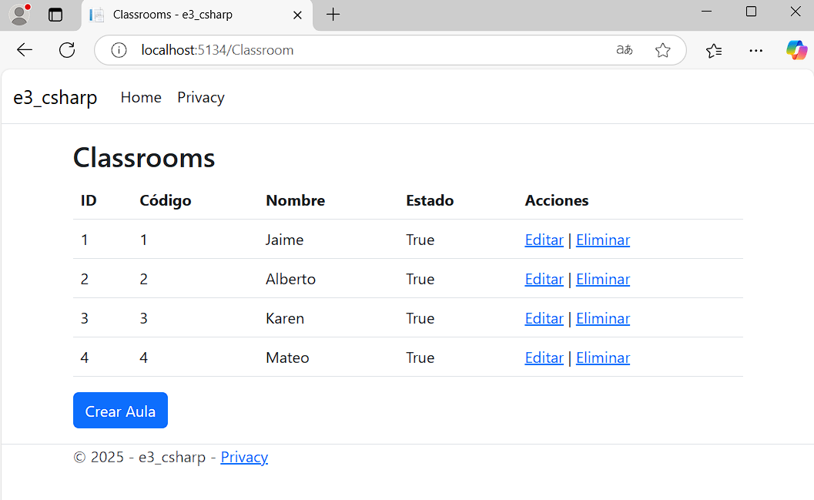

# 📚 Proyecto e3-csharp - Gestión de Aulas

Este proyecto es un ejemplo de una pequeña aplicación en ASP.NET Core MVC para gestionar aulas (Classroom) usando Entity Framework Core con una base de datos.

## 🚀 Tecnologías usadas
- ASP.NET Core MVC
- Entity Framework Core
- Razor Pages (Views)
- Bootstrap 4/5 para los estilos
- SQL Server LocalDB (por defecto)

## ⚙️ Paso a paso que realizamos

### 1. Configuramos el Proyecto
Creamos un proyecto de tipo ASP.NET Core Web App (Model-View-Controller). Definimos el contexto de base de datos `ApplicationDbContext` en la carpeta `Data/`.

### 2. Creamos el Modelo Classroom
**Archivo:** `Models/Classroom.cs`

```csharp
public class Classroom
{
    public int Id { get; set; }
    public string Codigo { get; set; }
    public string Nombre { get; set; }
    public bool Estado { get; set; }
}
```

### 3. Agregamos el DbSet en ApplicationDbContext

```csharp
public DbSet<Classroom> Classrooms { get; set; }
```

### 4. Creamos el controlador ClassroomController
Con acciones básicas:

- Index
- Create
- Edit
- Details
- Delete

Nota: Usamos el patrón CRUD básico en MVC.

### 5. Creamos las Vistas Razor (Views/Classroom/)
Utilizamos Bootstrap para los formularios.

Vistas que creamos:

- Index.cshtml (Lista de Aulas)
- Create.cshtml (Formulario de Crear Aula)
- Edit.cshtml
- Details.cshtml
- Delete.cshtml

Ejemplo del formulario Create:

```html
@model e3_csharp.Models.Classroom

@{
    ViewData["Title"] = "Crear Aula";
}

<h2>@ViewData["Title"]</h2>

<form method="post">
    <div class="form-group">
        <label for="Codigo">Código</label>
        <input type="text" class="form-control" id="Codigo" name="Codigo" value="@Model?.Codigo" required />
    </div>
    <div class="form-group">
        <label for="Nombre">Nombre</label>
        <input type="text" class="form-control" id="Nombre" name="Nombre" value="@Model?.Nombre" required />
    </div>
    <div class="form-group">
        <label for="Estado">Estado</label>
        <select class="form-control" id="Estado" name="Estado" required>
            <option value="true" selected="@(Model?.Estado == true ? "selected" : null)">Activo</option>
            <option value="false" selected="@(Model?.Estado == false ? "selected" : null)">Inactivo</option>
        </select>
    </div>
    <button type="submit" class="btn btn-primary">Guardar</button>
</form>

<a href="@Url.Action("Index", "Classroom")" class="btn btn-secondary mt-3">Volver a la lista</a>
```

### 6. Configuramos la Base de Datos
Configuramos la conexión en `appsettings.json`.

Agregamos el servicio de DbContext en `Program.cs`:

```csharp
builder.Services.AddDbContext<ApplicationDbContext>(options =>
    options.UseSqlServer(builder.Configuration.GetConnectionString("DefaultConnection")));
```

### 7. Creamos las Migraciones y la Base de Datos
Ejecutamos los comandos:

```bash
dotnet ef migrations add InitialCreate
dotnet ef database update
```

Esto creó la tabla `Classrooms` en nuestra base de datos.

### 8. Solucionamos Errores
- Error de falta de propiedad `ID` solucionado usando la propiedad correcta `Id`.
- Error de `selected` rojo en el `<select>` solucionado usando:

```html
selected="@(Model?.Estado == true ? "selected" : null)"
```

- Pendientes de migración solucionados ejecutando una nueva migración.

### ✅ Resultado final
Pudimos:

- Listar aulas.
- Crear nuevas aulas usando el formulario Create.
- Editar aulas.
- Ver detalles de un aula específica.
- Eliminar aulas.

¡Todo funcionando correctamente en localhost!

🎯 Notas Importantes

- Siempre recordar ejecutar `dotnet ef migrations add` si se hace un cambio en el modelo.
- Bootstrap mejora muchísimo la vista de los formularios.
- Las mejores prácticas incluyen usar `TagHelpers` (asp-for) para formularios más limpios.

🚀 ¡Proyecto funcionando exitosamente!
