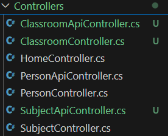
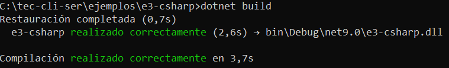
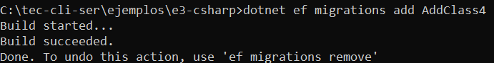
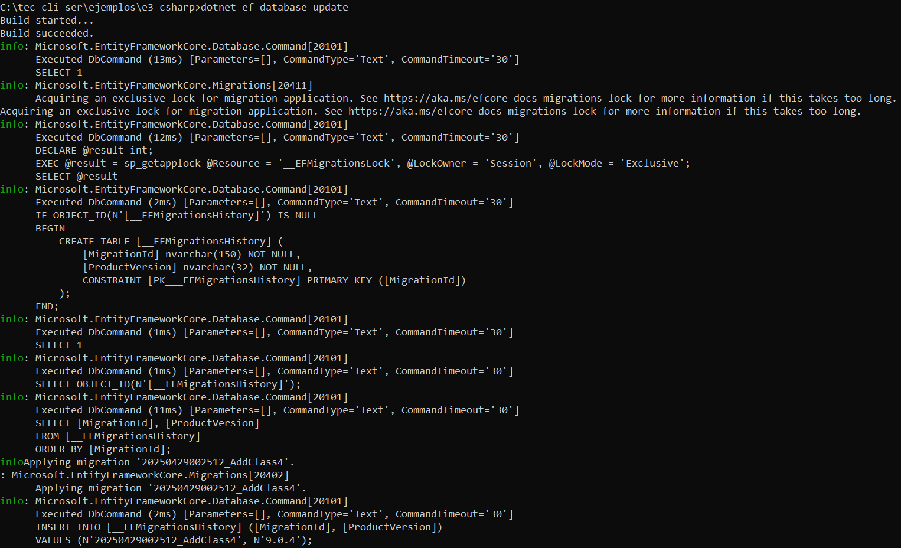
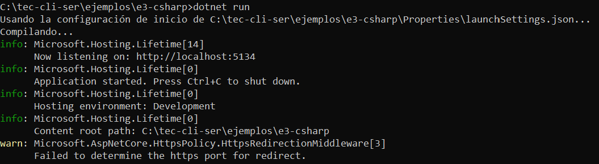
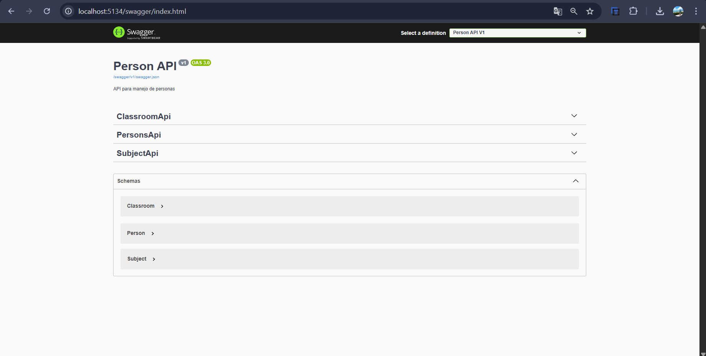
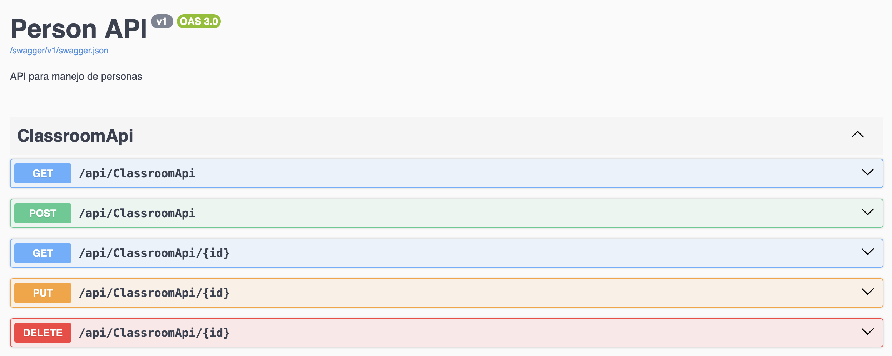
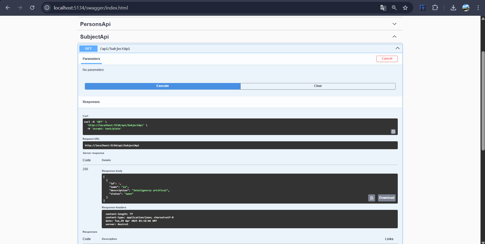

# 🎓 Proyecto API REST – Gestión de Personas, Aulas y Materias

## 📘 Descripción General

Este proyecto es una **API RESTful desarrollada con ASP.NET Core y Entity Framework Core**, orientada a la gestión de entidades académicas:

- 👤 **Person** (Personas)
- 🏫 **Classroom** (Aulas)
- 📚 **Subject** (Materias)

Utiliza controladores decorados con `[ApiController]` para facilitar el desarrollo de endpoints robustos y seguros, con integración completa de **Swagger UI** para pruebas y documentación interactiva.

---

## ⚙️ Tecnologías Utilizadas

- ASP.NET Core 8
- Entity Framework Core
- SQL Server
- Swagger (Swashbuckle)
- C#
- DotNetEnv (para variables de entorno)

---

## 🧱 Estructura y Funcionalidades del Proyecto

### 📂 Controladores Implementados

Ubicados en la carpeta `Controllers/`, se crearon:

- `ClassroomApiController.cs` → Gestión de aulas
- `SubjectApiController.cs` → Gestión de materias

📸 *Vista en el explorador de archivos:*



---

## 🔧 Implementación de Endpoints

### 🔹 `ClassroomApiController.cs`
Permite operaciones CRUD sobre la tabla `Classrooms`.

```csharp
[HttpGet]         // Obtener todas las aulas
[HttpGet("{id}")] // Obtener una aula específica
[HttpPost]        // Crear una nueva aula
[HttpPut("{id}")] // Actualizar aula existente
[HttpDelete("{id}")] // Eliminar aula
```

🔍 Utiliza `ApplicationDbContext` para acceder a la base de datos y devolver respuestas estándar como `NotFound()`, `CreatedAtAction()` o `NoContent()`.

---

### 🔹 `SubjectApiController.cs`
Permite operaciones CRUD sobre la tabla `Subjects`.

```csharp
[HttpGet]         // Listar materias
[HttpGet("{id}")] // Obtener una materia específica
[HttpPost]        // Agregar nueva materia
[HttpPut("{id}")] // Editar materia existente
[HttpDelete("{id}")] // Eliminar materia
```

Ambos controladores manejan excepciones como `DbUpdateConcurrencyException` y validan la existencia previa del recurso.

---

## 🚀 Pasos Técnicos Realizados

### ✅ 1. Compilación del Proyecto

```bash
dotnet build
```

> Verifica errores de sintaxis o dependencias antes de ejecutar.

📸 Resultado:



---

### 🛠️ 2. Crear una Migración

```bash
dotnet ef migrations add AddSubjectAndClassroomTables
```

> Crea los scripts necesarios para construir las tablas en la base de datos.

📸 Resultado:



---

### 🗃️ 3. Aplicar la Migración

```bash
dotnet ef database update
```

> Ejecuta las migraciones y sincroniza la base de datos con el modelo actual.

📸 Resultado:



---

### ▶️ 4. Ejecutar la API

```bash
dotnet run
```

> Inicia el servidor local. Las rutas disponibles son:

- `GET /api/ClassroomApi`
- `GET /api/SubjectApi`

📸 Resultado:



---

## 📑 Documentación con Swagger

La API está documentada automáticamente con **Swagger UI**, accesible en:

```
http://localhost:<puerto>/swagger
```

### 🔍 Vista general de Swagger


### 📘 Endpoints de Classroom


### 📘 Endpoints de Subject


---

## 📌 Conclusión

Este proyecto demuestra cómo construir una API modular, escalable y fácil de mantener con ASP.NET Core. La estructura del código, el uso de Entity Framework para persistencia de datos, y la integración de Swagger garantizan un entorno profesional y práctico para el desarrollo de software académico o administrativo.
