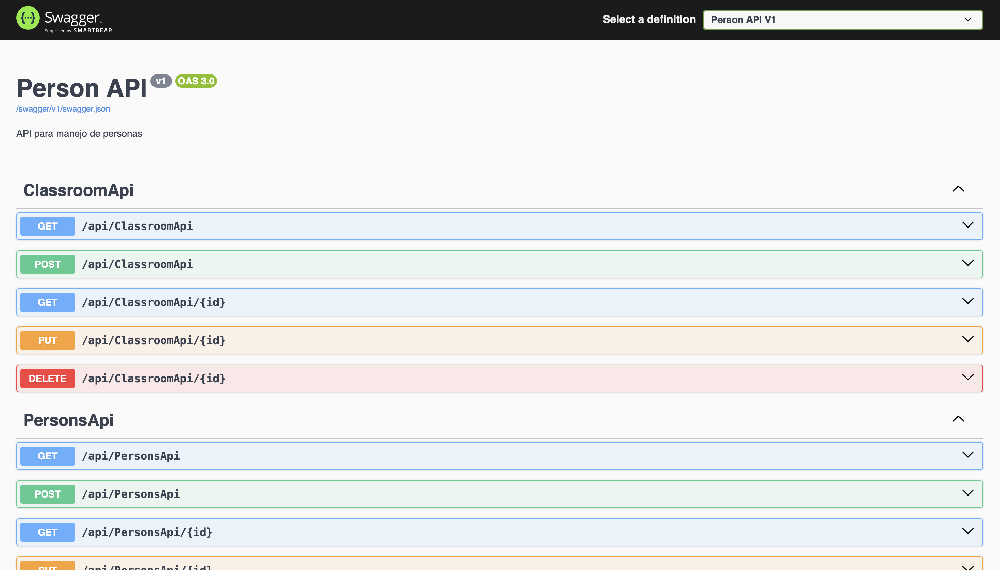
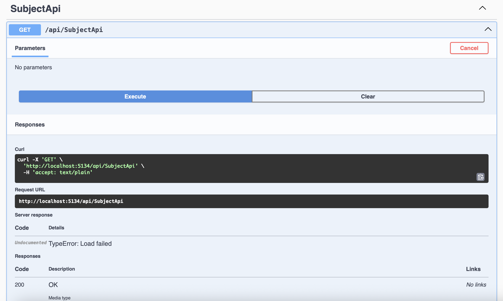

# Proyecto API para Person, Classroom y Subject

## Descripción
Este proyecto es una API en ASP.NET Core que permite gestionar información de **Personas**, **Clases** y **Materias** (Subjects) utilizando controladores API (`ApiController`) y Entity Framework Core.

## Pasos Realizados

### 1. Creación de Controladores API
Se crearon los siguientes controladores en la carpeta `Controllers/`:
- `ClassroomApiController`
- `SubjectApiController`


Estos controladores exponen los endpoints necesarios para CRUD básico de las tablas `Classrooms` y `Subjects`.

### 2. Código de los controladores

#### Código de `ClassroomApiController.cs`
```csharp
using System.Collections.Generic;
using System.Linq;
using System.Threading.Tasks;
using Microsoft.AspNetCore.Mvc;
using Microsoft.EntityFrameworkCore;
using e3_csharp.Data;
using e3_csharp.Models;

namespace c3_csharp.Controllers
{
    [Route("api/[controller]")]
    [ApiController]
    public class ClassroomApiController : ControllerBase
    {
        private readonly ApplicationDbContext _context;

        public ClassroomApiController(ApplicationDbContext context)
        {
            _context = context;
        }

        // GET: api/ClassroomApi
        [HttpGet]
        public async Task<ActionResult<IEnumerable<Classroom>>> GetClassrooms()
        {
            return await _context.Classrooms.ToListAsync();
        }

        // GET: api/ClassroomApi/5
        [HttpGet("{id}")]
        public async Task<ActionResult<Classroom>> GetClassroom(int id)
        {
            var classroom = await _context.Classrooms.FindAsync(id);

            if (classroom == null)
            {
                return NotFound();
            }

            return classroom;
        }

        // PUT: api/ClassroomApi/5
        [HttpPut("{id}")]
        public async Task<IActionResult> PutClassroom(int id, Classroom classroom)
        {
            if (id != classroom.ID)
            {
                return BadRequest();
            }

            _context.Entry(classroom).State = EntityState.Modified;

            try
            {
                await _context.SaveChangesAsync();
            }
            catch (DbUpdateConcurrencyException)
            {
                if (!ClassroomExists(id))
                {
                    return NotFound();
                }
                else
                {
                    throw;
                }
            }

            return NoContent();
        }

        // POST: api/ClassroomApi
        [HttpPost]
        public async Task<ActionResult<Classroom>> PostClassroom(Classroom classroom)
        {
            _context.Classrooms.Add(classroom);
            await _context.SaveChangesAsync();

            return CreatedAtAction("GetClassroom", new { id = classroom.ID }, classroom);
        }

        // DELETE: api/ClassroomApi/5
        [HttpDelete("{id}")]
        public async Task<IActionResult> DeleteClassroom(int id)
        {
            var classroom = await _context.Classrooms.FindAsync(id);
            if (classroom == null)
            {
                return NotFound();
            }

            _context.Classrooms.Remove(classroom);
            await _context.SaveChangesAsync();

            return NoContent();
        }

        private bool ClassroomExists(int id)
        {
            return _context.Classrooms.Any(e => e.ID == id);
        }
    }
}

```

#### Código de `SubjectApiController.cs`
```csharp
using System.Collections.Generic;
using System.Linq;
using System.Threading.Tasks;
using Microsoft.AspNetCore.Mvc;
using Microsoft.EntityFrameworkCore;
using e3_csharp.Data;
using e3_csharp.Models;

namespace c3_csharp.Controllers
{
    [Route("api/[controller]")]
    [ApiController]
    public class SubjectApiController : ControllerBase
    {
        private readonly ApplicationDbContext _context;

        public SubjectApiController(ApplicationDbContext context)
        {
            _context = context;
        }

        // GET: api/SubjectApi
        [HttpGet]
        public async Task<ActionResult<IEnumerable<Subject>>> GetSubjects()
        {
            return await _context.Subjects.ToListAsync();
        }

        // GET: api/SubjectApi/5
        [HttpGet("{id}")]
        public async Task<ActionResult<Subject>> GetSubject(int id)
        {
            var subject = await _context.Subjects.FindAsync(id);

            if (subject == null)
            {
                return NotFound();
            }

            return subject;
        }

        // PUT: api/SubjectApi/5
        [HttpPut("{id}")]
        public async Task<IActionResult> PutSubject(int id, Subject subject)
        {
            if (id != subject.ID)
            {
                return BadRequest();
            }

            _context.Entry(subject).State = EntityState.Modified;

            try
            {
                await _context.SaveChangesAsync();
            }
            catch (DbUpdateConcurrencyException)
            {
                if (!SubjectExists(id))
                {
                    return NotFound();
                }
                else
                {
                    throw;
                }
            }

            return NoContent();
        }

        // POST: api/SubjectApi
        [HttpPost]
        public async Task<ActionResult<Subject>> PostSubject(Subject subject)
        {
            _context.Subjects.Add(subject);
            await _context.SaveChangesAsync();

            return CreatedAtAction("GetSubject", new { id = subject.ID }, subject);
        }

        // DELETE: api/SubjectApi/5
        [HttpDelete("{id}")]
        public async Task<IActionResult> DeleteSubject(int id)
        {
            var subject = await _context.Subjects.FindAsync(id);
            if (subject == null)
            {
                return NotFound();
            }

            _context.Subjects.Remove(subject);
            await _context.SaveChangesAsync();

            return NoContent();
        }

        private bool SubjectExists(int id)
        {
            return _context.Subjects.Any(e => e.ID == id);
        }
    }
}

```
### 3. Comandos ejecutados paso a paso

#### 3.1. Compilar el proyecto
Este comando verifica que no haya errores de compilación:
```bash
dotnet build
```


#### 3.2. Crear una nueva migración
Este comando genera una migración basada en los modelos actualizados:
```bash
dotnet ef migrations add NombreDeLaMigracion
```

> Reemplaza `NombreDeLaMigracion` por un nombre descriptivo como `AddSubjectAndClassroomTables`


#### 3.3. Aplicar la migración a la base de datos
Este comando actualiza la base de datos con la nueva migración:
```bash
dotnet ef database update
```


#### 3.4. Ejecutar el proyecto
Este comando inicia el servidor web y expone las rutas API:
```bash
dotnet run
```


Con esto, las tablas `Classroom` y `Subject` están disponibles a través de sus respectivas APIs en las rutas:
- `/api/ClassroomApi`
- `/api/SubjectApi`

### 4. Capturas del Swagger
A continuación se puede observar el Swagger UI mostrando:
- La ruta general de la API (`/swagger`)
- Los endpoints de `Person`, `Classroom` y `Subject`



#### ClassroomApi


#### SubjectApi

