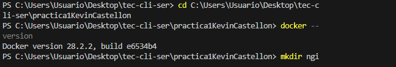
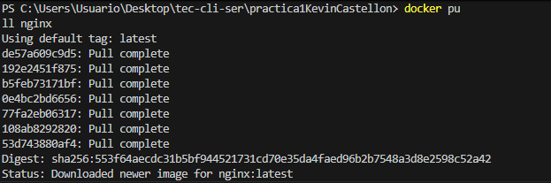
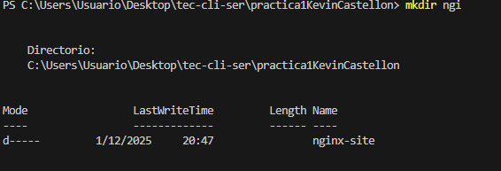
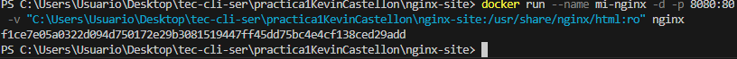
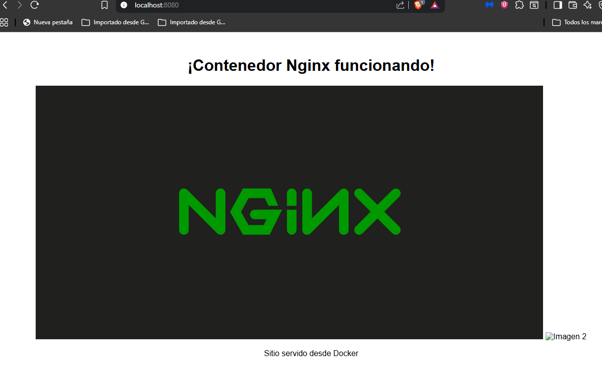

# 🐳 Práctica: Contenedor Docker con Nginx

## 📌 Descripción
Despliegue de un servidor web Nginx en un contenedor Docker, configurado para servir contenido estático desde una carpeta local.

## 🎯 Objetivos
- Crear y ejecutar un contenedor Docker con Nginx
- Servir contenido HTML estático
- Configurar montaje de volúmenes para desarrollo
- Verificar el funcionamiento del servidor web

## 🛠️ Requisitos
- Docker Desktop para Windows
- PowerShell
- Navegador web

## 🚀 Instalación y ejecución

## 🔹 Requisitos previos
- Tener **Docker** instalado en tu sistema.
- Conocimientos básicos de **Docker** y **línea de comandos**.

### 1. verificar Docker

```sh
docker --version
docker info
```
Si Docker Desktop está corriendo verás la versión y `docker info` mostrará info sobre el daemon.

---
## 2) Descargar (pull) la imagen de nginx 
```sh
docker pull nginx
```
## 3) Crear la carpeta `nginx-site`

```sh
mkdir nginx-site
```
# Crear index.html
# Agregar imágenes al sitio
# Copiar tus imágenes a esta carpeta

## 4) Ejecutar los contenedores ( en mi caso) 
```sh
docker run --name mi-nginx -d -p 8080:80 -v "C:\Users\Usuario\Desktop\tec-cli-ser\practica1KevinCastellon\nginx-site:/usr/share/nginx/html:ro" nginx
```
## 5)Verificamos el estado de los contenedores 

```sh
docker ps
```
## 6) Acceder al sitio
```sh
http://localhost:8080
```

## Administración del contenedor

# Ver contenedores en ejecución
```sh
docker ps
```
# Ver logs del contenedor

```sh
docker logs mi-nginx
```

# Detener contenedor

```sh
docker stop mi-nginx
```

# Iniciar contenedor
```sh
docker start mi-nginx
```

# Eliminar contenedor
```sh
docker rm mi-nginx
```

# Acceder al terminal del contenedor
```sh
docker exec -it mi-nginx bash
```
## Limpieza

# Detener y eliminar contenedor
```sh
docker stop mi-nginx && docker rm mi-nginx
```

# Eliminar imagen
```sh
docker rmi nginx
```
## Capturas de pantalla





