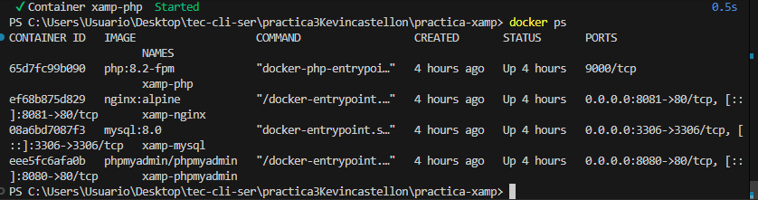
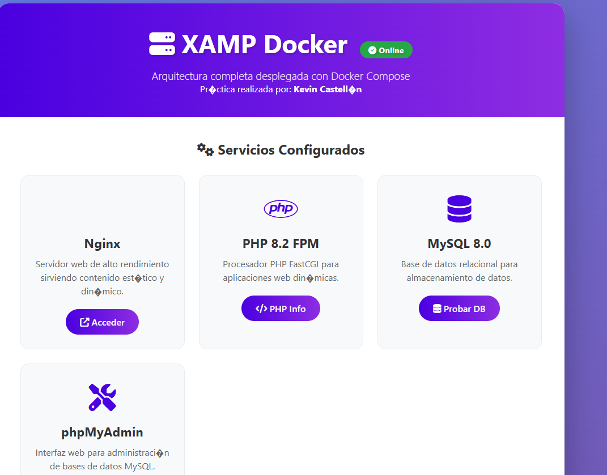
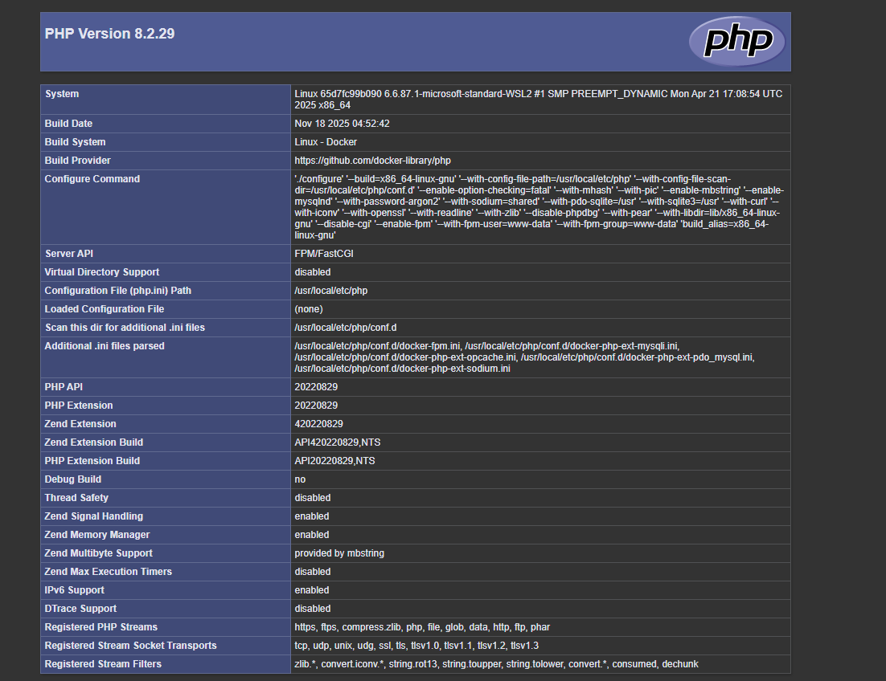
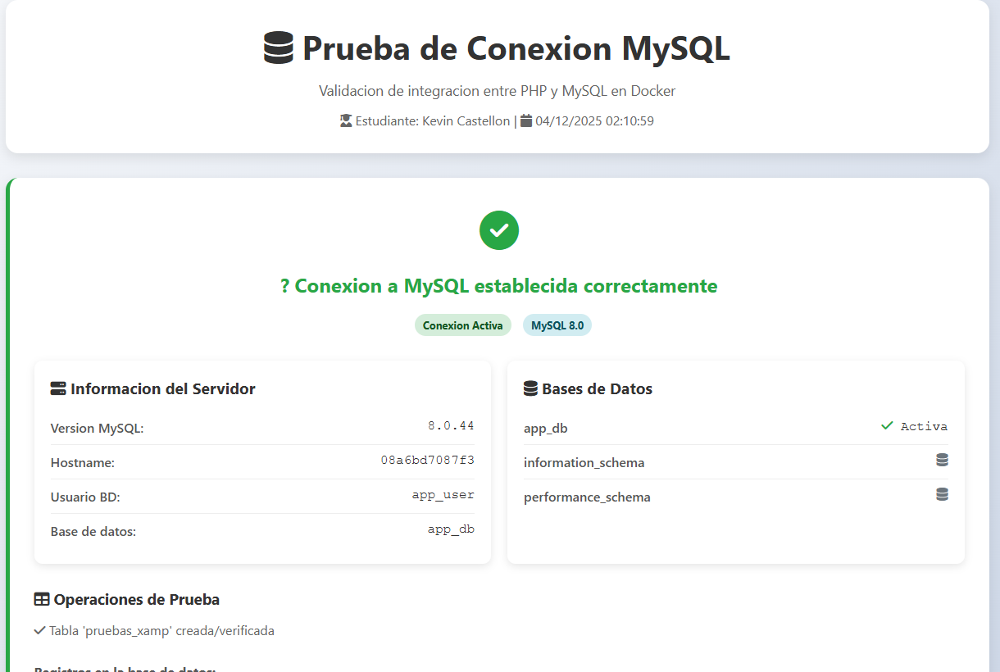
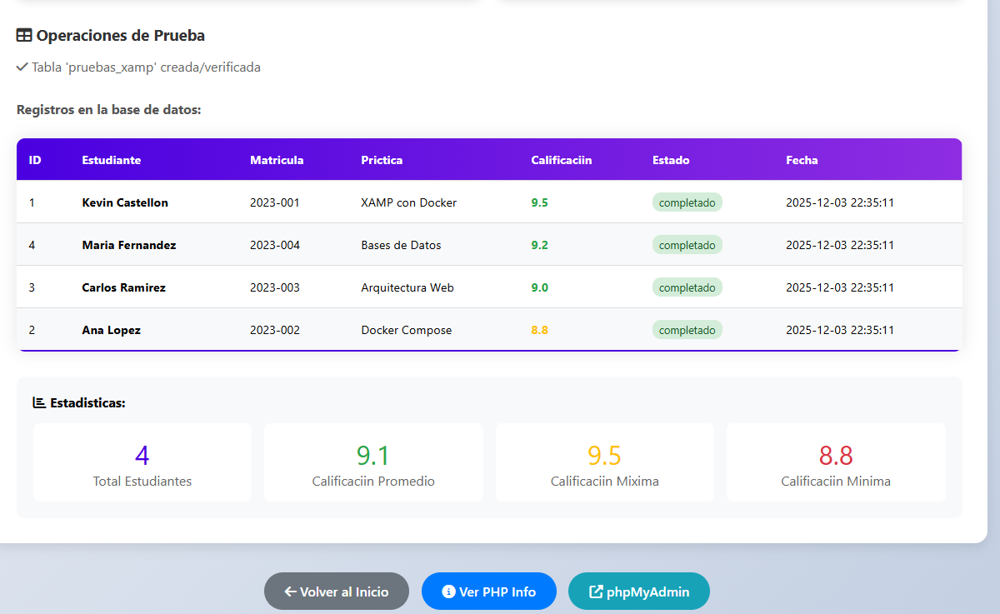
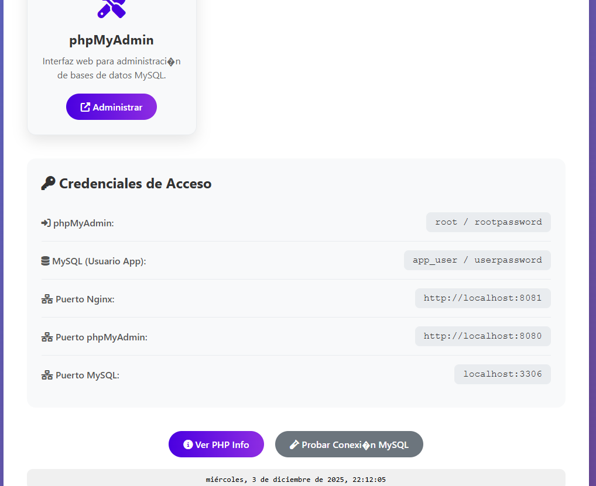

### 🎯 Descripción del Proyecto
Implementación de una arquitectura XAMP completa utilizando Docker Compose que incluye:

Nginx como servidor web

PHP 8.2-FPM para procesamiento PHP

MySQL 8.0 como base de datos

phpMyAdmin para administración de MySQL

### 📁 Estructura del Proyecto
```sh
practica-xamp/
├── 📄 docker-compose.yml          # Configuración principal
├── 📄 README.md                   # Documentación
├── 📁 nginx/
│   └── 📁 sites/
│       └── 📄 default.conf       # Configuración de Nginx
├── 📁 php/
│   └── 📁 www/
│       ├── 📄 index.html         # Página principal con estilos
│       ├── 📄 info.php           # Información PHP
│       └── 📄 test-mysql.php     # Prueba de conexión MySQL
└── 📁 screenshots/               # Capturas de evidencia
```
###🚀 Instalación y Ejecución Rápida

# 1. Requisitos Previos

```sh
# Verificar que Docker está instalado
docker --version
docker-compose --version
```
# 2. Clonar/Preparar el Proyecto

```sh
# Crear estructura de carpetas
mkdir practica-xamp
cd practica-xamp
mkdir -Force nginx\sites, php\www
``` 

# 3. Archivo docker-compose.yml
```sh
version: "3.8"
services:
  mysql:
    image: mysql:8.0
    container_name: xamp-mysql
    environment:
      MYSQL_ROOT_PASSWORD: rootpassword
      MYSQL_DATABASE: app_db
      MYSQL_USER: app_user
      MYSQL_PASSWORD: userpassword
    ports: ["3306:3306"]
    volumes: [mysql_data:/var/lib/mysql]
    networks: [xamp-network]

  php:
    image: php:8.2-fpm
    container_name: xamp-php
    volumes: ["./php/www:/var/www/html"]
    networks: [xamp-network]

  nginx:
    image: nginx:alpine
    container_name: xamp-nginx
    ports: ["8081:80"]
    volumes:
      - "./php/www:/var/www/html"
      - "./nginx/sites:/etc/nginx/conf.d"
    networks: [xamp-network]

  phpmyadmin:
    image: phpmyadmin/phpmyadmin
    container_name: xamp-phpmyadmin
    environment:
      PMA_HOST: mysql
      MYSQL_ROOT_PASSWORD: rootpassword
    ports: ["8080:80"]
    networks: [xamp-network]

networks:
  xamp-network:
volumes:
  mysql_data:
  ```
  # 4. Configuración de Nginx

  ```sh

  # Crear archivo default.conf
Set-Content -Path .\nginx\sites\default.conf -Value @'
server {
    listen 80;
    root /var/www/html;
    index index.php index.html;
    
    location / {
        try_files $uri $uri/ =404;
    }
    
    location ~ \.php$ {
        fastcgi_pass php:9000;
        include fastcgi_params;
        fastcgi_param SCRIPT_FILENAME $document_root$fastcgi_script_name;
    }
}
'@
```
# 5. Archivos HTML/PHP Básicos

```sh
# Crear archivos básicos
# (Los archivos con estilos ya están incluidos en el proyecto)
```
# 6. Iniciar los Servicios

```sh 
# Ejecutar docker-compose
docker-compose up -d

# Verificar estado
docker-compose ps
```
## Capturas de pantalla contenedores levantados



## Capturas de pantalla Página principal: http://localhost:8081


## Capturas de pantalla PHP Info


## Capturas de pantalla prueba de conexion Mysql


## Capturas de pantalla detos de ejemplos insertados


## Capturas de pantalla credenciales de acceso 



