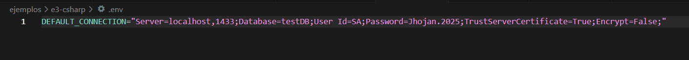

# PRIMERO CREE EL .ENV
# ejecute el docker-composer up -d

# despues cree un .env en el ejemplo 3

#despues instale los paquetes:

# despues ejecute el comando dotnet build
# se ejecuto el comando dotnet ef database update

# se ejecuto dotnet aspnet-codegenerator controller -name ClassroomController -m Classroom -dc ApplicationDbContext -outDir Controllers -scripts
para crear controlador vistas y modelos :

# se uso el comando dotnet run para compilar 

