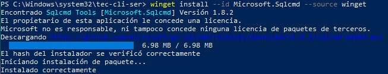
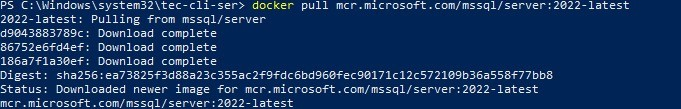
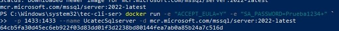
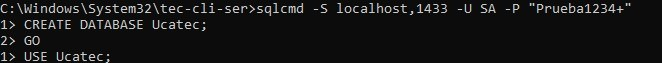
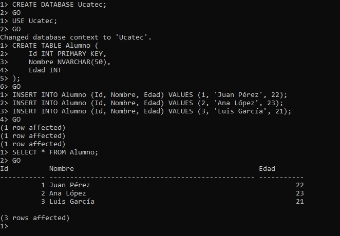

# 📘 Experiencia siguiendo el manual para crear una base de datos en SQL Server con Docker

Este documento resume mi experiencia al seguir un manual proporcionado por un compañero para crear una base de datos en SQL Server utilizando Docker y `sqlcmd`.

---

## ✅ Requisitos Previos

Cumplí con todos los requisitos mencionados en el manual. Ya tenía instalado **Docker Desktop**, por lo que solo fue necesario instalar **`sqlcmd`**.



### 💡 Observación Importante:
Tuve un inconveniente al ejecutar el siguiente comando en PowerShell:

```bash
sqlcmd -S localhost,1433 -U SA -P "Prueba1234+"
```

PowerShell interpretaba incorrectamente algunos caracteres especiales, como el signo `+` y las comillas. Para solucionarlo, cambié a la terminal **CMD**, donde el comando funcionó sin problemas:

```cmd
sqlcmd -S localhost,1433 -U SA -P "Prueba1234+"
```

---

## 🐳 Paso 1: Descargar la Imagen de SQL Server

Utilicé el siguiente comando para descargar la imagen oficial de SQL Server desde el Container Registry:

```bash
docker pull mcr.microsoft.com/mssql/server:2022-latest
```

La descarga se realizó sin inconvenientes.



---

## 🚀 Paso 2: Ejecutar el Contenedor

Ejecuté el contenedor con el siguiente comando, unificándolo en una sola línea para evitar errores con caracteres especiales:

```powershell
docker run -e "ACCEPT_EULA=Y" -e "SA_PASSWORD=Prueba1234+" -p 1433:1433 --name UcatecSqlserver -d mcr.microsoft.com/mssql/server:2022-latest
```

El contenedor se levantó correctamente.



---

## 🔍 Paso 3: Verificar el Contenedor y Conectarse

Verifiqué que el contenedor estuviera activo con el comando:

```bash
docker ps
```

Luego me conecté exitosamente a SQL Server usando `sqlcmd` desde CMD:

```cmd
sqlcmd -S localhost,1433 -U SA -P "Prueba1234+"
```

Esto me permitió acceder al prompt de SQL Server (`1>`).



---

## 🧹 Paso 4 y 🗒 Paso 5: Crear Base de Datos y Consultar

Ejecuté los comandos SQL indicados en el manual para:

- Crear la base de datos `Ucatec`.
- Crear la tabla `Alumno`.
- Insertar registros de prueba.
- Consultar los datos insertados.

Todos los comandos se ejecutaron correctamente y sin errores.

Adicionalmente, ejecuté el siguiente comando para listar las bases de datos existentes:

```sql
SELECT name FROM sys.databases;
GO
```

Y pude verificar la existencia de la base de datos creada.



---

## 🎯 Conclusión

El manual fue claro, ordenado y fácil de seguir. La única dificultad fue la incompatibilidad del comando `sqlcmd` con PowerShell, debido al manejo de caracteres especiales. Este inconveniente se resolvió fácilmente al cambiar de terminal. Fuera de eso, todo el proceso fue fluido y logré tener el entorno de SQL Server completamente funcional.
