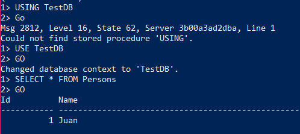
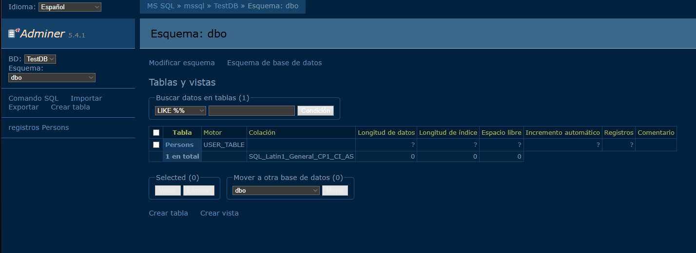

# Guía: Usar **SQL Server** descargado con **Docker**

Esta guía muestra, paso a paso y en Markdown, cómo:

1. Crear la carpeta del proyecto y el archivo `docker-compose.yml`.
2. Hacer `pull` y levantar los servicios con Docker Compose.
3. Crear bases de datos y acceder a ellas de dos maneras:

   * (3.1) Ejecutando un archivo `init.sql` dentro del contenedor con `sqlcmd` usando `docker exec`.
   * (3.2) Creando un archivo `.sql` y ejecutándolo desde **Adminer** (interfaz web).

> Requisitos previos: Docker y Docker Compose instalados en tu máquina.

---

## 1) Crear carpeta del proyecto y archivo `docker-compose.yml`

Abre una terminal y ejecuta:

```bash
mkdir sqlserver-docker
cd sqlserver-docker
```

Crea un archivo `docker-compose.yml` (puedes usar el editor que prefieras):

```yaml
version: '3.8'
services:
  mssql:
    image: mcr.microsoft.com/mssql/server:2022-latest
    container_name: mssql
    environment:
      - ACCEPT_EULA=Y
      - SA_PASSWORD=YourComplex!Pass123 
    ports:
      - "1433:1433"
    volumes:
      - ./data:/var/opt/mssql
      - ./init.sql:/tmp/init.sql:ro
    restart: unless-stopped

  adminer:
    image: adminer:latest
    container_name: adminer
    ports:
      - "8080:8080"
    depends_on:
      - mssql
    restart: unless-stopped

```

**Notas:**

* Reemplaza `YourComplex!Pass123` por una contraseña que cumpla las políticas de SQL Server: mínimo 8 caracteres, mayúscula, minúscula, número y símbolo.
* `./data` en host persistirá los datos de la base.
* `./init.sql` será montado en el contenedor para que puedas ejecutarlo manualmente si lo necesitas.

* Este utiliza `Adminer`como UI en navegador ya que otras como `phpMyAdmin`no soportan SQL Server.
---

## 2) Pull y run con Docker Compose

Desde la carpeta `sqlserver-docker` ejecuta:

```bash
# Levanta en segundo plano (crea y hace pull automáticamente si hace falta)
docker compose up -d

# Verifica los contenedores en ejecución
docker ps

# Ver logs del servidor SQL si necesitas diagnosticar
docker logs -f mssql
```

> `docker compose up -d` hará `pull` si no tienes la imagen local. Si deseas forzar el pull antes de levantar:

```bash
docker compose pull
docker compose up -d
```

Si necesitas detener y remover:

```bash
docker compose down
```

---

## 3) Crear base de datos y acceder

### 3.1 Ejecutar `init.sql` dentro del contenedor con `sqlcmd` (usando `docker exec`)

1. Crea un archivo `init.sql` en la carpeta del proyecto con contenido de ejemplo:

```sql
-- init.sql
CREATE DATABASE TestDB;
GO
USE TestDB;
GO
CREATE TABLE Personas (
    Id INT IDENTITY(1,1) PRIMARY KEY,
    Nombre NVARCHAR(100),
    Edad INT
);
GO
INSERT INTO Personas (Nombre, Edad) VALUES ('Juan', 30), ('José', 25);
GO
SELECT * FROM Personas;
GO
```

> Asegúrate de que `init.sql` está en la misma carpeta donde pusiste `docker-compose.yml` para que la línea de `volumes` lo monte en `/tmp/init.sql`.

2. Ejecuta el script dentro del contenedor usando `sqlcmd` (comando sugerido):

```bash
docker exec -it mssql bash -c "/opt/mssql-tools/bin/sqlcmd -S localhost -U SA -P 'YourComplex!Pass123' -C -i /tmp/init.sql"
```

**Explicación rápida de los flags:**

* `docker exec -it mssql bash -c "..."` — abre una shell dentro del contenedor `mssql` y ejecuta el comando.
* `/opt/mssql-tools/bin/sqlcmd` — ruta del cliente `sqlcmd` dentro del contenedor.
* `-S localhost` — servidor (en el contenedor, SQL Server escucha en `localhost`/`1433`).
* `-U SA -P '...'` — credenciales del usuario `SA`.
* `-i /tmp/init.sql` — archivo a ejecutar.
* `-C` — permite confiar en el certificado del servidor (útil en entornos con certificado autofirmado). Si no necesitas esto, puedes quitar `-C`.

:warning: En la ruta del cliente `/opt/mssql-tools/bin/sqlcmd`, puede causar error segun la version. Si esta no funciona, cambia a: `/opt/mssql-tools18/bin/sqlcmd`

3. Si prefieres ejecutar comandos `sqlcmd` interactivos dentro del contenedor:

```bash
# Abrir un shell y lanzar sqlcmd interactivo
docker exec -it mssql /opt/mssql-tools/bin/sqlcmd -S localhost -U SA -P 'YourComplex!Pass123'

-- Una vez dentro, puedes ejecutar T-SQL, por ejemplo:
-- 1> SELECT name FROM sys.databases;
-- 2> GO
```

> Si ves problemas con certificados o conexión, revisa `docker logs mssql` para ver errores y confirma que el contenedor está `healthy`.

## Ejemplo




### 3.2 Crear un archivo `.sql` y usar **Adminer** (interfaz web) mediante `localhost`

**Opción A — Usando Adminer dentro del `docker-compose` (recomendado si seguiste el `docker-compose.yml` anterior):**

1. Accede a Adminer en tu navegador: `http://localhost:8080`.
2. En la pantalla de login elige **System** = `MS SQL`. Rellena los campos:

   * **Server**: `mssql`  (si Adminer corre como servicio en el mismo `docker-compose`, `mssql` es el nombre del servicio y resolverá automáticamente)
   * **Username**: `SA`
   * **Password**: la contraseña que definiste (`YourComplex!Pass123`)
   * **Database**: (opcional) deja en blanco para listar todas
3. Una vez conectado, puedes usar la interfaz para ejecutar SQL directamente (pegar el contenido de tu `.sql` y ejecutar).

**Opción B — Si ejecutas Adminer en el host o fuera del mismo compose:**

* En `Server` usa `host.docker.internal,1433` (en Docker Desktop) o la IP del host.
* Ten en cuenta las reglas de red y que el puerto 1433 esté mapeado a `localhost` (en nuestro `docker-compose` sí lo está: `1433:1433`).

**Ejecutar un archivo `.sql` con Adminer:**

* En Adminer ve a *SQL command* o *Import*, pega el contenido de tu archivo `.sql` o súbelo si la interfaz lo permite.


## Ejemplo



---

## Verificación y comandos útiles

* Ver contenedores: `docker ps`
* Ver logs del servidor SQL: `docker logs -f mssql`
* Conectar con `sqlcmd` desde un contenedor de herramientas (si prefieres no entrar al contenedor `mssql`):

```bash
# Ejecutar sqlcmd desde el contenedor oficial de mssql-tools y conectarse al servidor que corre en host
docker run -it --rm mcr.microsoft.com/mssql-tools \
  /bin/bash -lc "sqlcmd -S host.docker.internal -U SA -P 'YourComplex!Pass123' -Q 'SELECT name FROM sys.databases;'"
```

> En Windows PowerShell la escapatoria de comillas puede causar problemas; si usas PowerShell, considera usar comillas simples/ dobles adecuadamente o dividir en dos comandos (abrir el contenedor y luego ejecutar sqlcmd dentro).

---

## Troubleshooting — Problemas comunes

* **`Login failed for user 'sa'`**: revisa que la contraseña sea la correcta y cumpla la política de complejidad; examina `docker logs mssql`.
* **`sqlcmd: command not found`**: estás en una shell que no tiene `sqlcmd`. Usa la ruta absoluta `/opt/mssql-tools/bin/sqlcmd` dentro del contenedor, o usa la imagen `mcr.microsoft.com/mssql-tools` para ejecutar `sqlcmd` desde otro contenedor.
* **Errores SSL / certificado autofirmado**: agrega `-C` a `sqlcmd` para confiar en el certificado del servidor (útil en entornos de contenedores), o resolver la conexión TLS correctamente con certificados válidos.
* **`${PWD}` no funciona en Windows**: usa rutas absolutas o la sintaxis de PowerShell adecuada; en `docker-compose.yml` usar rutas relativas `./data` evita problemas.

---

## Resumen rápido de comandos

```bash
# Crear carpeta
mkdir sqlserver-docker && cd sqlserver-docker

# Levantar (pull + run)
docker compose up -d

# Ejecutar init.sql dentro del contenedor
docker exec -it mssql bash -c "/opt/mssql-tools/bin/sqlcmd -S localhost -U SA -P 'YourComplex!Pass123' -C -i /tmp/init.sql"

# Acceder a Adminer: http://localhost:8080 (usuario SA / contraseña)
```
