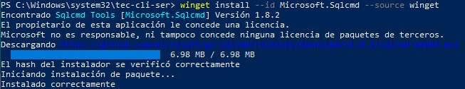
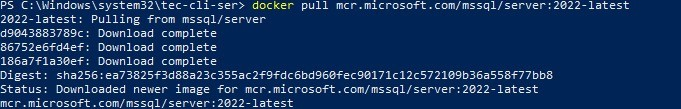
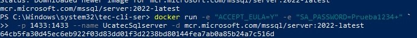
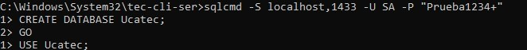
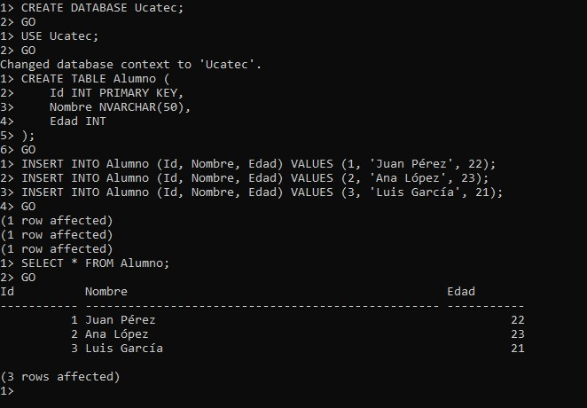

# 📘 Experiencia al seguir el manual para crear una base de datos en SQL Server

Este documento resume mi experiencia al seguir el manual proporcionado por un compañero para crear una base de datos en SQL Server utilizando Docker y sqlcmd.

---

## ✅ Requisitos

Seguí todos los pasos mencionados en el apartado de requisitos. Ya tenía instalado Docker Desktop, así que solo necesitaba instalar sqlcmd.

### 💡 Observación:
Tuve un pequeño problema al intentar usar el comando:
bash
sqlcmd -S localhost,1433 -U SA -P "Prueba1234+"

Este comando no funcionaba correctamente en PowerShell debido a cómo interpreta algunos caracteres especiales (como el + y las comillas). Para solucionarlo, cambié de PowerShell a la terminal CMD, donde el comando funcionó sin problemas:
cmd
sqlcmd -S localhost,1433 -U SA -P "Prueba1234+"

---

## 🐳 Paso 1: Descargar la Imagen de SQL Server

Ejecuté correctamente el comando para descargar la imagen desde el Container Registry:
bash
docker pull mcr.microsoft.com/mssql/server:2022-latest

Todo funcionó según lo esperado.

---

## 🚀 Paso 2: Ejecutar el Contenedor

Pude ejecutar el contenedor usando el comando propuesto. También probé usarlo en una sola línea para evitar complicaciones con el acento grave (`):
powershell
docker run -e "ACCEPT_EULA=Y" -e "SA_PASSWORD=Prueba1234+" -p 1433:1433 --name UcatecSqlserver -d mcr.microsoft.com/mssql/server:2022-latest

El contenedor se levantó correctamente.

---

## 🔍 Paso 3: Verificar el contenedor y conectarse

Verifiqué con docker ps y confirmé que el contenedor estaba corriendo.

Como mencioné antes, tuve que cambiar a CMD para que el comando de conexión funcionara correctamente:
cmd
sqlcmd -S localhost,1433 -U SA -P "Prueba1234+"

Después de eso, entré correctamente al prompt de SQL Server (1>).

---

## 🧹 Paso 4 y 🗒 Paso 5: Crear Base de Datos y Consultar

Ejecuté los comandos SQL proporcionados para crear la base de datos Ucatec, la tabla Alumno, insertar los datos y luego consultarlos. Todo funcionó sin errores.

También probé el comando adicional para listar las bases de datos:
sql
SELECT name FROM sys.databases;
GO

Y pude ver la base de datos creada.

---

## ✅ Conclusión

Seguir el manual fue bastante sencillo y claro. La única dificultad que encontré fue con la ejecución del comando sqlcmd en PowerShell, pero se solucionó cambiando a la terminal CMD. Fuera de eso, todo el proceso fue fluido y el sistema quedó funcionando perfectamente.