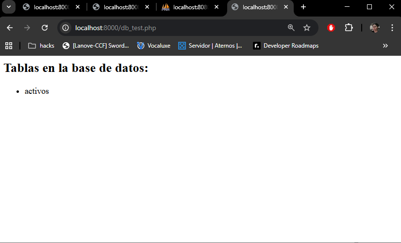
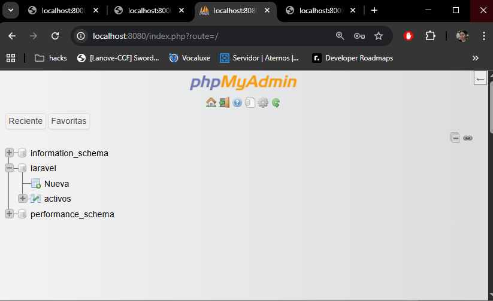
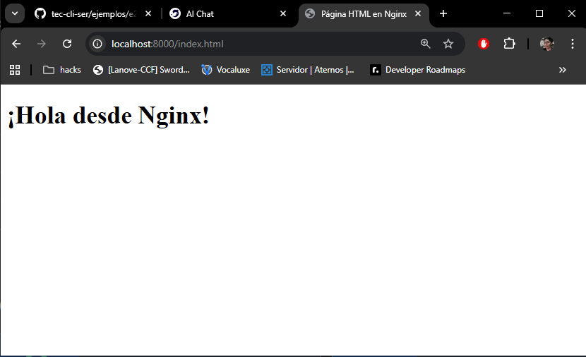
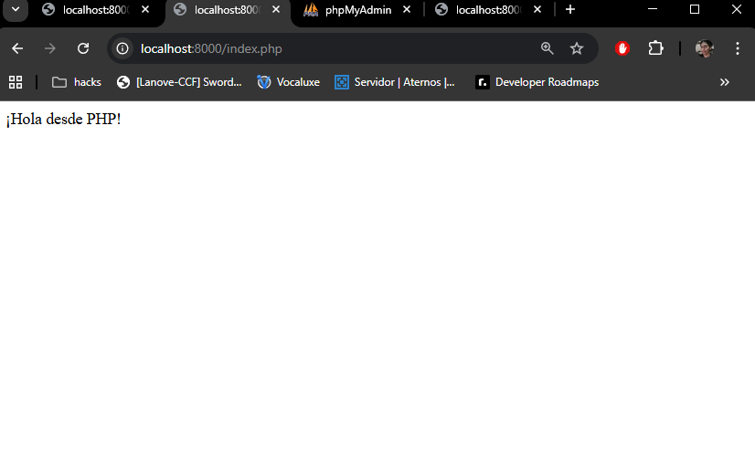
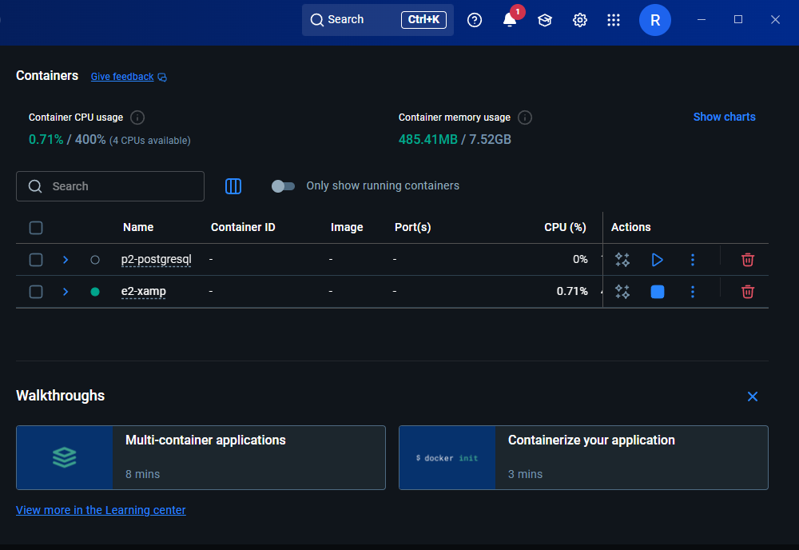

# Proyecto PHP + Docker + MySQL que simula XAMP

## Descripción del Proyecto

Este proyecto consiste en una aplicación PHP que se conecta a una base de datos MySQL para realizar operaciones de prueba. La configuración se realiza usando Docker, permitiendo un entorno aislado y fácilmente reproducible.

---

## Tecnologías utilizadas

- **PHP 8.2** (con extensión mysqli para conexión a MySQL)
- **MySQL 8.0**
- **Docker y Docker Compose**
- **PHP

---

## Configuración

### 1. Dockerfile

Este archivo define la imagen personalizada de PHP con la extensión `mysqli` instalada.

```dockerfile
FROM php:8.2-fpm

RUN docker-php-ext-install mysqli
```

### 2. docker-compose.yml

Este archivo configura los servicios de PHP y MySQL.

```yaml
version: '3.8'

services:
  app:
    build: .
    ports:
      - "8000:80"
    volumes:
      - ./src:/var/www/html
    depends_on:
      - db

  db:
    image: mysql:8.0
    environment:
      MYSQL_ROOT_PASSWORD: rootpassword
      MYSQL_DATABASE: mi_base_de_datos
      MYSQL_USER: usuario
      MYSQL_PASSWORD: contraseña
    ports:
      - "3306:3306"
    volumes:
      - db_data:/var/lib/mysql

volumes:
  db_data:
```

---

## Cómo levantar el entorno

1. **Construir las imágenes y levantar los contenedores:**

```bash
docker-compose build
docker-compose up -d
```

2. **Acceder al contenedor PHP para pruebas o configuración adicional:**

```bash
docker exec -it <nombre_contenedor_php> bash
```

3. **Verificar que PHP tenga habilitada la extensión mysqli:**

```bash
php -m | grep mysqli
```

---

## Archivos de ejemplo

### `src/db_test.php`

Archivo para probar la conexión a la base de datos.

```php
<?php
$mysqli = new mysqli("db", "usuario", "contraseña", "mi_base_de_datos");

if ($mysqli->connect_error) {
    die("Error de conexión: " . $mysqli->connect_error);
}
echo "Conexión exitosa a la base de datos!";
?>
```

### `src/index.php`

Archivo principal que puede incluir lógica de la aplicación.

```php
<?php
include 'db_test.php';
// Aquí puedes agregar más lógica de tu aplicación
?>
```

---

## Cómo hacer pruebas

1. Accede a `http://localhost:8000` en tu navegador para ver la página principal.
2. Para probar la conexión a la base de datos, visita `http://localhost:8000/db_test.php`.
3. Verifica que la conexión sea exitosa y que no haya errores.

---

## Evidencias






