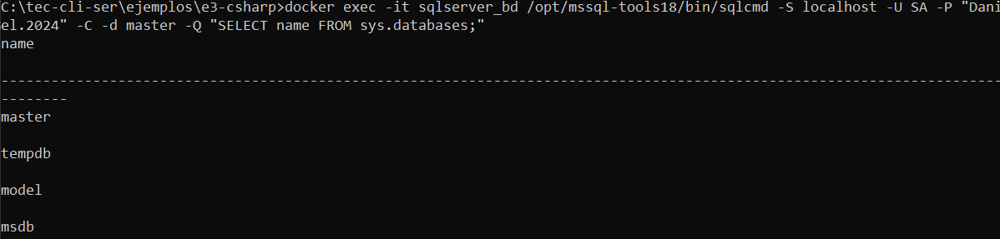
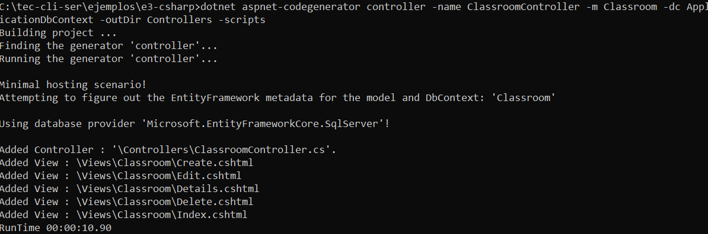
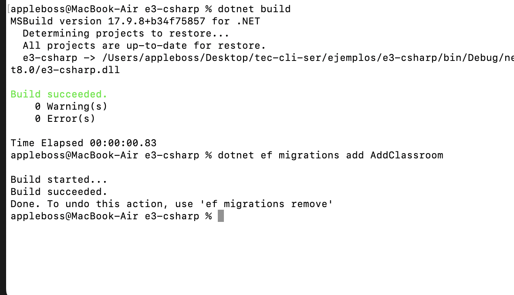
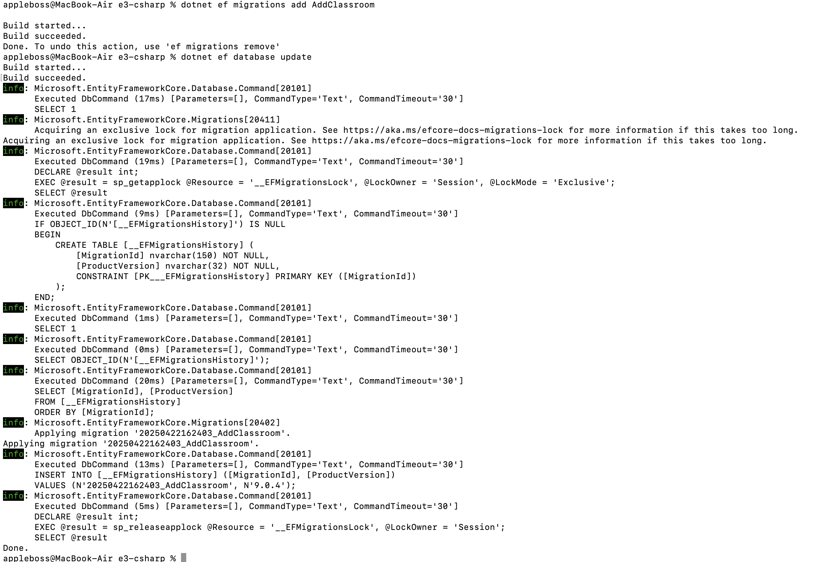
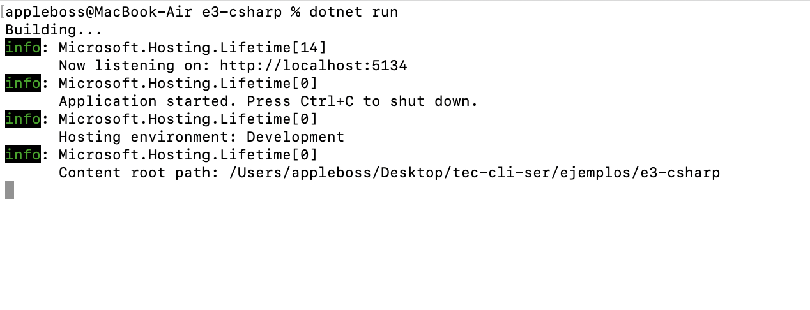
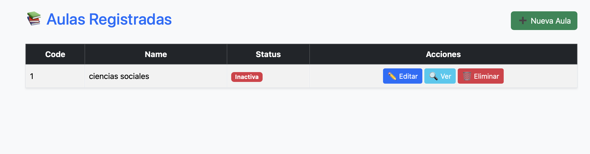
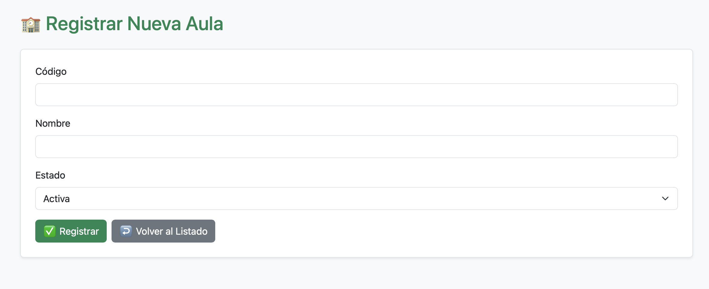

# 📘 Guía Completa: Proyecto MVC en C# con .NET 8 + SQL Server + Docker + EF Core

Esta guía paso a paso te ayudará a construir una aplicación MVC moderna con C# y .NET 8, utilizando SQL Server a través de Docker, junto con Entity Framework Core para el manejo de base de datos. También aprenderás a usar archivos `.env` para manejar variables de entorno de manera segura.

---

## ✅ Requisitos Previos

Asegúrate de tener lo siguiente instalado:

- 🐳 **Docker Desktop**: [Descargar Docker](https://www.docker.com/products/docker-desktop)
- ⚙️ **.NET SDK 8.0**: [Descargar .NET](https://dotnet.microsoft.com/en-us/download/dotnet/8.0)
- 🖥️ Editor de código: Visual Studio Code, Rider o similar
- 💻 Terminal y conocimientos básicos de C# y SQL Server

---

## 🐳 Paso 1: Preparar SQL Server con Docker

1. Crea una carpeta `e4-sqlserver` y dentro un archivo `.env` con:

```env
SA_PASSWORD=Santy.2024
```

2. Crea el archivo `docker-compose.yml` con:

```yaml
services:
  sqlserver:
    image: mcr.microsoft.com/mssql/server:2022-latest
    container_name: sqlserver_bd
    platform: linux/amd64
    ports:
      - "1433:1433"
    environment:
      SA_PASSWORD: ${SA_PASSWORD}
      ACCEPT_EULA: "Y"
    volumes:
      - sqlserver_data:/var/opt/mssql
volumes:
  sqlserver_data:
```

3. Levanta el contenedor SQL Server:

```bash
docker-compose up -d
```

4. Verifica las bases de datos creadas:

```bash
docker exec -it sqlserver_bd /opt/mssql-tools18/bin/sqlcmd -S localhost -U sa -P "Santy.2024" -Q "SELECT name FROM sys.databases;"
```

📷 

---

## ⚙️ Paso 2: Configurar Conexión con .env en el Proyecto

1. Ve a tu carpeta de proyecto `e3-csharp`, y crea un archivo `.env`:

```env
DEFAULT_CONNECTION=Server=127.0.0.1;Database=test_bd;User Id=sa;Password=Santy.2024;Encrypt=False;TrustServerCertificate=True
```

2. En `Program.cs`, carga la variable:

```csharp
Env.Load();
var connectionString = Environment.GetEnvironmentVariable("DEFAULT_CONNECTION");
builder.Services.AddDbContext<ApplicationDbContext>(options =>
    options.UseSqlServer(connectionString));
```

---

## 📦 Paso 3: Instalar Paquetes Necesarios para EF Core

```bash
dotnet add package Microsoft.Data.SqlClient

dotnet add package DotNetEnv

dotnet add package Microsoft.EntityFrameworkCore

dotnet add package Microsoft.EntityFrameworkCore.SqlServer

dotnet add package Microsoft.EntityFrameworkCore.Design

dotnet add package Microsoft.EntityFrameworkCore.Tools

dotnet tool install --global dotnet-ef
```

---

## 🏗️ Paso 4: Crear el Modelo `Classroom` y el `DbContext`

### 📁 Models/Classroom.cs

```csharp
public class Classroom
{
    public int ID { get; set; }
    public string Code { get; set; } = string.Empty;
    public string Name { get; set; } = string.Empty;
    public string Status { get; set; } = "AC";
}
```

### 📁 Data/ApplicationDbContext.cs

```csharp
public class ApplicationDbContext : DbContext
{
    public ApplicationDbContext(DbContextOptions<ApplicationDbContext> options) : base(options) { }

    public DbSet<Classroom> Classrooms { get; set; }
}
```

---

## 🛠️ Paso 5: Generar Controlador y Vistas con Scaffolding

```bash
dotnet aspnet-codegenerator controller -name ClassroomController -m Classroom -dc ApplicationDbContext -outDir Controllers -scripts
```

📷 


---

## 🔄 Paso 6: Crear la Migración y Aplicarla a la Base de Datos

```bash
dotnet ef migrations add AddClassroom

dotnet ef database update
```

📷 

📷 

---

## 🚀 Paso 7: Compilar y Ejecutar la Aplicación

```bash
dotnet build

dotnet run
```

📷 


---

## 🌐 Paso 8: Verificar Funcionalidad desde el Navegador

Abre tu navegador y accede a:

```
http://localhost:5134/Classroom
```


## Programa Funcionando
📷 

## Crud Funcionando
📷 

---

## 🧠 Recomendaciones Finales

- ✅ Usa el archivo `.env` para manejar credenciales sensibles y mantenerlo fuera del control de versiones (`.gitignore`).
- ✅ Asegúrate de que el contenedor Docker esté activo antes de correr `dotnet run`.
- ✅ Ejecuta `dotnet build` cada vez que modifiques clases o migraciones.

> Esta guía fue creada con .NET 8 en mente y es ideal para desarrollo local. Para producción, se recomienda habilitar certificados SSL reales y políticas de seguridad adecuadas.

---

