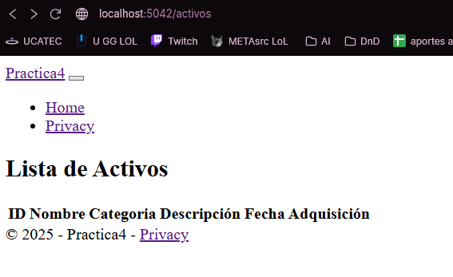

# #️⃣ Proyecto MVC con C#, SQL Server

## 1. Crear un proyecto MVC en consola

```bash
dotnet new mvc -n MiProyectoActivos
cd MiProyectoActivos
```

---

## 2. Instalar los paquetes necesarios

Ejecuta:

```bash
dotnet add package Microsoft.Data.SqlClient
dotnet add package DotNetEnv
dotnet add package Microsoft.EntityFrameworkCore
dotnet add package Microsoft.EntityFrameworkCore.SqlServer
dotnet add package Microsoft.EntityFrameworkCore.Design
dotnet add package Microsoft.EntityFrameworkCore.Tools
```

### ✔ Nota importante sobre `dotnet ef`

Para poder usar migraciones, instala la CLI global:

```bash
dotnet tool install --global dotnet-ef
```

---

## 3. Crear archivo **.env** para la conexión

En la raíz del proyecto crea:

**.env**

```env
DB_HOST=localhost
DB_PORT=1433
DB_NAME=ActivosDB
DB_USER=SA
DB_PASSWORD=Admin123!
```

> **Nota:** Ajusta el contenido a tu entorno, Docker o SQL Server local.
> `.env` no debe subirse al repositorio (agregar a `.gitignore`).

---

## 4. Leer el `.env` en el proyecto

En `Program.cs`:

```csharp
using DotNetEnv;
using Microsoft.EntityFrameworkCore;
using MiProyectoActivos.Data;

var builder = WebApplication.CreateBuilder(args);

// Cargar variables .env
Env.Load();

string connectionString =
    $"Server={Environment.GetEnvironmentVariable("DB_HOST")},{Environment.GetEnvironmentVariable("DB_PORT")};" +
    $"Database={Environment.GetEnvironmentVariable("DB_NAME")};" +
    $"User Id={Environment.GetEnvironmentVariable("DB_USER")};" +
    $"Password={Environment.GetEnvironmentVariable("DB_PASSWORD")};" +
    "TrustServerCertificate=True;";

builder.Services.AddDbContext<AppDbContext>(options =>
    options.UseSqlServer(connectionString));

builder.Services.AddControllersWithViews();

var app = builder.Build();

app.MapDefaultControllerRoute();

app.Run();
```

---

## 5. Crear el modelo **Activo**

Carpeta → `Models/Activo.cs`

```csharp
namespace MiProyectoActivos.Models
{
    public class Activo
    {
        public int Id { get; set; }
        public string Nombre { get; set; } = "";
        public string Categoria { get; set; } = "";
        public string Descripcion { get; set; } = "";
        public DateTime FechaAdquisicion { get; set; }
    }
}
```

---

## 6. Crear DbContext

Carpeta → `Data/AppDbContext.cs`

```csharp
using Microsoft.EntityFrameworkCore;
using MiProyectoActivos.Models;

namespace MiProyectoActivos.Data
{
    public class AppDbContext : DbContext
    {
        public AppDbContext(DbContextOptions<AppDbContext> options) : base(options) { }

        public DbSet<Activo> Activos { get; set; }
    }
}
```

---

## 7. Crear la base de datos con migraciones

```bash
dotnet ef migrations add InitialCreate
dotnet ef database update
```

Esto crea la tabla **Activos** en la base de datos.

---

## 8. Crear el controlador para mostrar la tabla (solo lectura)

Carpeta → `Controllers/ActivosController.cs`

```csharp
using Microsoft.AspNetCore.Mvc;
using MiProyectoActivos.Data;

namespace MiProyectoActivos.Controllers
{
    public class ActivosController : Controller
    {
        private readonly AppDbContext _context;

        public ActivosController(AppDbContext context)
        {
            _context = context;
        }

        public IActionResult Index()
        {
            var lista = _context.Activos.ToList();
            return View(lista);
        }
    }
}
```

---

## 9. Crear vista simple para mostrar la tabla

Carpeta → `Views/Activos/Index.cshtml`

```cshtml
@model IEnumerable<MiProyectoActivos.Models.Activo>

<h2>Lista de Activos</h2>

<table class="table">
    <thead>
        <tr>
            <th>ID</th>
            <th>Nombre</th>
            <th>Categoria</th>
            <th>Descripción</th>
            <th>Fecha Adquisición</th>
        </tr>
    </thead>

    <tbody>
        @foreach (var item in Model)
        {
            <tr>
                <td>@item.Id</td>
                <td>@item.Nombre</td>
                <td>@item.Categoria</td>
                <td>@item.Descripcion</td>
                <td>@item.FechaAdquisicion.ToShortDateString()</td>
            </tr>
        }
    </tbody>
</table>
```

---

## 10. Ejecutar el proyecto

```bash
dotnet run
```

En el navegador ingresa:

```
https://localhost:5001/Activos
```
#### Ejemplo:

